# 数据看板模块

<!-- COMMON_REPEAT_PRUNE_NOTE -->
> 整理说明：用户标红的顶部搜索、应用中心、通知、语言、账号等公共工具区，只在总览/通用导航章节保留一次；本模块已剔除重复公共区域截图，保留业务区、tab、弹窗和按钮截图。
<!-- COMMON_REPEAT_PRUNE_NOTE_END -->
数据看板是平台的结果消费层和管理者入口。它通过“看板首页 + AI 智能管控中心”组织大屏场景，承担实时监控、业务概览、报警态势和指挥展示的职责。

## 采集覆盖

| 维度 | 数量/说明 |
| --- | --- |
| 深度截图 | 32 张/条交互记录 |
| 覆盖子模块 | 数据看板首页、AI智能管控中心 |
| 动作类型 | overview: 2；scroll: 4；hover: 13；focus-or-open: 2；click: 11 |

| 子模块 | 截图/交互记录数 |
| --- | --- |
| 数据看板首页 | 18 |
| AI智能管控中心 | 14 |

## 模块设计思路

- 把数据看板设计成场景入口集合，而不是直接堆叠复杂报表，有利于不同角色先选择“实时监控、业务概览、报警图片墙、AI 管控中心”等目标。
- 创建看板按钮说明系统存在自定义能力，后续应设计模板、数据源、组件编排、权限共享和发布预览流程。
- 顶部栏和应用中心在看板页暴露较多，说明看板既是结果页，也是跨模块入口页。

<!-- FOCUSED_SUPPLEMENT_START -->
## 业务区聚焦补充

- 本次按“公共顶部工具区只截一次、模块内只看业务差异”的原则补充业务区截图。数据看板的重点不再重复搜索菜单、应用中心、消息、语言和账号区，而是看场景入口卡片、创建看板弹窗，以及四类看板入口如何把用户导向不同结果消费场景。
- 截图中的业务区裁剪已经避开顶部工具区，适合直接用于产品评审时讨论看板场景、入口层级和空状态引导。
- 本次新增聚焦截图 6 张，其中业务区裁剪 1 张、弹窗/抽屉裁剪 5 张、安全定位 0 张；这些图片存放在 `competitive_research/screenshots_focused/`。
- 你标红的顶部搜索、应用中心、通知、语言、账号等公共区域，只在总览和截图索引的“通用导航与顶部栏”中保留一次；下面各图只用于分析模块业务区域。

| 子模块/场景 | 聚焦截图数 |
| --- | --- |
| 数据看板首页 | 6 |

### 数据看板首页 聚焦截图与设计说明

- 业务定位：看板首页以入口卡片组织场景，核心不是单个图表，而是把实时视频、业务概览、报警图片墙、AI 管控中心这些结果消费方式前置给用户选择。
- 产品设计思考：卡片点击进入弹窗或二级场景，说明系统试图用“场景入口 + 配置/打开流程”承接大屏使用；创建看板应继续补足模板选择、数据源绑定、组件布局、发布范围和预览校验。

| 截图 | 交互点 | 类型/命中状态 | 业务设计说明 |
| --- | --- | --- | --- |
| 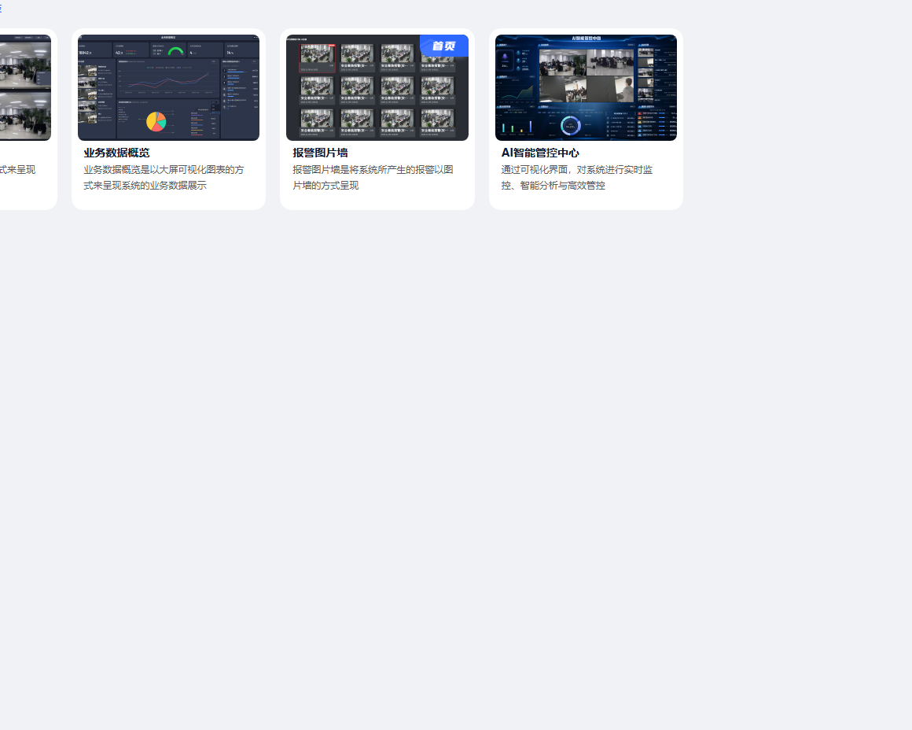 | 数据看板首页 业务区域默认态 | 业务区默认态 状态截图 | 默认态用于观察页面主对象、筛选区、表格/卡片区和主操作分布；本图已避开顶部公共工具区，适合分析模块自身差异。 |
|  | 数据看板首页 Tab_实时视频监控 | 弹窗内切换 已命中 | 切换 实时视频监控 后观察内容是否随 tab 独立变化。产品上 tab 应表达清晰的信息分组，并保留当前上下文，避免用户在配置任务时迷失。 |
| 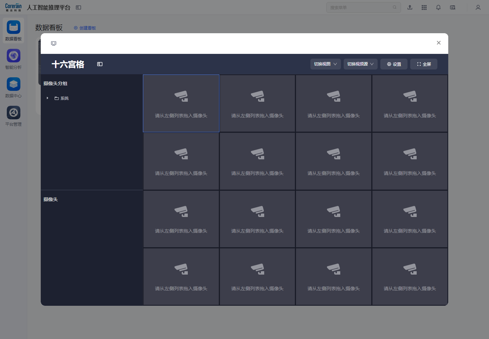 | 数据看板首页 Tab_业务数据概览 | 弹窗内切换 已命中 | 切换 业务数据概览 后观察内容是否随 tab 独立变化。产品上 tab 应表达清晰的信息分组，并保留当前上下文，避免用户在配置任务时迷失。 |
| 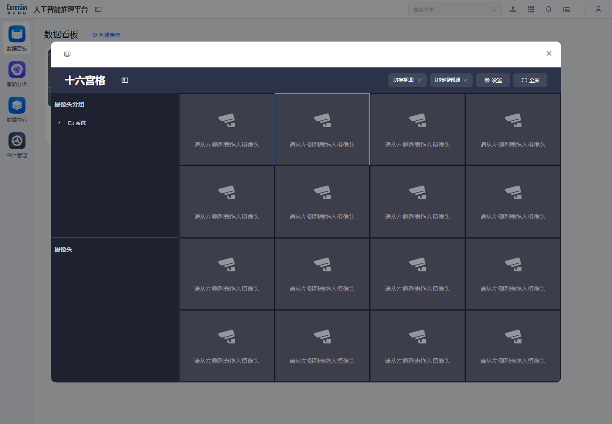 | 数据看板首页 Tab_报警图片墙 | 弹窗内切换 已命中 | 切换 报警图片墙 后观察内容是否随 tab 独立变化。产品上 tab 应表达清晰的信息分组，并保留当前上下文，避免用户在配置任务时迷失。 |
|  | 数据看板首页 Tab_AI智能管控中心 | 弹窗内切换 已命中 | 切换 AI智能管控中心 后观察内容是否随 tab 独立变化。产品上 tab 应表达清晰的信息分组，并保留当前上下文，避免用户在配置任务时迷失。 |
|  | 数据看板首页 操作_创建看板 | 弹窗操作 已命中 | 创建看板 是该页面的业务动作入口。若打开弹窗/抽屉，应让用户在不离开当前列表的情况下完成配置；若只是状态按钮，应有明确反馈。 |

<!-- FOCUSED_SUPPLEMENT_END -->

## 数据看板首页

- 定位：看板首页不是单张报表，而是可视化场景入口集合，把实时监控、业务概览、报警图片墙、AI 管控中心聚合在一个选择页。
- 核心对象：看板入口卡片、创建看板按钮、业务场景描述、全局导航。
- 页面 URL：http://192.168.11.88:8081/app/main-app/cockpit/home/#/cockpit-home
- 主要控件：搜索菜单、创建看板
- 表格字段：未采集到表格字段或本页以卡片/配置项为主

### 产品设计解读

- 卡片用一句话解释使用场景，适合新用户快速理解差异；创建看板作为主 CTA 暗示系统支持自定义大屏。
- 页面内容摘要：人工智能推理平台 搜索菜单 数据看板 智能分析 数据中心 平台管理 数据看板 创建看板 实时视频监控 实时视频监控是以视频墙的方式来呈现摄像头直播流或演示直播流 业务数据概览 业务数据概览是以大屏可视化图表的方式来呈现系统的业务数据展示 报警图片墙 报警图片墙是将系统所产生的报警以图片墙的方式呈现 AI智能管控中心 通过可视化界面，对系统进行实时监控、智能分析与高效管控
- 创建看板与场景入口应给出模板、数据源、权限、发布预览等流程，否则用户看到入口但不知道如何落地。

### 数据看板首页按钮、弹窗与状态截图明细

| 截图 | 子模块/动作 | 类型与页面反馈 | 产品设计说明 |
| --- | --- | --- | --- |
|  | 数据看板首页 页面全貌 | overview 进入子模块后的页面全貌，用于识别信息架构、主操作区、筛选区和表格/卡片区。 | 页面全貌用于判断信息架构：左侧导航负责定位，主区承载筛选、操作、表格或卡片，适合作为子模块设计基线。 |
| 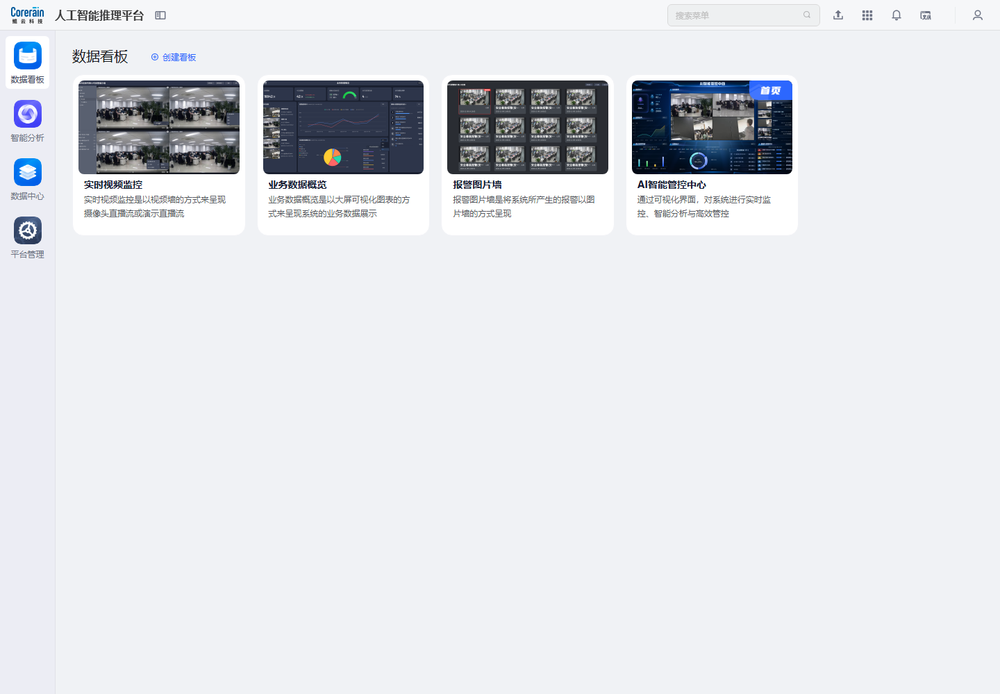 | 数据看板首页 滚动位置_0% | scroll 记录页面不同滚动位置，补足表格、卡片和底部状态。 | 滚动截图用于确认页面内容密度、底部表格/分页/卡片布局，避免只看首屏导致遗漏。 |
| 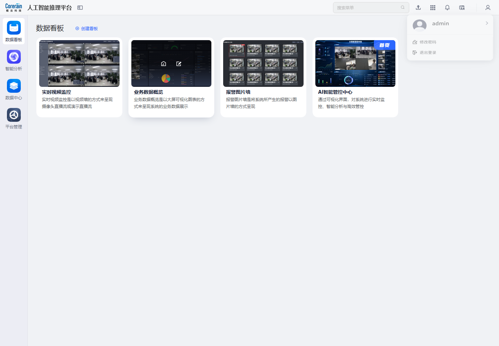 | 数据看板首页 06_业务数据概览 业务数据概览是以大屏可视化图表的方式来呈现系统的业务数据展示_悬停 | hover 悬停查看 业务数据概览 业务数据概览是以大屏可视化图表的方式来呈现系统的业务数据展示 的 hover/提示状态 | 悬停 业务数据概览 业务数据概览是以大屏可视化图表的方式来呈现系统的业务数据展示，观察按钮可点击性、危险操作样式、行操作显隐和 hover 反馈；这是判断操作优先级的重要细节。 |
| 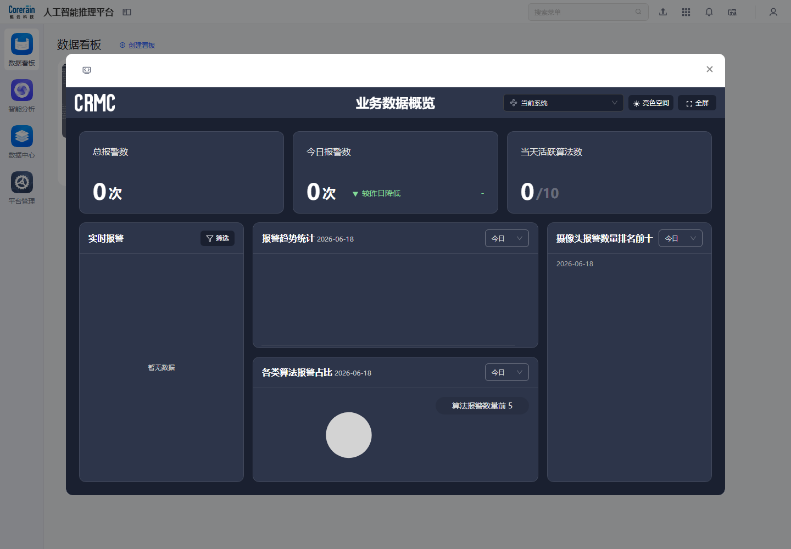 | 数据看板首页 06_业务数据概览 业务数据概览是以大屏可视化图表的方式来呈现系统的业务数据展示_点击后 | click 点击后出现弹窗/下拉/提示：.custom-light-modal、[role="dialog"] | 点击 业务数据概览 业务数据概览是以大屏可视化图表的方式来呈现系统的业务数据展示 后进入弹窗/抽屉式流程。弹窗内容：已出现对话框。设计上把复杂创建、导入、配置或密码类操作隔离在临时层，既保留当前列表上下文，也降低页面跳转成本。 |
| 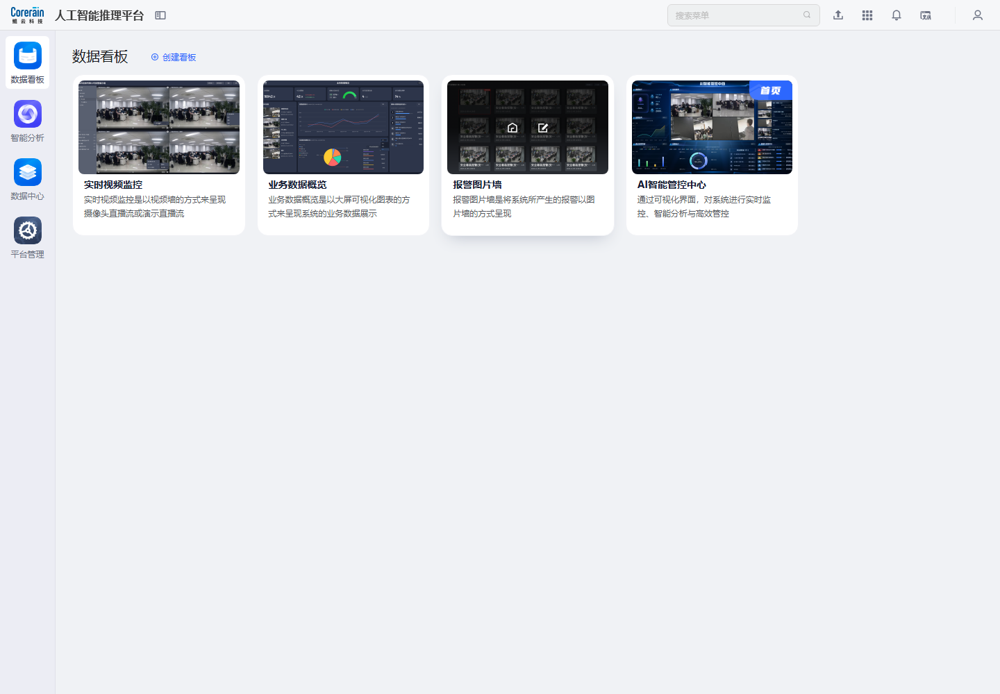 | 数据看板首页 07_报警图片墙 报警图片墙是将系统所产生的报警以图片墙的方式呈现_悬停 | hover 悬停查看 报警图片墙 报警图片墙是将系统所产生的报警以图片墙的方式呈现 的 hover/提示状态 | 悬停 报警图片墙 报警图片墙是将系统所产生的报警以图片墙的方式呈现，观察按钮可点击性、危险操作样式、行操作显隐和 hover 反馈；这是判断操作优先级的重要细节。 |
| 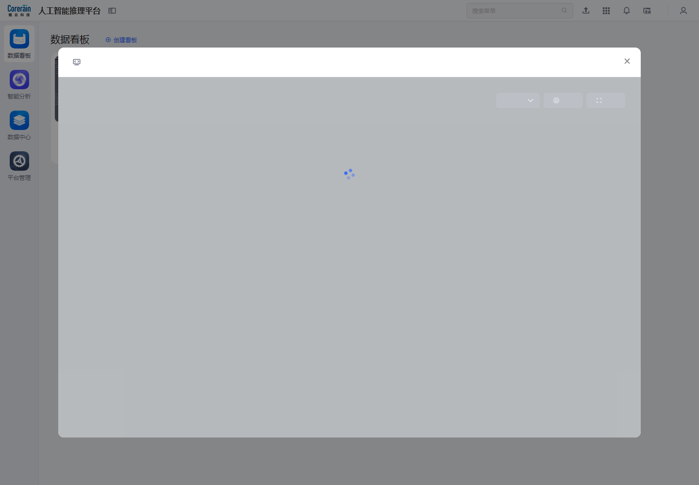 | 数据看板首页 07_报警图片墙 报警图片墙是将系统所产生的报警以图片墙的方式呈现_点击后 | click 点击后出现弹窗/下拉/提示：.custom-light-modal、[role="dialog"] | 点击 报警图片墙 报警图片墙是将系统所产生的报警以图片墙的方式呈现 后进入弹窗/抽屉式流程。弹窗内容：已出现对话框。设计上把复杂创建、导入、配置或密码类操作隔离在临时层，既保留当前列表上下文，也降低页面跳转成本。 |
| 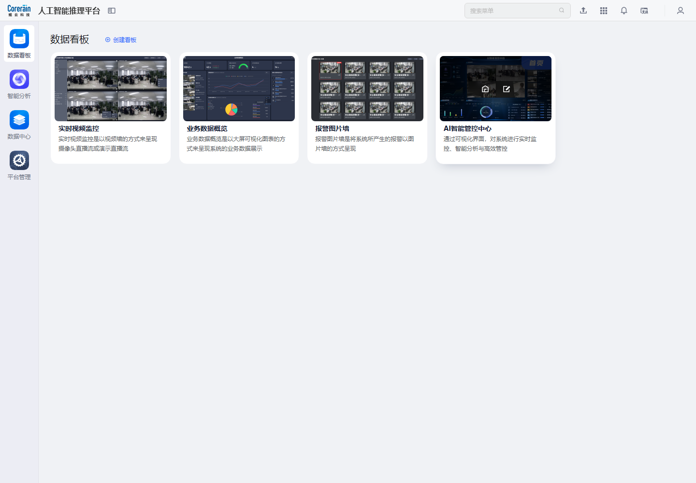 | 数据看板首页 08_AI智能管控中心 通过可视化界面，对系统进行实时监控、智能分析与高效管控_悬停 | hover 悬停查看 AI智能管控中心 通过可视化界面，对系统进行实时监控、智能分析与高效管控 的 hover/提示状态 | 悬停 AI智能管控中心 通过可视化界面，对系统进行实时监控、智能分析与高效管控，观察按钮可点击性、危险操作样式、行操作显隐和 hover 反馈；这是判断操作优先级的重要细节。 |
| 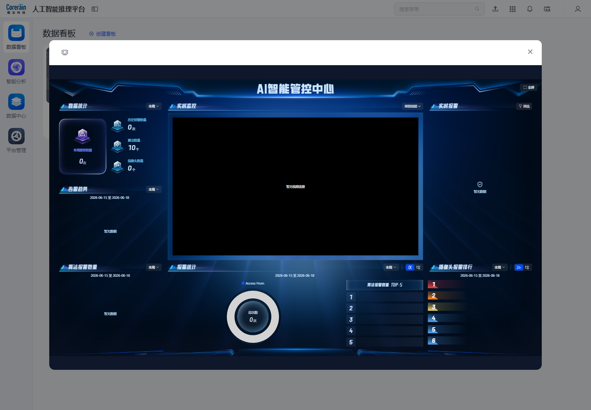 | 数据看板首页 08_AI智能管控中心 通过可视化界面，对系统进行实时监控、智能分析与高效管控_点击后 | click 点击后出现弹窗/下拉/提示：.custom-light-modal、[role="dialog"] | 点击 AI智能管控中心 通过可视化界面，对系统进行实时监控、智能分析与高效管控 后进入弹窗/抽屉式流程。弹窗内容：已出现对话框。设计上把复杂创建、导入、配置或密码类操作隔离在临时层，既保留当前列表上下文，也降低页面跳转成本。 |

## AI智能管控中心

- 定位：面向管理者和指挥大屏的综合态势页，承接实时监控、报警趋势、算法与摄像头态势等高层指标。
- 核心对象：实时指标、报警态势、摄像头/算法运行状态、排行与趋势。
- 页面 URL：http://192.168.11.88:8081/app/main-app/frame
- 主要控件：搜索菜单
- 表格字段：未采集到表格字段或本页以卡片/配置项为主

### 产品设计解读

- 管控中心更像“结果消费层”，依赖智能分析产生任务，依赖数据中心沉淀报警日志。
- 页面内容摘要：人工智能推理平台 搜索菜单 数据看板 智能分析 数据中心 平台管理
- 如果没有任务或报警数据，价值感会明显下降；建议提供空状态引导，直接跳转到摄像头和任务配置。

### AI智能管控中心按钮、弹窗与状态截图明细

| 截图 | 子模块/动作 | 类型与页面反馈 | 产品设计说明 |
| --- | --- | --- | --- |
|  | AI智能管控中心 页面全貌 | overview 进入子模块后的页面全貌，用于识别信息架构、主操作区、筛选区和表格/卡片区。 | 页面全貌用于判断信息架构：左侧导航负责定位，主区承载筛选、操作、表格或卡片，适合作为子模块设计基线。 |
| 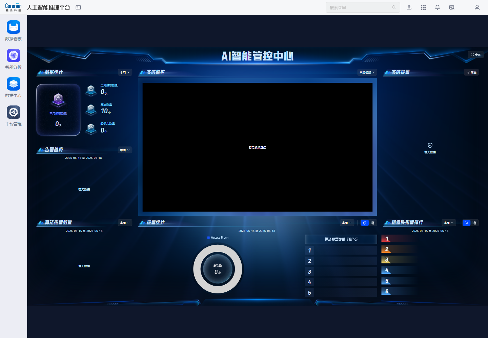 | AI智能管控中心 滚动位置_0% | scroll 记录页面不同滚动位置，补足表格、卡片和底部状态。 | 滚动截图用于确认页面内容密度、底部表格/分页/卡片布局，避免只看首屏导致遗漏。 |
|  | AI智能管控中心 滚动位置_50% | scroll 记录页面不同滚动位置，补足表格、卡片和底部状态。 | 滚动截图用于确认页面内容密度、底部表格/分页/卡片布局，避免只看首屏导致遗漏。 |
| 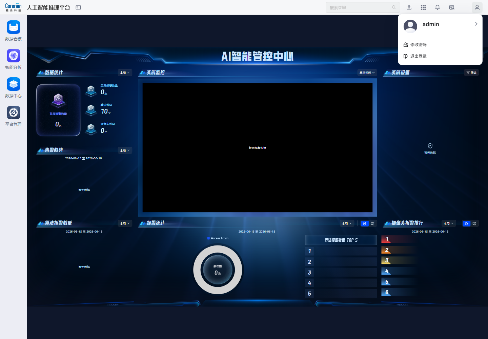 | AI智能管控中心 滚动位置_100% | scroll 记录页面不同滚动位置，补足表格、卡片和底部状态。 | 滚动截图用于确认页面内容密度、底部表格/分页/卡片布局，避免只看首屏导致遗漏。 |