# 智能分析模块

<!-- COMMON_REPEAT_PRUNE_NOTE -->
> 整理说明：用户标红的顶部搜索、应用中心、通知、语言、账号等公共工具区，只在总览/通用导航章节保留一次；本模块已剔除重复公共区域截图，保留业务区、tab、弹窗和按钮截图。
<!-- COMMON_REPEAT_PRUNE_NOTE_END -->
智能分析是平台的生产链路核心，把摄像头/图片输入、算法资产、人员/底库数据、分析任务、服务状态和结果推送串成可运行的 AI 推理业务。

## 采集覆盖

| 维度 | 数量/说明 |
| --- | --- |
| 深度截图 | 192 张/条交互记录 |
| 覆盖子模块 | 摄像头配置、算法列表、人员库、算法底库、视频流分析、图片分析、分析服务状态、报警推送、报警弹窗及语音 |
| 动作类型 | overview: 9；scroll: 13；hover: 85；click: 63；safety-skip: 5；focus-or-open: 17 |

| 子模块 | 截图/交互记录数 |
| --- | --- |
| 摄像头配置 | 22 |
| 算法列表 | 22 |
| 人员库 | 22 |
| 算法底库 | 22 |
| 视频流分析 | 22 |
| 图片分析 | 22 |
| 分析服务状态 | 20 |
| 报警推送 | 18 |
| 报警弹窗及语音 | 22 |

## 模块设计思路

- 信息架构从输入源开始，向算法配置、任务配置、运行服务、结果推送递进，符合 AI 推理平台“先接入，再识别，再输出”的业务路径。
- 配置页多采用左侧分组/菜单 + 右侧表格的形态，适合大量对象维护。
- 弹窗覆盖了新增摄像头、视频源管理、导入、虚拟算法、统计配置、添加人员、特征提取等关键动作，说明系统把复杂表单放在局部流程内完成。
- 任务类页面已经具备启停、详情、删除、演示视频等操作，后续应强化任务详情的可观测性。

<!-- FOCUSED_SUPPLEMENT_START -->
## 业务区聚焦补充

- 本次重点补齐智能分析中容易遗漏的详情页、配置弹窗、tab 与分段控件，尤其是算法详情页的“算法信息 / 绘制对象管理 / 默认绘制样式”三段式配置。
- 截图按业务区裁剪，避免重复展示顶部公共工具区；对保存、删除、恢复默认等可能改变配置的操作，仅做定位或悬停，不执行提交。
- 本次新增聚焦截图 55 张，其中业务区裁剪 30 张、弹窗/抽屉裁剪 25 张、安全定位 6 张；这些图片存放在 `competitive_research/screenshots_focused/`。
- 你标红的顶部搜索、应用中心、通知、语言、账号等公共区域，只在总览和截图索引的“通用导航与顶部栏”中保留一次；下面各图只用于分析模块业务区域。

| 子模块/场景 | 聚焦截图数 |
| --- | --- |
| 报警弹窗及语音 | 8 |
| 报警推送创建 | 12 |
| 创建视频分析任务 | 6 |
| 视频流分析详情 | 6 |
| 算法详情-人员入侵识别 | 18 |
| 图片分析详情 | 5 |

### 报警弹窗及语音 聚焦截图与设计说明

- 业务定位：报警弹窗及语音页面按报警等级和音频动作组织，解决值守场景中的本地提醒问题。
- 产品设计思考：一级、二级、三级体现优先级差异，试听和替换让配置可验证；编辑入口说明系统支持对提醒策略做局部定制。

| 截图 | 交互点 | 类型/命中状态 | 业务设计说明 |
| --- | --- | --- | --- |
| 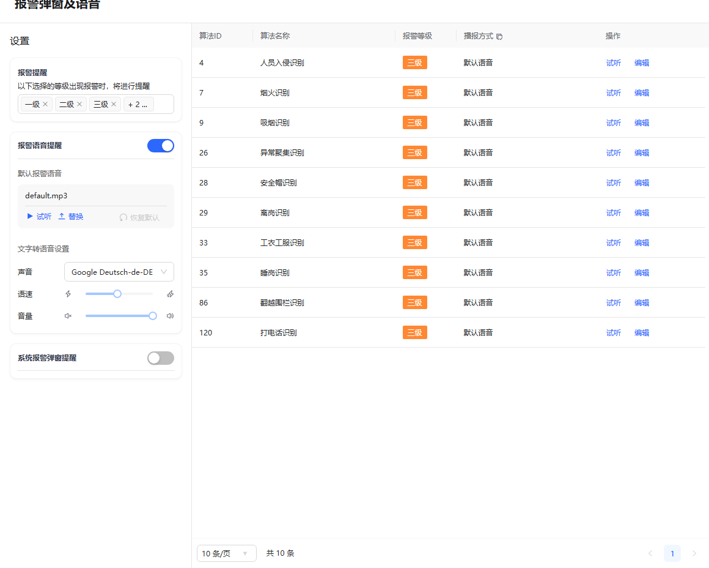 | 报警弹窗及语音 业务区域默认态 | 业务区默认态 状态截图 | 默认态用于观察页面主对象、筛选区、表格/卡片区和主操作分布；本图已避开顶部公共工具区，适合分析模块自身差异。 |
|  | 报警弹窗及语音 Tab_一级 | Tab/分段切换 已命中 | 切换 一级 后观察内容是否随 tab 独立变化。产品上 tab 应表达清晰的信息分组，并保留当前上下文，避免用户在配置任务时迷失。 |
| 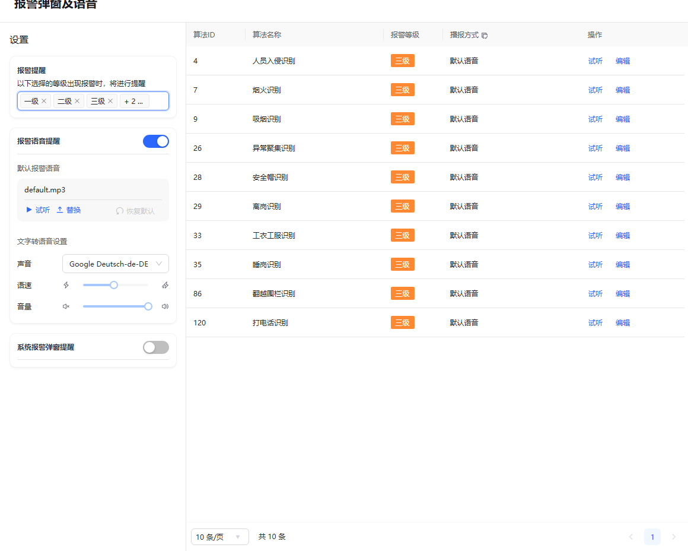 | 报警弹窗及语音 Tab_二级 | Tab/分段切换 已命中 | 切换 二级 后观察内容是否随 tab 独立变化。产品上 tab 应表达清晰的信息分组，并保留当前上下文，避免用户在配置任务时迷失。 |
| 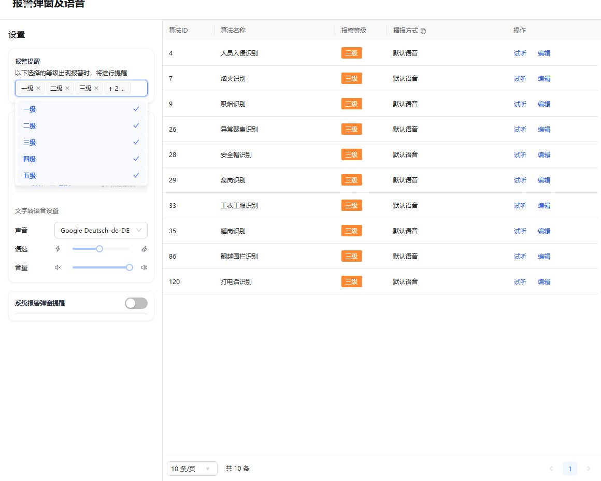 | 报警弹窗及语音 Tab_三级 | Tab/分段切换 已命中 | 切换 三级 后观察内容是否随 tab 独立变化。产品上 tab 应表达清晰的信息分组，并保留当前上下文，避免用户在配置任务时迷失。 |
| 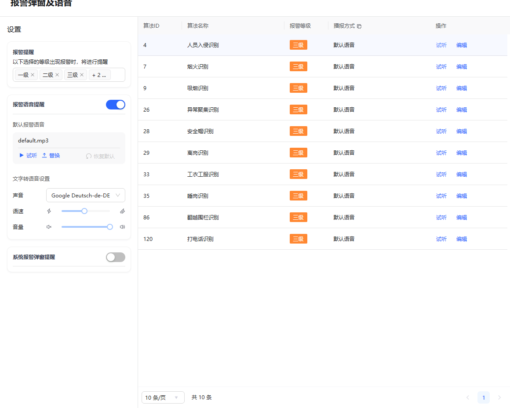 | 报警弹窗及语音 Tab_试听 | Tab/分段切换 已命中 | 切换 试听 后观察内容是否随 tab 独立变化。产品上 tab 应表达清晰的信息分组，并保留当前上下文，避免用户在配置任务时迷失。 |
| 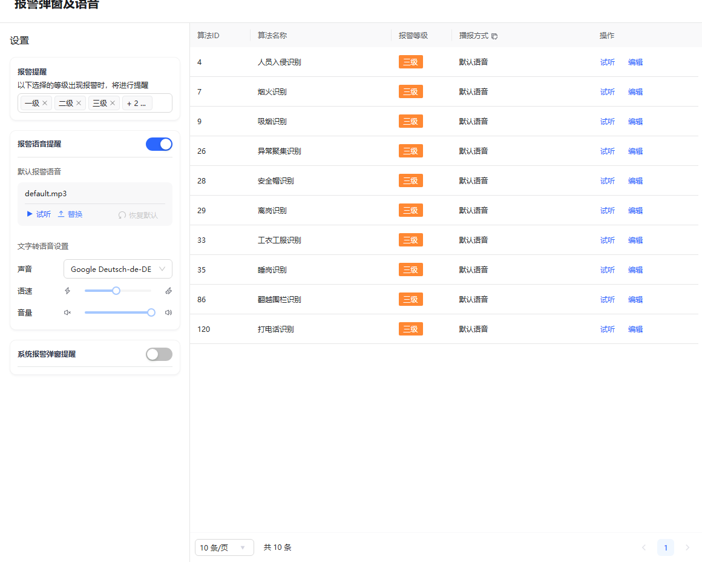 | 报警弹窗及语音 Tab_替换 | Tab/分段切换 已命中 | 切换 替换 后观察内容是否随 tab 独立变化。产品上 tab 应表达清晰的信息分组，并保留当前上下文，避免用户在配置任务时迷失。 |
|  | 报警弹窗及语音 Tab_恢复默认 | Tab/分段切换 已命中 | 切换 恢复默认 后观察内容是否随 tab 独立变化。产品上 tab 应表达清晰的信息分组，并保留当前上下文，避免用户在配置任务时迷失。 |
|  | 报警弹窗及语音 Tab_编辑 | 弹窗内切换 已命中 | 切换 编辑 后观察内容是否随 tab 独立变化。产品上 tab 应表达清晰的信息分组，并保留当前上下文，避免用户在配置任务时迷失。 |

### 报警推送创建 聚焦截图与设计说明

- 业务定位：报警推送创建弹窗把基础信息、场景选择、内容格式、存储/链接和预览串在一起，是报警事件进入外部系统前的最后一道配置。
- 产品设计思考：视频流分析场景与图片分析场景分开，有助于按任务类型控制推送范围；base64、对象存储、本地链接体现同一报警证据的多种交付方式。

| 截图 | 交互点 | 类型/命中状态 | 业务设计说明 |
| --- | --- | --- | --- |
| 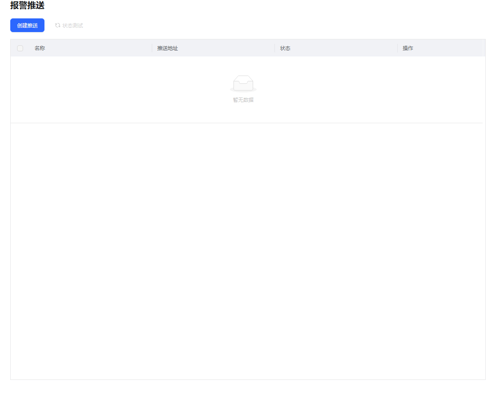 | 报警推送创建 打开前_创建推送 | 进入前状态 状态截图 | 进入前截图用于保留列表上下文，说明用户从哪个对象或主操作进入详情/弹窗。 |
|  | 报警推送创建 业务区域默认态 | 弹窗默认态 状态截图 | 默认态用于观察页面主对象、筛选区、表格/卡片区和主操作分布；本图已避开顶部公共工具区，适合分析模块自身差异。 |
|  | 报警推送创建 Tab_基础信息 | 弹窗内切换 已命中 | 切换 基础信息 后观察内容是否随 tab 独立变化。产品上 tab 应表达清晰的信息分组，并保留当前上下文，避免用户在配置任务时迷失。 |
| 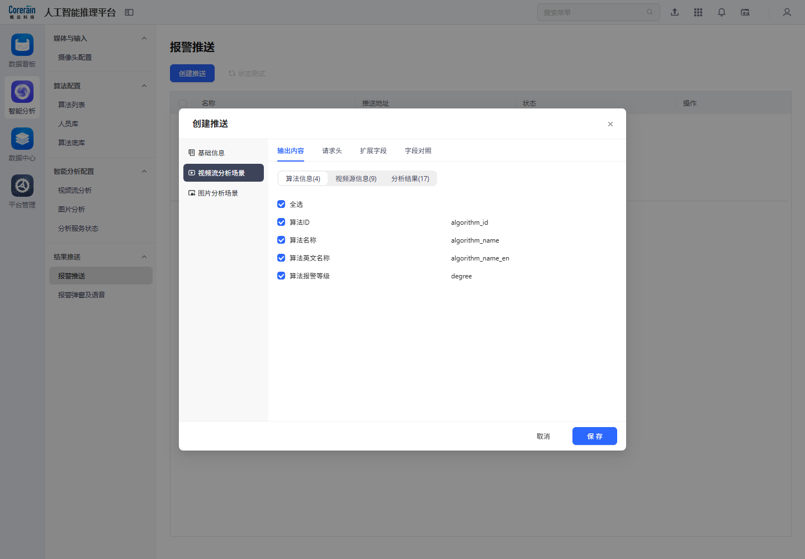 | 报警推送创建 Tab_视频流分析场景 | 弹窗内切换 已命中 | 切换 视频流分析场景 后观察内容是否随 tab 独立变化。产品上 tab 应表达清晰的信息分组，并保留当前上下文，避免用户在配置任务时迷失。 |
| 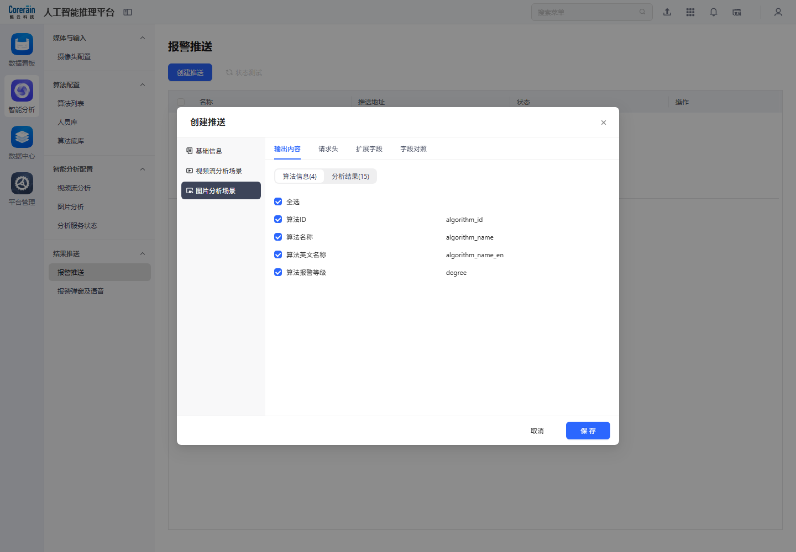 | 报警推送创建 Tab_图片分析场景 | 弹窗内切换 已命中 | 切换 图片分析场景 后观察内容是否随 tab 独立变化。产品上 tab 应表达清晰的信息分组，并保留当前上下文，避免用户在配置任务时迷失。 |
|  | 报警推送创建 Tab_base64 | 弹窗内切换 未稳定命中 | 切换 base64 后观察内容是否随 tab 独立变化。产品上 tab 应表达清晰的信息分组，并保留当前上下文，避免用户在配置任务时迷失。 |
|  | 报警推送创建 Tab_对象存储 | 弹窗内切换 未稳定命中 | 切换 对象存储 后观察内容是否随 tab 独立变化。产品上 tab 应表达清晰的信息分组，并保留当前上下文，避免用户在配置任务时迷失。 |
|  | 报警推送创建 Tab_本地链接 | 弹窗内切换 未稳定命中 | 切换 本地链接 后观察内容是否随 tab 独立变化。产品上 tab 应表达清晰的信息分组，并保留当前上下文，避免用户在配置任务时迷失。 |
|  | 报警推送创建 Tab_预览 | 弹窗内切换 未稳定命中 | 切换 预览 后观察内容是否随 tab 独立变化。产品上 tab 应表达清晰的信息分组，并保留当前上下文，避免用户在配置任务时迷失。 |
|  | 报警推送创建 Tab_编辑 | 弹窗内切换 未稳定命中 | 切换 编辑 后观察内容是否随 tab 独立变化。产品上 tab 应表达清晰的信息分组，并保留当前上下文，避免用户在配置任务时迷失。 |
| 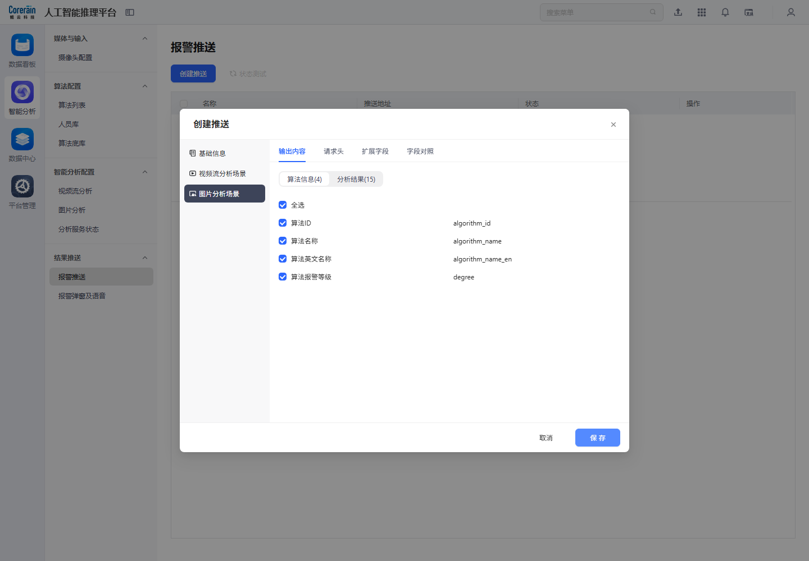 | 报警推送创建 操作_保存 | 安全定位 已命中 未执行最终提交 | 保存 可能产生保存、删除、安装、归档、主题切换或配置变更，本次只定位/悬停截图。产品设计上应提供权限控制、二次确认、影响范围说明和操作审计。 |
|  | 报警推送创建 操作_取消 | 业务操作 未稳定命中 | 取消 是该页面的业务动作入口。若打开弹窗/抽屉，应让用户在不离开当前列表的情况下完成配置；若只是状态按钮，应有明确反馈。 |

### 创建视频分析任务 聚焦截图与设计说明

- 业务定位：创建任务弹窗把“实时分析 / 轮巡分析”作为第一层选择，先确定任务运行模式，再进入摄像头、算法和任务参数配置。
- 产品设计思考：实时分析强调持续守护，轮巡分析强调资源复用；产品上应配套展示算力占用、轮巡周期、失败重试和任务启停策略。

| 截图 | 交互点 | 类型/命中状态 | 业务设计说明 |
| --- | --- | --- | --- |
| 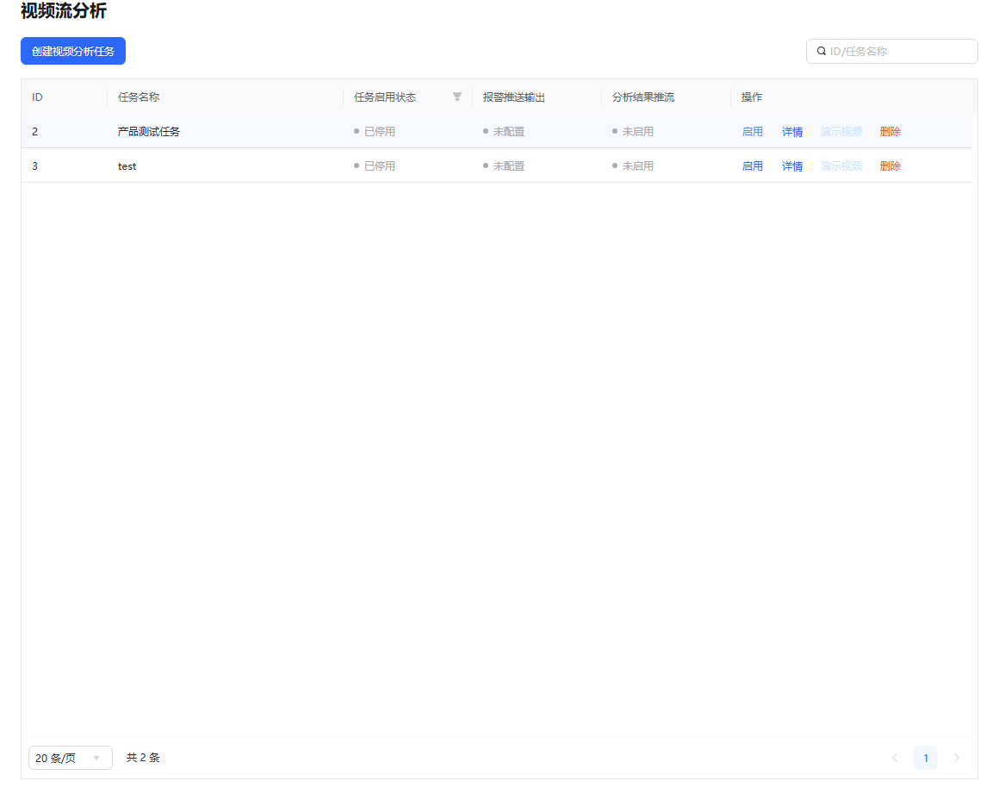 | 创建视频分析任务 打开前_创建视频分析任务 | 进入前状态 状态截图 | 进入前截图用于保留列表上下文，说明用户从哪个对象或主操作进入详情/弹窗。 |
| 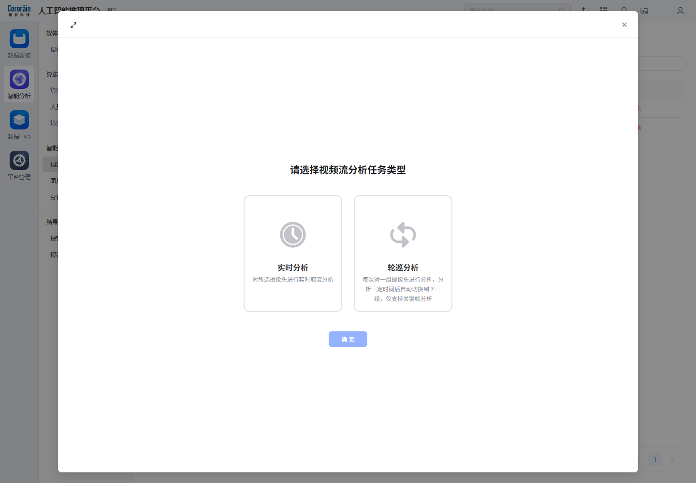 | 创建视频分析任务 业务区域默认态 | 弹窗默认态 状态截图 | 默认态用于观察页面主对象、筛选区、表格/卡片区和主操作分布；本图已避开顶部公共工具区，适合分析模块自身差异。 |
| 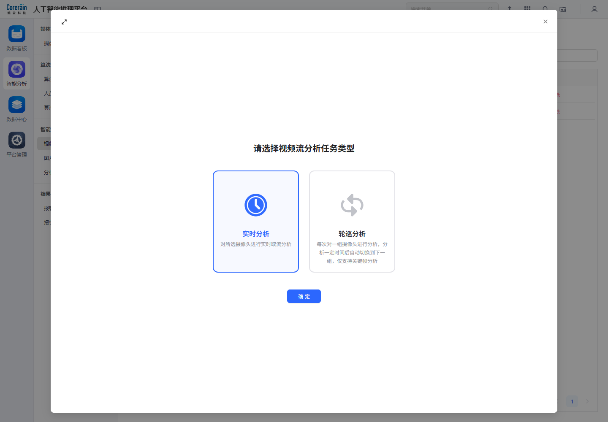 | 创建视频分析任务 Tab_实时分析 | 弹窗内切换 已命中 | 切换 实时分析 后观察内容是否随 tab 独立变化。产品上 tab 应表达清晰的信息分组，并保留当前上下文，避免用户在配置任务时迷失。 |
| 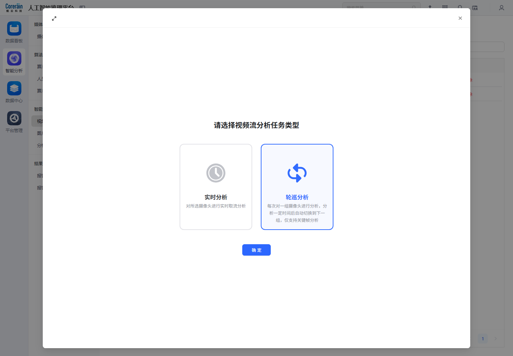 | 创建视频分析任务 Tab_轮巡分析 | 弹窗内切换 已命中 | 切换 轮巡分析 后观察内容是否随 tab 独立变化。产品上 tab 应表达清晰的信息分组，并保留当前上下文，避免用户在配置任务时迷失。 |
|  | 创建视频分析任务 操作_保存 | 安全定位 未稳定命中 未执行最终提交 | 保存 可能产生保存、删除、安装、归档、主题切换或配置变更，本次只定位/悬停截图。产品设计上应提供权限控制、二次确认、影响范围说明和操作审计。 |
| 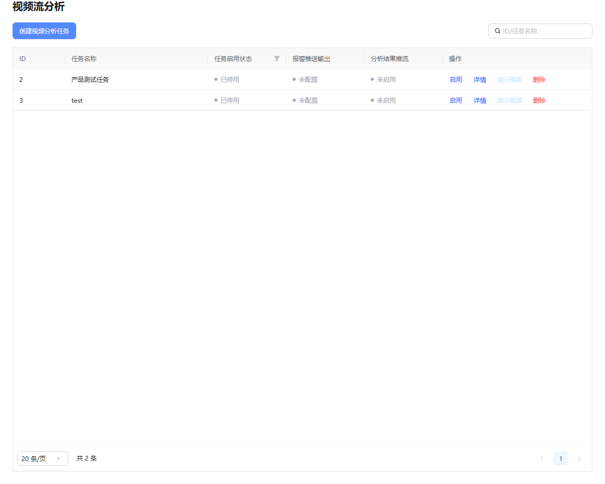 | 创建视频分析任务 操作_取消 | 业务操作 未稳定命中 | 取消 是该页面的业务动作入口。若打开弹窗/抽屉，应让用户在不离开当前列表的情况下完成配置；若只是状态按钮，应有明确反馈。 |

### 视频流分析详情 聚焦截图与设计说明

- 业务定位：视频流分析详情采用步骤式 tab：先选择摄像头与算法，再配置任务，最后查看报警，符合实时分析任务的创建与运维顺序。
- 产品设计思考：详情页把输入、规则和结果放在一个弹窗/抽屉内，适合运营人员快速复核任务配置；建议从查看报警直接跳转到数据中心过滤后的报警日志。

| 截图 | 交互点 | 类型/命中状态 | 业务设计说明 |
| --- | --- | --- | --- |
| 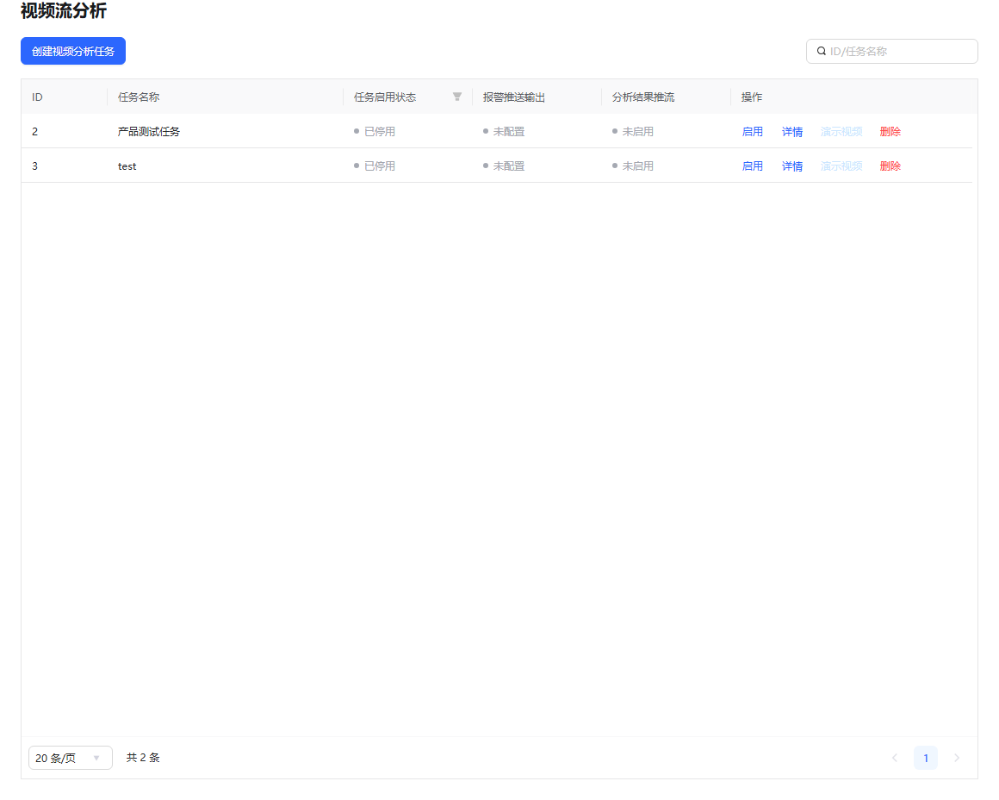 | 视频流分析详情 进入前_详情 | 进入前状态 状态截图 | 进入前截图用于保留列表上下文，说明用户从哪个对象或主操作进入详情/弹窗。 |
|  | 视频流分析详情 业务区域默认态 | 弹窗默认态 状态截图 | 默认态用于观察页面主对象、筛选区、表格/卡片区和主操作分布；本图已避开顶部公共工具区，适合分析模块自身差异。 |
| 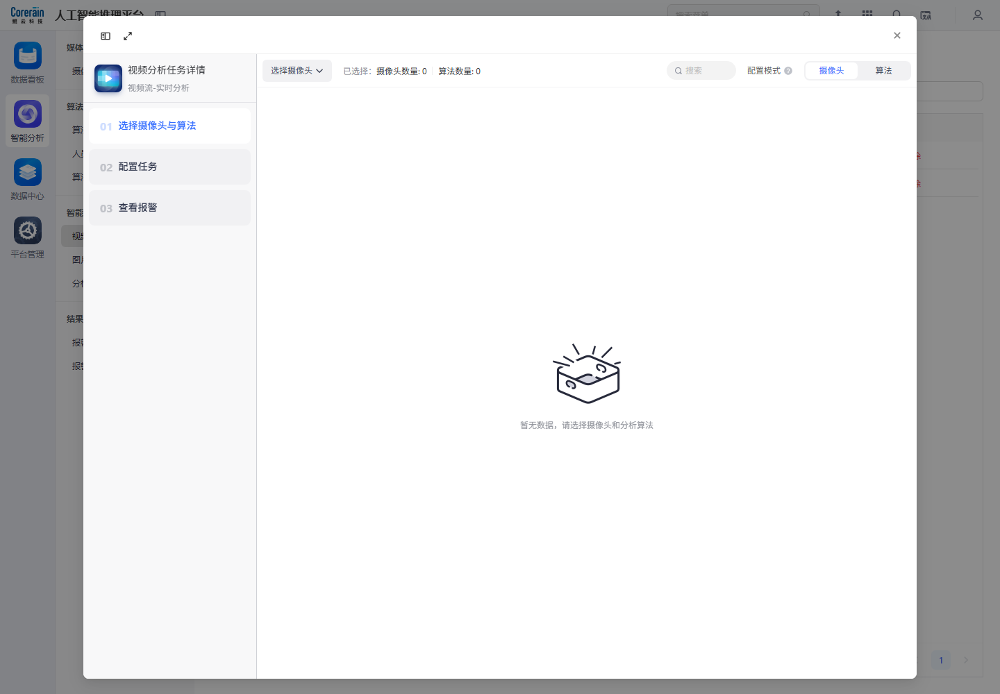 | 视频流分析详情 Tab_选择摄像头与算法 | 弹窗内切换 已命中 | 切换 选择摄像头与算法 后观察内容是否随 tab 独立变化。产品上 tab 应表达清晰的信息分组，并保留当前上下文，避免用户在配置任务时迷失。 |
| 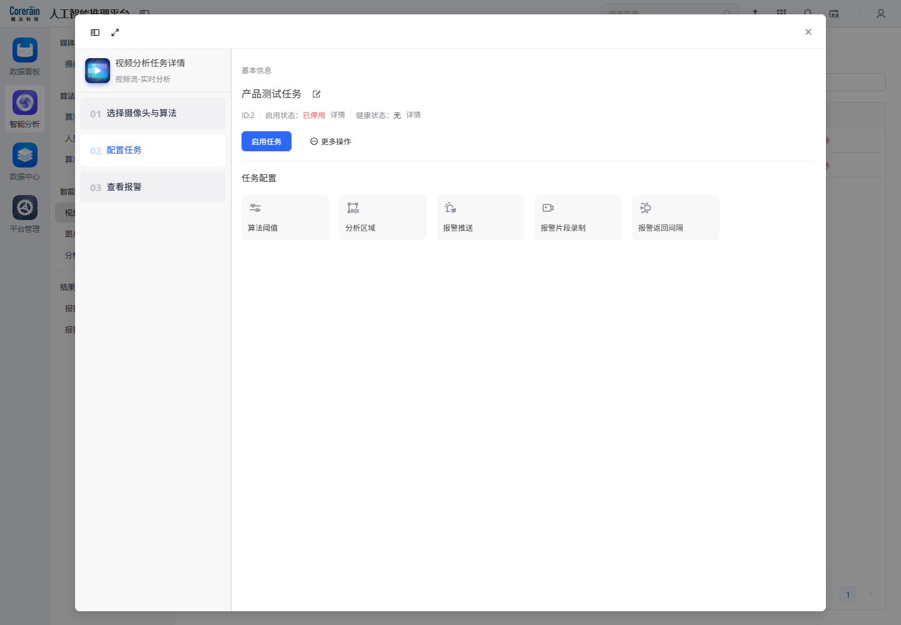 | 视频流分析详情 Tab_配置任务 | 弹窗内切换 已命中 | 切换 配置任务 后观察内容是否随 tab 独立变化。产品上 tab 应表达清晰的信息分组，并保留当前上下文，避免用户在配置任务时迷失。 |
|  | 视频流分析详情 Tab_查看报警 | 弹窗内切换 已命中 | 切换 查看报警 后观察内容是否随 tab 独立变化。产品上 tab 应表达清晰的信息分组，并保留当前上下文，避免用户在配置任务时迷失。 |
| 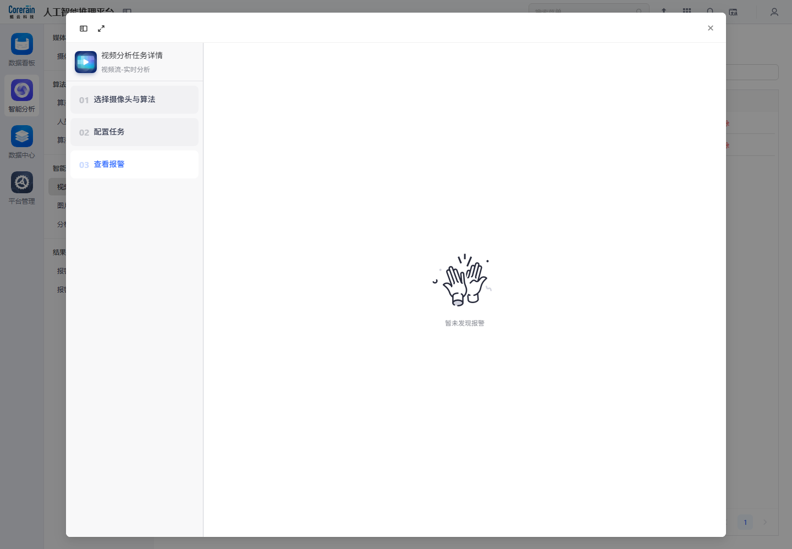 | 视频流分析详情 操作_启用 | 弹窗操作 已命中 | 启用 是该页面的业务动作入口。若打开弹窗/抽屉，应让用户在不离开当前列表的情况下完成配置；若只是状态按钮，应有明确反馈。 |

### 算法详情-人员入侵识别 聚焦截图与设计说明

- 业务定位：算法详情页把一个算法拆成基础信息、阈值策略、绘制对象和默认样式四类配置，是算法从“可安装能力”转成“可业务化使用能力”的关键页。
- 产品设计思考：算法信息页用高精度、均衡、高检出三种模式降低阈值配置门槛，同时保留更多阈值给专家调参；绘制对象管理把检测类别、颜色和是否绘制表格化；默认绘制样式用实时预览降低配置风险。

| 截图 | 交互点 | 类型/命中状态 | 业务设计说明 |
| --- | --- | --- | --- |
| 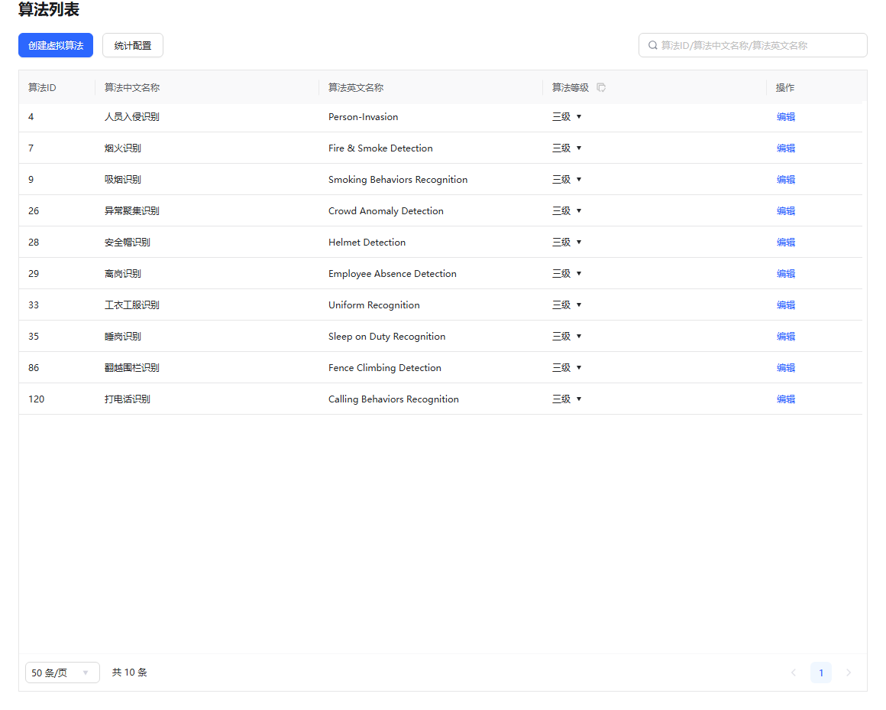 | 算法详情-人员入侵识别 进入前_编辑 | 进入前状态 状态截图 | 进入前截图用于保留列表上下文，说明用户从哪个对象或主操作进入详情/弹窗。 |
|  | 算法详情-人员入侵识别 业务区域默认态 | 业务区默认态 状态截图 | 默认态用于观察页面主对象、筛选区、表格/卡片区和主操作分布；本图已避开顶部公共工具区，适合分析模块自身差异。 |
|  | 算法详情-人员入侵识别 Tab_算法信息 | Tab/分段切换 已命中 | 切换 算法信息 后观察内容是否随 tab 独立变化。产品上 tab 应表达清晰的信息分组，并保留当前上下文，避免用户在配置任务时迷失。 |
|  | 算法详情-人员入侵识别 Tab_算法信息_操作_高精度 | Tab/分段切换 已命中 | 切换 算法信息_操作_高精度 后观察内容是否随 tab 独立变化。产品上 tab 应表达清晰的信息分组，并保留当前上下文，避免用户在配置任务时迷失。 |
| 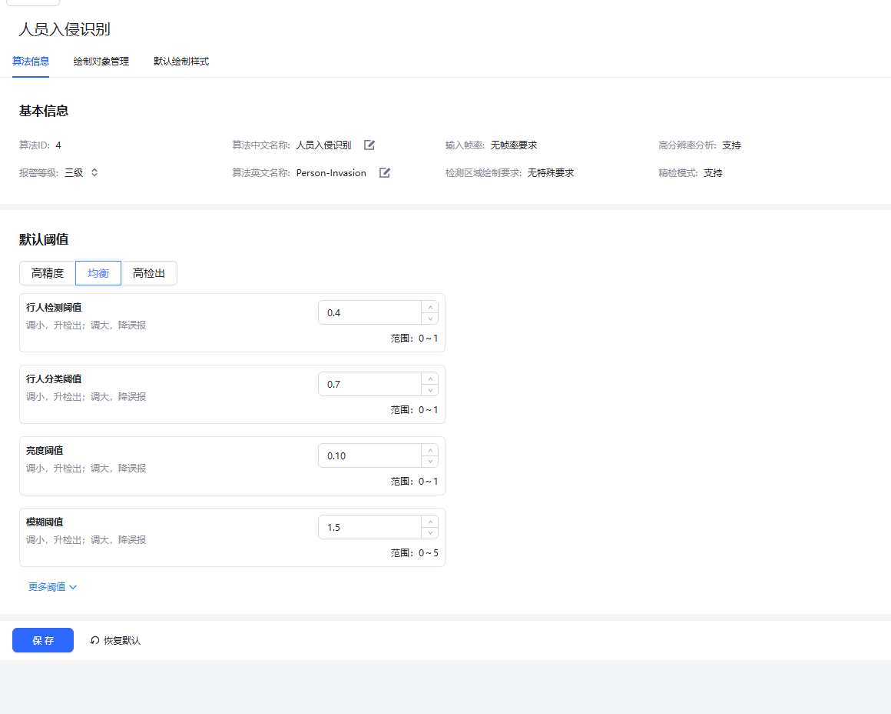 | 算法详情-人员入侵识别 Tab_算法信息_操作_均衡 | Tab/分段切换 已命中 | 切换 算法信息_操作_均衡 后观察内容是否随 tab 独立变化。产品上 tab 应表达清晰的信息分组，并保留当前上下文，避免用户在配置任务时迷失。 |
| 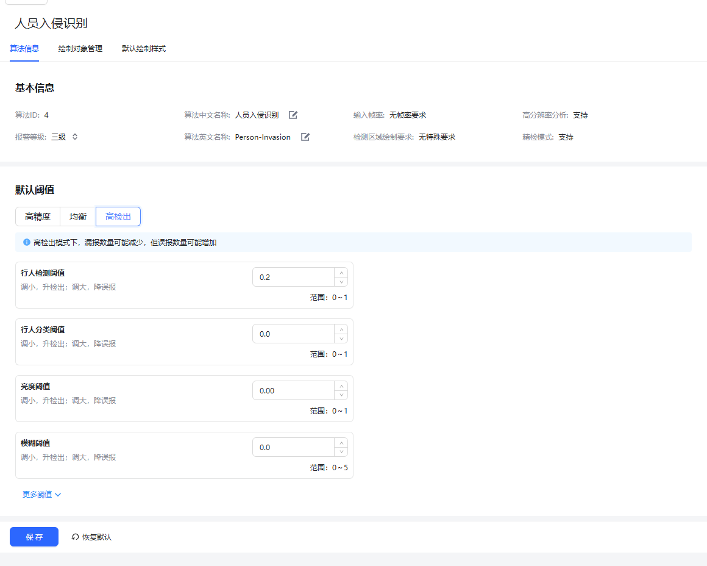 | 算法详情-人员入侵识别 Tab_算法信息_操作_高检出 | Tab/分段切换 已命中 | 切换 算法信息_操作_高检出 后观察内容是否随 tab 独立变化。产品上 tab 应表达清晰的信息分组，并保留当前上下文，避免用户在配置任务时迷失。 |
| 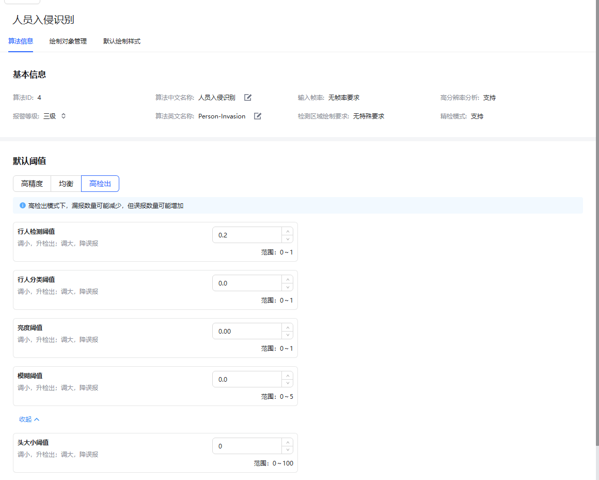 | 算法详情-人员入侵识别 Tab_算法信息_操作_更多阈值 | Tab/分段切换 已命中 | 切换 算法信息_操作_更多阈值 后观察内容是否随 tab 独立变化。产品上 tab 应表达清晰的信息分组，并保留当前上下文，避免用户在配置任务时迷失。 |
| 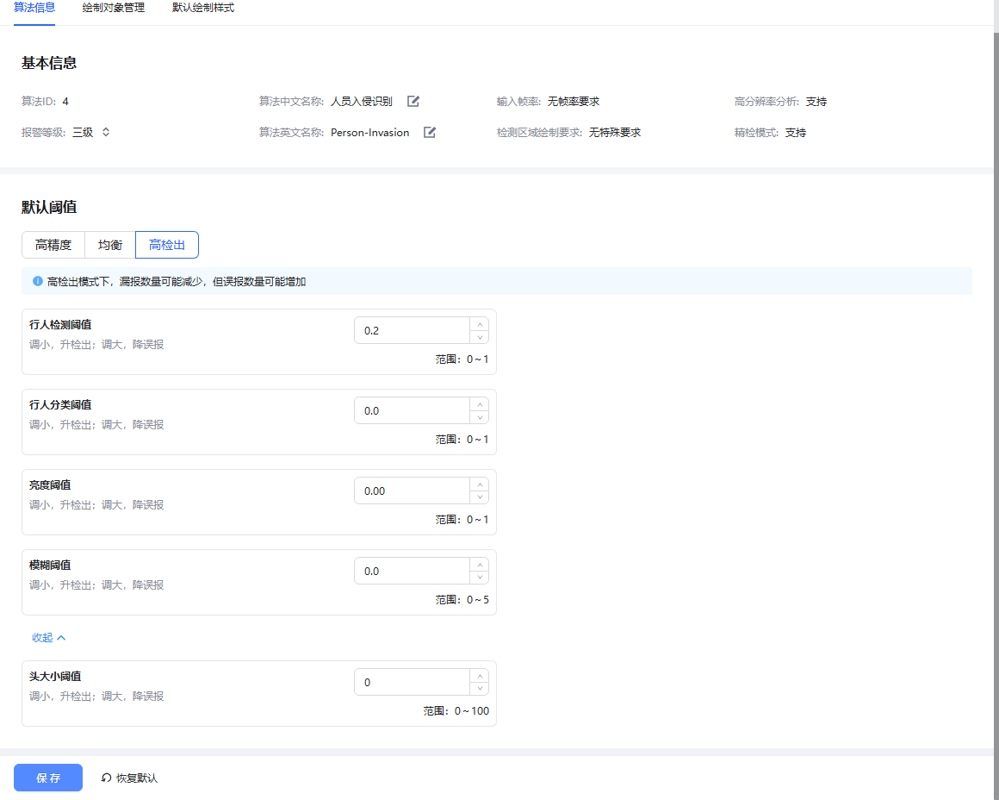 | 算法详情-人员入侵识别 Tab_算法信息_操作_保存 | 安全定位 已命中 未执行最终提交 | 算法信息_操作_保存 可能产生保存、删除、安装、归档、主题切换或配置变更，本次只定位/悬停截图。产品设计上应提供权限控制、二次确认、影响范围说明和操作审计。 |
| 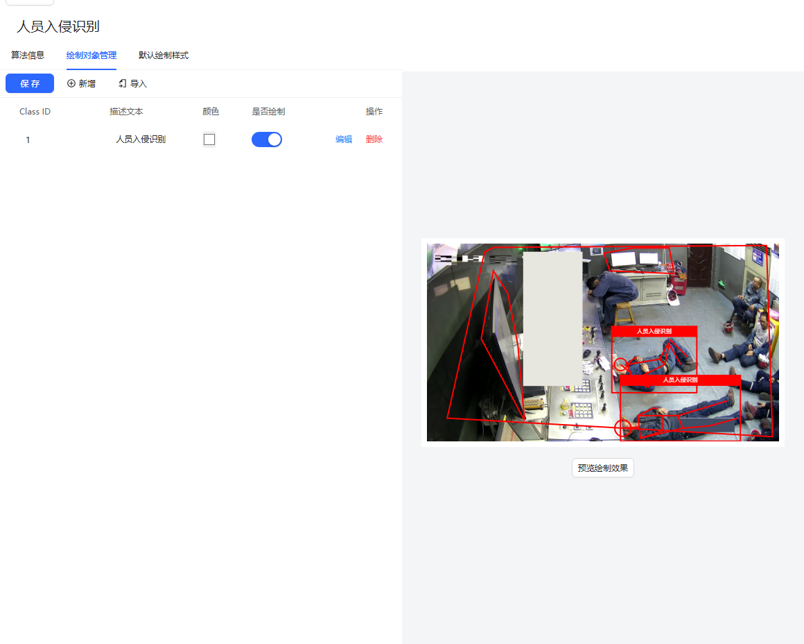 | 算法详情-人员入侵识别 Tab_绘制对象管理 | Tab/分段切换 已命中 | 切换 绘制对象管理 后观察内容是否随 tab 独立变化。产品上 tab 应表达清晰的信息分组，并保留当前上下文，避免用户在配置任务时迷失。 |
|  | 算法详情-人员入侵识别 Tab_绘制对象管理_操作_新增 | Tab/分段切换 已命中 | 切换 绘制对象管理_操作_新增 后观察内容是否随 tab 独立变化。产品上 tab 应表达清晰的信息分组，并保留当前上下文，避免用户在配置任务时迷失。 |
| 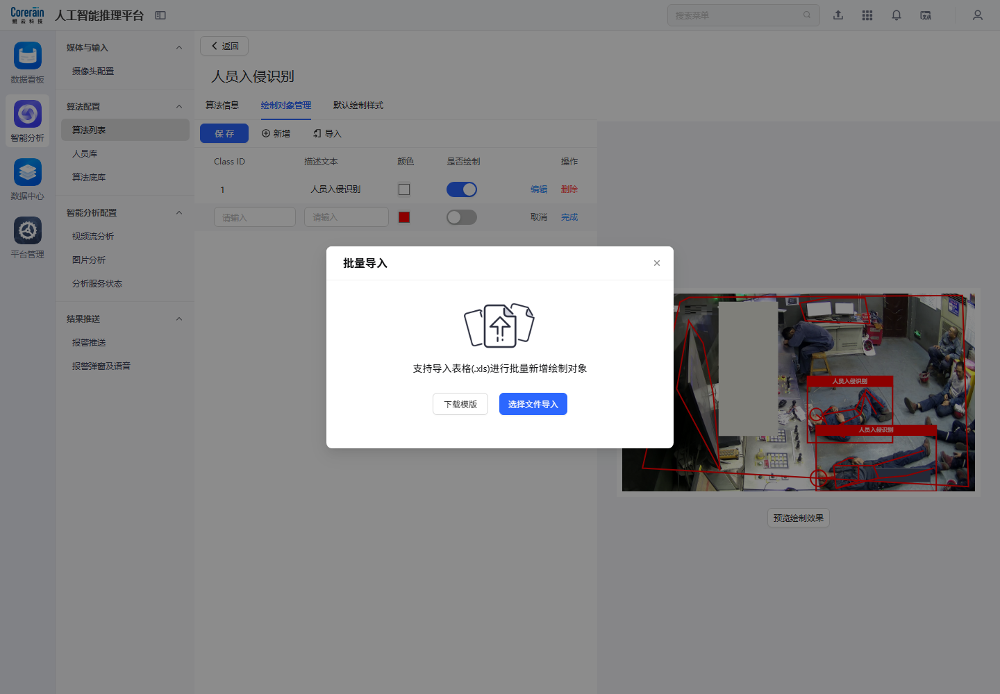 | 算法详情-人员入侵识别 Tab_绘制对象管理_操作_导入 | 弹窗内切换 已命中 | 切换 绘制对象管理_操作_导入 后观察内容是否随 tab 独立变化。产品上 tab 应表达清晰的信息分组，并保留当前上下文，避免用户在配置任务时迷失。 |
| 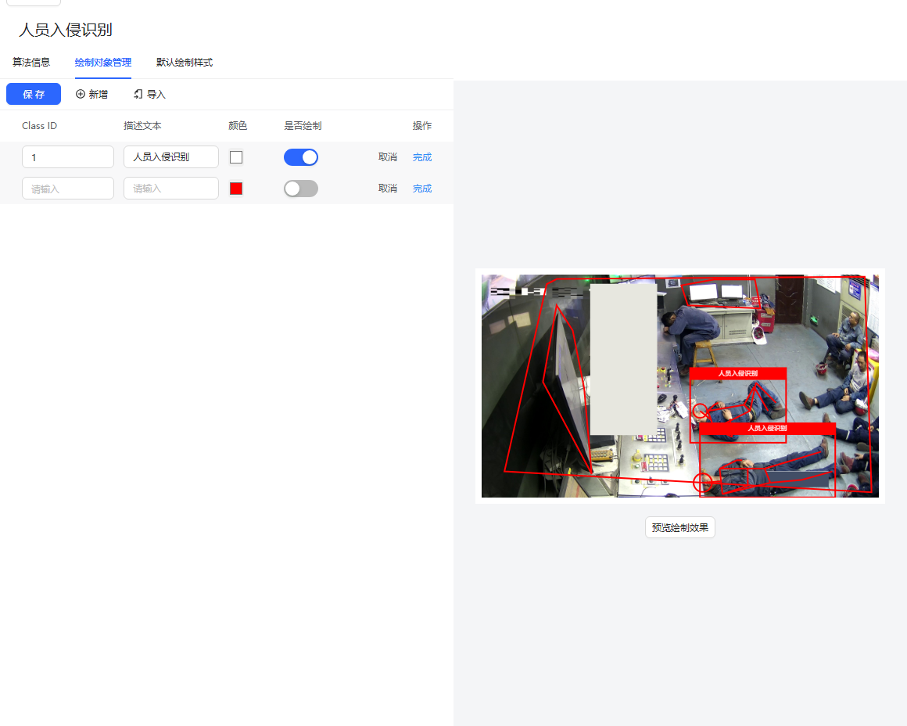 | 算法详情-人员入侵识别 Tab_绘制对象管理_操作_编辑 | Tab/分段切换 已命中 | 切换 绘制对象管理_操作_编辑 后观察内容是否随 tab 独立变化。产品上 tab 应表达清晰的信息分组，并保留当前上下文，避免用户在配置任务时迷失。 |
|  | 算法详情-人员入侵识别 Tab_绘制对象管理_操作_删除 | 安全定位 未稳定命中 未执行最终提交 | 绘制对象管理_操作_删除 可能产生保存、删除、安装、归档、主题切换或配置变更，本次只定位/悬停截图。产品设计上应提供权限控制、二次确认、影响范围说明和操作审计。 |
| 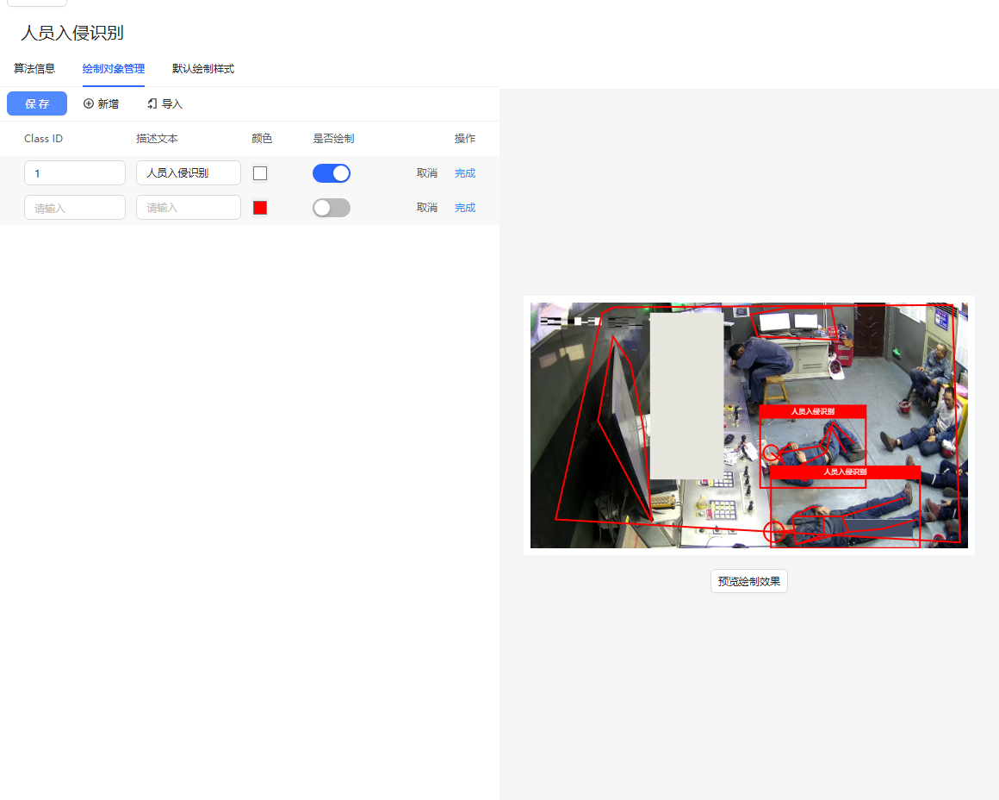 | 算法详情-人员入侵识别 Tab_绘制对象管理_操作_保存 | 安全定位 已命中 未执行最终提交 | 绘制对象管理_操作_保存 可能产生保存、删除、安装、归档、主题切换或配置变更，本次只定位/悬停截图。产品设计上应提供权限控制、二次确认、影响范围说明和操作审计。 |
|  | 算法详情-人员入侵识别 Tab_默认绘制样式 | Tab/分段切换 已命中 | 切换 默认绘制样式 后观察内容是否随 tab 独立变化。产品上 tab 应表达清晰的信息分组，并保留当前上下文，避免用户在配置任务时迷失。 |
| 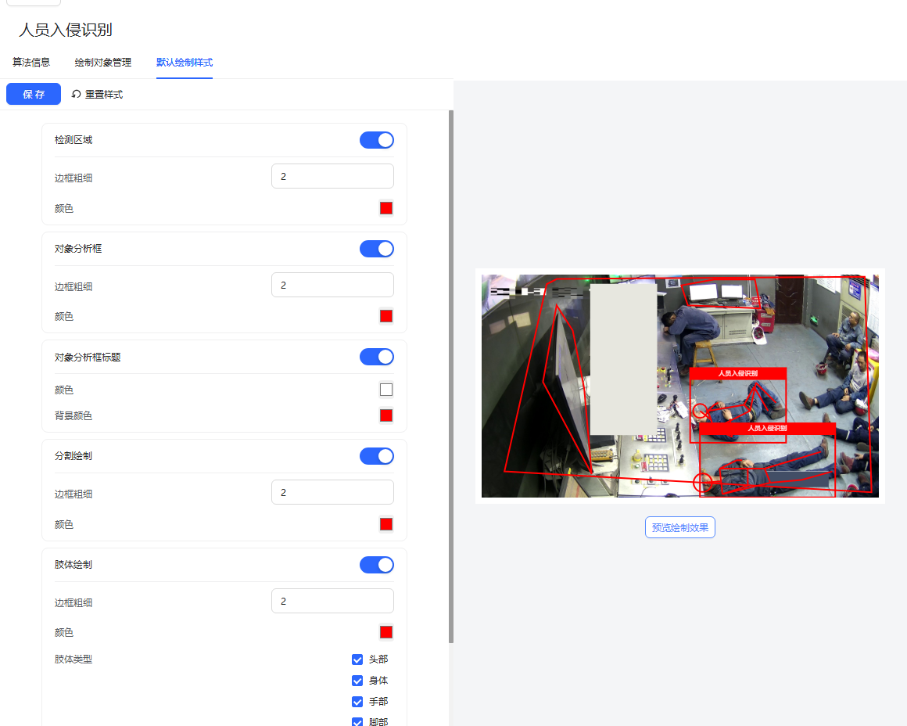 | 算法详情-人员入侵识别 Tab_默认绘制样式_操作_预览绘制效果 | Tab/分段切换 已命中 | 切换 默认绘制样式_操作_预览绘制效果 后观察内容是否随 tab 独立变化。产品上 tab 应表达清晰的信息分组，并保留当前上下文，避免用户在配置任务时迷失。 |
| 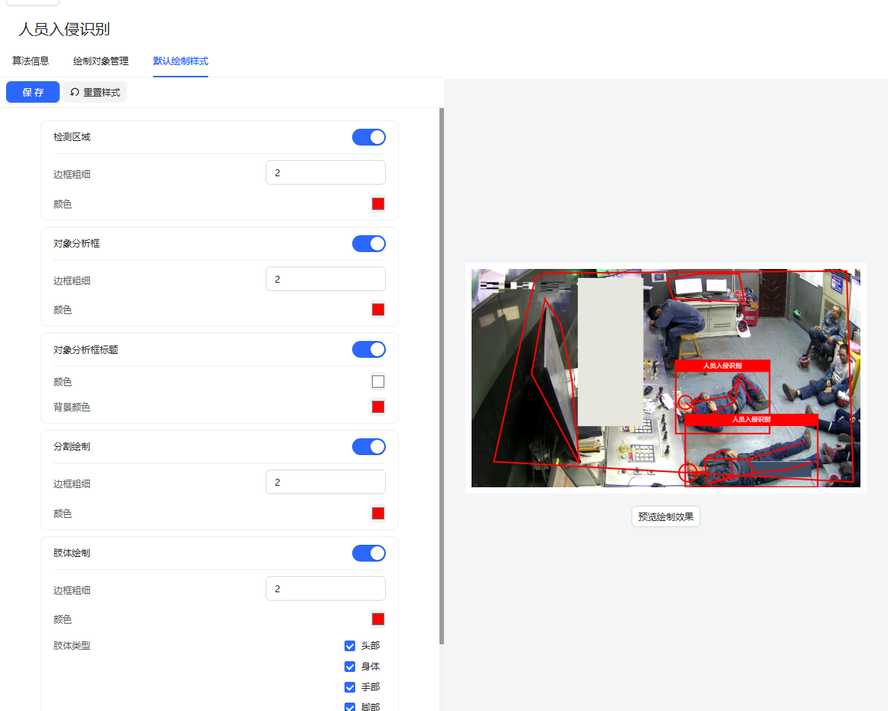 | 算法详情-人员入侵识别 Tab_默认绘制样式_操作_重置样式 | Tab/分段切换 已命中 | 切换 默认绘制样式_操作_重置样式 后观察内容是否随 tab 独立变化。产品上 tab 应表达清晰的信息分组，并保留当前上下文，避免用户在配置任务时迷失。 |
| 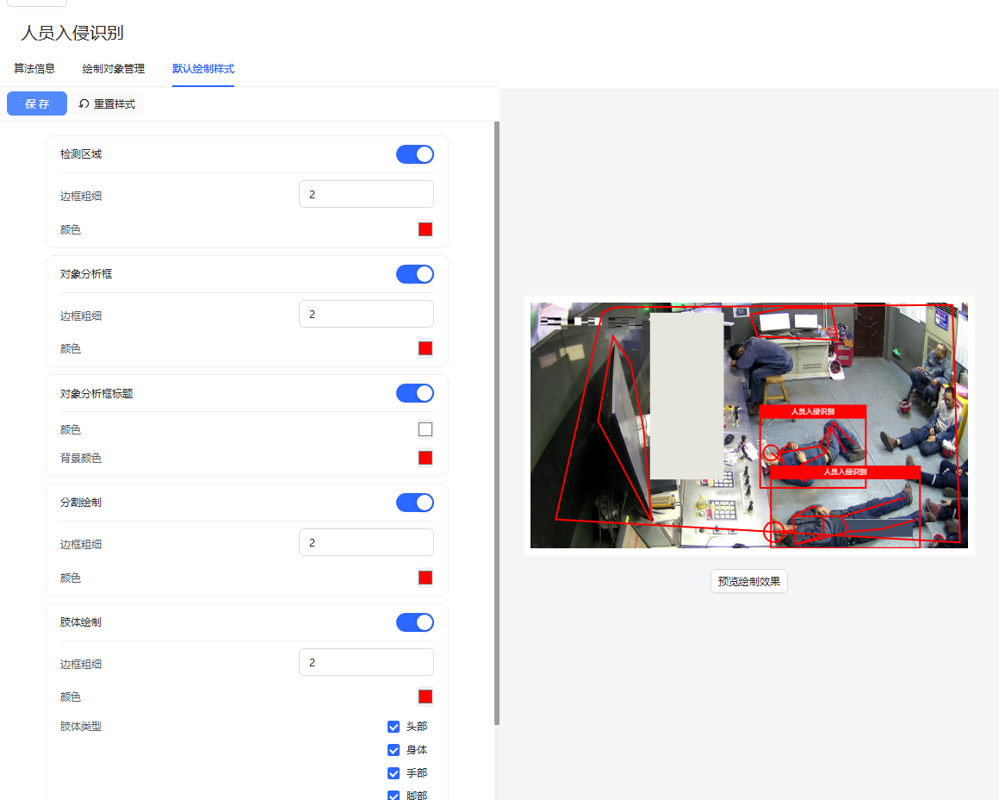 | 算法详情-人员入侵识别 Tab_默认绘制样式_操作_保存 | 安全定位 已命中 未执行最终提交 | 默认绘制样式_操作_保存 可能产生保存、删除、安装、归档、主题切换或配置变更，本次只定位/悬停截图。产品设计上应提供权限控制、二次确认、影响范围说明和操作审计。 |

### 图片分析详情 聚焦截图与设计说明

- 业务定位：图片分析详情与视频分析类似，也按配置算法、配置任务、查看报警组织，但输入形态从视频流变成图片任务。
- 产品设计思考：该设计保持任务模型一致，利于用户迁移理解；建议补充图片来源、批量上传、分析结果保留周期和失败重跑机制。

| 截图 | 交互点 | 类型/命中状态 | 业务设计说明 |
| --- | --- | --- | --- |
| 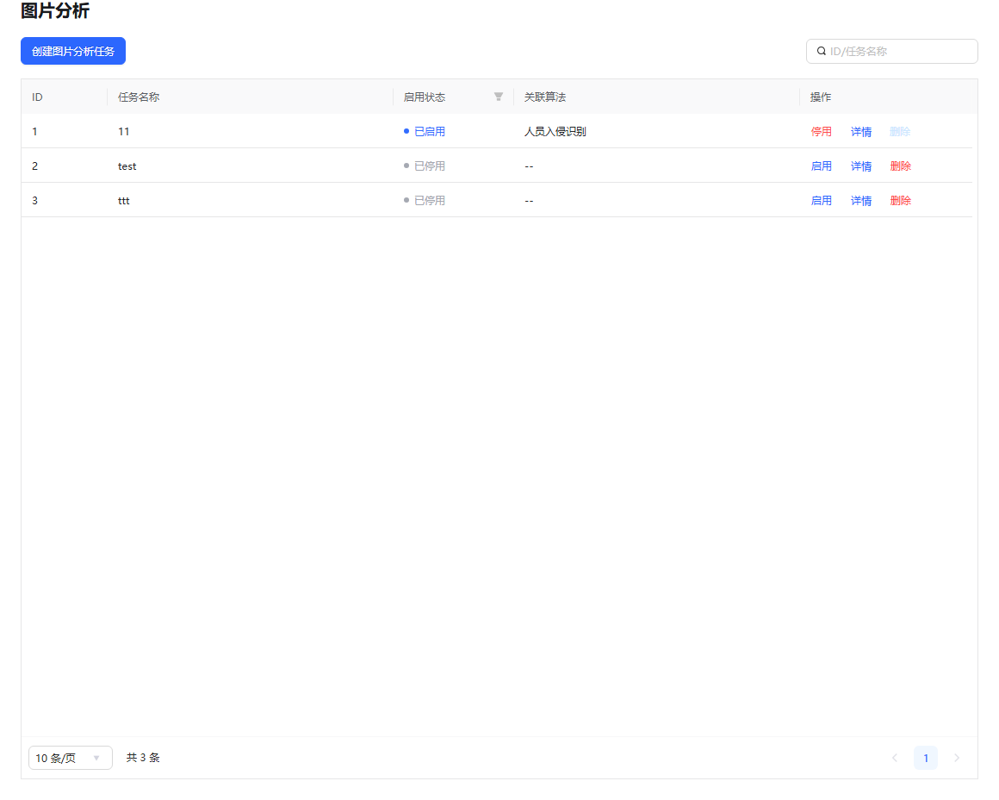 | 图片分析详情 进入前_详情 | 进入前状态 状态截图 | 进入前截图用于保留列表上下文，说明用户从哪个对象或主操作进入详情/弹窗。 |
|  | 图片分析详情 业务区域默认态 | 弹窗默认态 状态截图 | 默认态用于观察页面主对象、筛选区、表格/卡片区和主操作分布；本图已避开顶部公共工具区，适合分析模块自身差异。 |
| 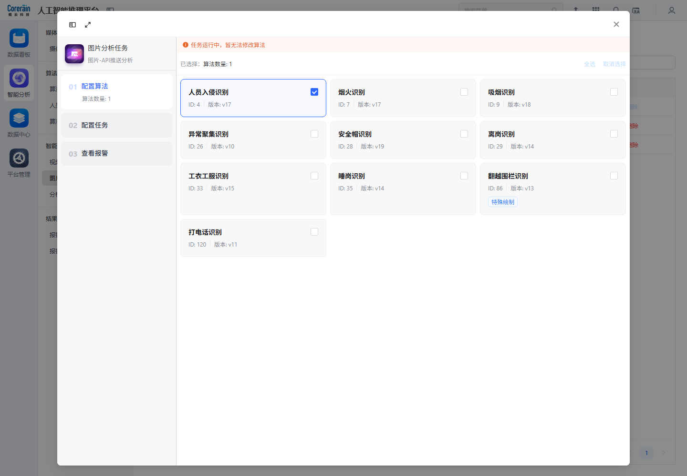 | 图片分析详情 Tab_配置算法 | 弹窗内切换 已命中 | 切换 配置算法 后观察内容是否随 tab 独立变化。产品上 tab 应表达清晰的信息分组，并保留当前上下文，避免用户在配置任务时迷失。 |
| 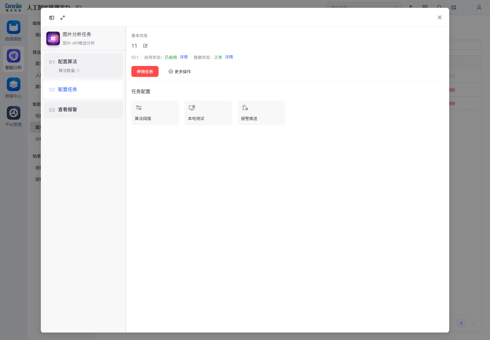 | 图片分析详情 Tab_配置任务 | 弹窗内切换 已命中 | 切换 配置任务 后观察内容是否随 tab 独立变化。产品上 tab 应表达清晰的信息分组，并保留当前上下文，避免用户在配置任务时迷失。 |
| 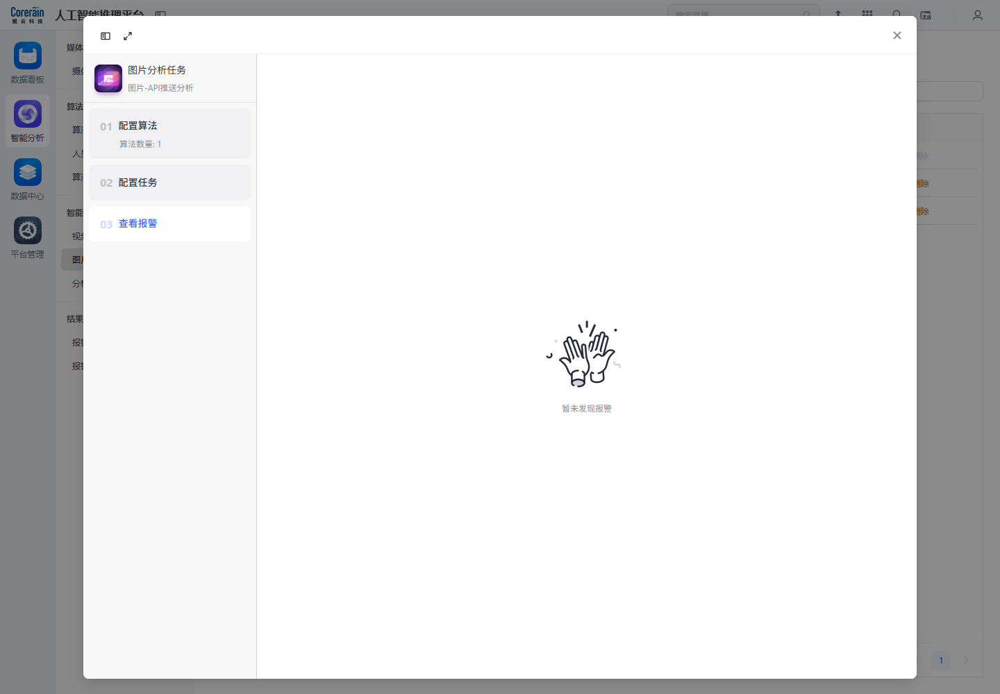 | 图片分析详情 Tab_查看报警 | 弹窗内切换 已命中 | 切换 查看报警 后观察内容是否随 tab 独立变化。产品上 tab 应表达清晰的信息分组，并保留当前上下文，避免用户在配置任务时迷失。 |

<!-- FOCUSED_SUPPLEMENT_END -->

## 摄像头配置

- 定位：智能分析链路的输入源管理页，决定系统“看哪里、看什么流”。
- 核心对象：摄像头、视频源、分组、流地址、连接状态、预览图。
- 页面 URL：http://192.168.11.88:8081/app/main-app/dispatch/media-input/video-input/#/basic-services/device-service/monitor-point
- 主要控件：搜索菜单、视频源管理、分组名称、新增摄像头、刷新、移动、抓图、导入、导出、删除、名称/流地址
- 表格字段：预览图、ID、名称、连接状态、流地址、操作

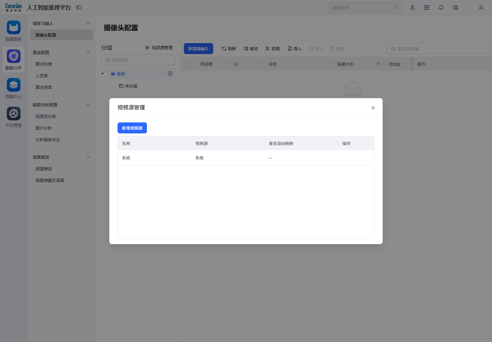

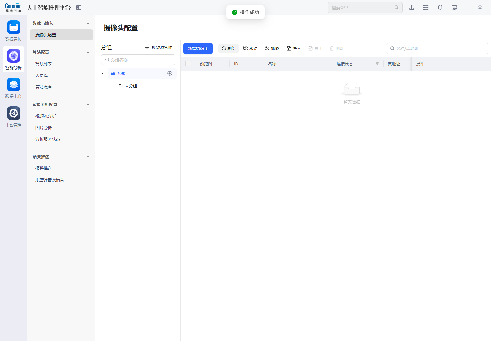

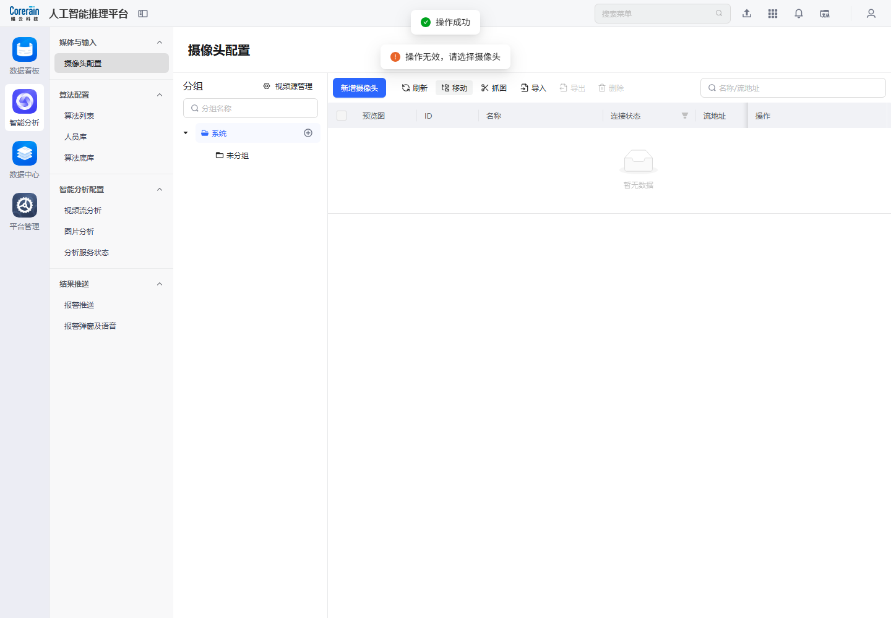

### 产品设计解读

- 新增、导入、导出、抓图、移动、删除覆盖了视频源的全生命周期；批量抓图和预览图用于验证流可用性。
- 页面内容摘要：人工智能推理平台 搜索菜单 数据看板 智能分析 数据中心 平台管理 媒体与输入 摄像头配置 算法配置 算法列表 人员库 算法底库 智能分析配置 视频流分析 图片分析 分析服务状态 结果推送 报警推送 报警弹窗及语音 摄像头配置 分组 视频源管理 系统 未分组 新增摄像头 刷新 移动 抓图 导入 导出 删除 预览图 ID 名称 连接状态 流地址 操作 暂无数据
- 建议增加连接诊断、RTSP 连通性、延迟、帧率、解码状态，让用户在新增时就能完成质量校验。

### 摄像头配置按钮、弹窗与状态截图明细

| 截图 | 子模块/动作 | 类型与页面反馈 | 产品设计说明 |
| --- | --- | --- | --- |
|  | 摄像头配置 页面全貌 | overview 进入子模块后的页面全貌，用于识别信息架构、主操作区、筛选区和表格/卡片区。 | 页面全貌用于判断信息架构：左侧导航负责定位，主区承载筛选、操作、表格或卡片，适合作为子模块设计基线。 |
|  | 摄像头配置 滚动位置_0% | scroll 记录页面不同滚动位置，补足表格、卡片和底部状态。 | 滚动截图用于确认页面内容密度、底部表格/分页/卡片布局，避免只看首屏导致遗漏。 |
| 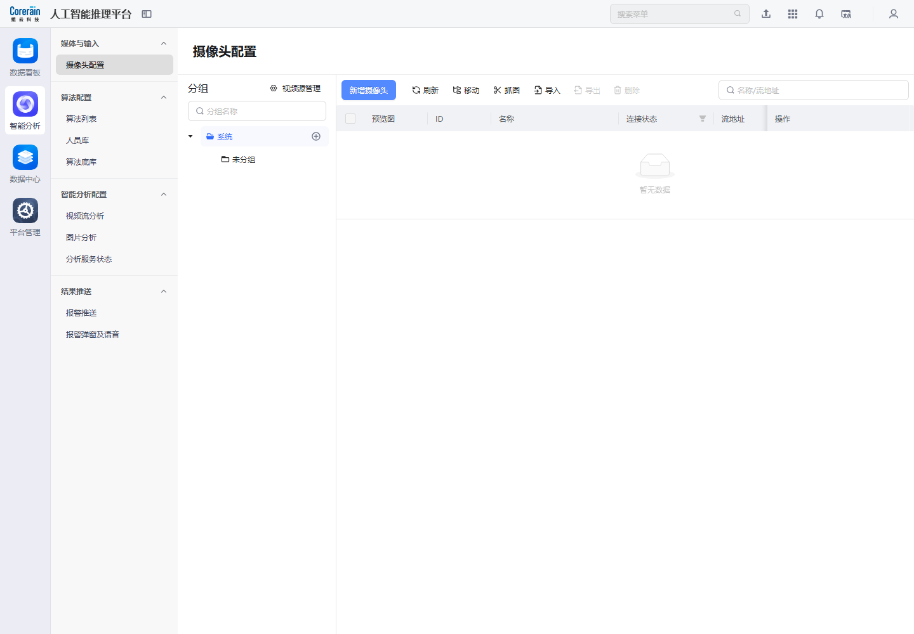 | 摄像头配置 01_新增摄像头_悬停 | hover 悬停查看 新增摄像头 的 hover/提示状态 | 悬停 新增摄像头，观察按钮可点击性、危险操作样式、行操作显隐和 hover 反馈；这是判断操作优先级的重要细节。 |
|  | 摄像头配置 01_新增摄像头_点击后 | click 点击后出现弹窗/下拉/提示：.custom-light-modal、[role="dialog"] | 点击 新增摄像头 后进入弹窗/抽屉式流程。弹窗内容：添加摄像头 名称 选择分组 请选择 GPS 信息 设备类型 实时视频 实时视频 原始流地址 一键生成 快速填写 海康 大华 其他 预览图 上传图片 获取抓图 取消 保 存。设计上把复杂创建、导入、配置或密码类操作隔离在临时层，既保留当前列表上下文，也降低页面跳转成本。 |
|  | 摄像头配置 02_视频源管理_悬停 | hover 悬停查看 视频源管理 的 hover/提示状态 | 悬停 视频源管理，观察按钮可点击性、危险操作样式、行操作显隐和 hover 反馈；这是判断操作优先级的重要细节。 |
|  | 摄像头配置 02_视频源管理_点击后 | click 点击后出现弹窗/下拉/提示：.custom-light-modal、[role="dialog"] | 点击 视频源管理 后进入弹窗/抽屉式流程。弹窗内容：视频源管理 新增视频源 名称 视频源 是否自动刷新 操作 系统 系统 --。设计上把复杂创建、导入、配置或密码类操作隔离在临时层，既保留当前列表上下文，也降低页面跳转成本。 |
|  | 摄像头配置 03_刷新_悬停 | hover 悬停查看 刷新 的 hover/提示状态 | 悬停 刷新，观察按钮可点击性、危险操作样式、行操作显隐和 hover 反馈；这是判断操作优先级的重要细节。 |
|  | 摄像头配置 03_刷新_点击后 | click 点击后出现弹窗/下拉/提示：.custom-light-message | 点击 刷新 后出现消息反馈。反馈内容：操作成功。该设计把空选择、无效操作、成功结果即时告知用户，是批量操作和空数据场景的必要兜底。 |
|  | 摄像头配置 04_移动_悬停 | hover 悬停查看 移动 的 hover/提示状态 | 悬停 移动，观察按钮可点击性、危险操作样式、行操作显隐和 hover 反馈；这是判断操作优先级的重要细节。 |
|  | 摄像头配置 04_移动_点击后 | click 点击后出现弹窗/下拉/提示：.custom-light-message | 点击 移动 后出现消息反馈。反馈内容：操作成功 操作无效，请选择摄像头。该设计把空选择、无效操作、成功结果即时告知用户，是批量操作和空数据场景的必要兜底。 |
| 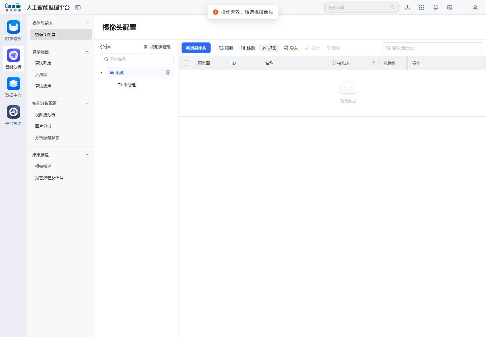 | 摄像头配置 05_抓图_悬停 | hover 悬停查看 抓图 的 hover/提示状态 | 悬停 抓图，观察按钮可点击性、危险操作样式、行操作显隐和 hover 反馈；这是判断操作优先级的重要细节。 |
| 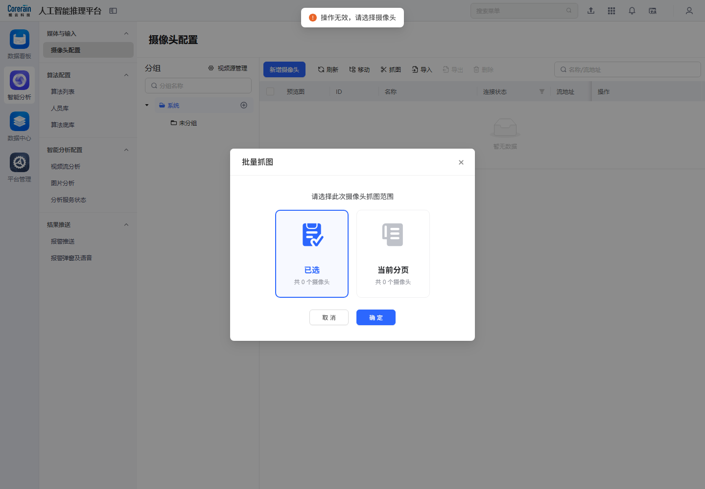 | 摄像头配置 05_抓图_点击后 | click 点击后出现弹窗/下拉/提示：.custom-light-modal、[role="dialog"]、.custom-light-message | 点击 抓图 后进入弹窗/抽屉式流程。弹窗内容：批量抓图 请选择此次摄像头抓图范围 已选 共 0 个摄像头 当前分页 共 0 个摄像头 取 消 确 定；操作无效，请选择摄像头。设计上把复杂创建、导入、配置或密码类操作隔离在临时层，既保留当前列表上下文，也降低页面跳转成本。 |
|  | 摄像头配置 06_导入_悬停 | hover 悬停查看 导入 的 hover/提示状态 | 悬停 导入，观察按钮可点击性、危险操作样式、行操作显隐和 hover 反馈；这是判断操作优先级的重要细节。 |
| 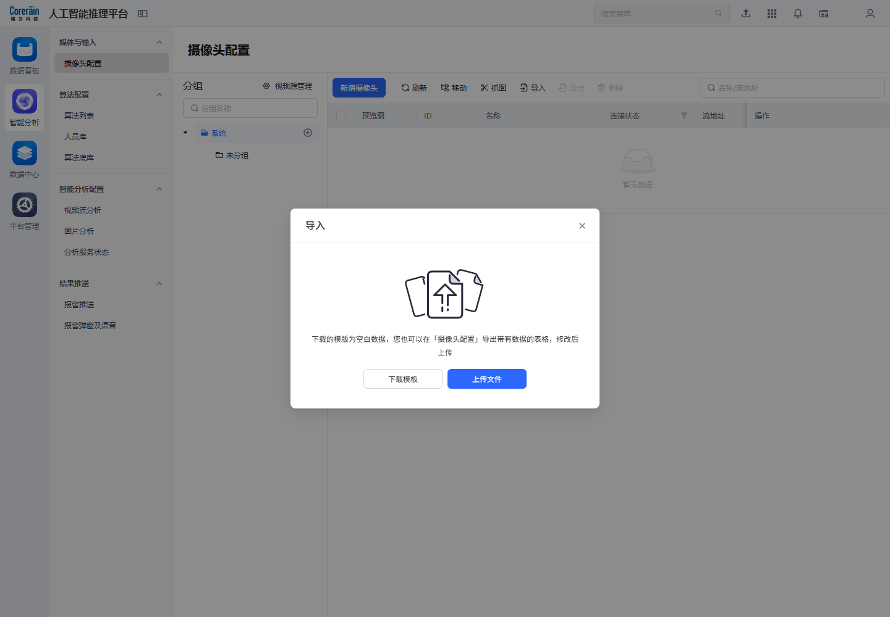 | 摄像头配置 06_导入_点击后 | click 点击后出现弹窗/下拉/提示：.custom-light-modal、[role="dialog"] | 点击 导入 后进入弹窗/抽屉式流程。弹窗内容：导入 下载的模版为空白数据，您也可以在「摄像头配置」导出带有数据的表格，修改后上传 下载模板 上传文件。设计上把复杂创建、导入、配置或密码类操作隔离在临时层，既保留当前列表上下文，也降低页面跳转成本。 |
|  | 摄像头配置 07_导出_悬停 | hover 悬停查看 导出 的 hover/提示状态 | 悬停 导出，观察按钮可点击性、危险操作样式、行操作显隐和 hover 反馈；这是判断操作优先级的重要细节。 |
|  | 摄像头配置 07_导出_安全跳过点击 | safety-skip 该控件可能触发安装、导出、保存等最终动作，本轮只记录悬停状态，避免修改系统数据。 | 该操作可能产生安装、导出、保存、删除、启停或配置变更等副作用，本次只保留悬停/按钮状态截图；产品上应通过权限、二次确认和审计保护。 |
|  | 摄像头配置 08_删除_悬停 | hover 悬停查看 删除 的 hover/提示状态 | 悬停 删除，观察按钮可点击性、危险操作样式、行操作显隐和 hover 反馈；这是判断操作优先级的重要细节。 |
|  | 摄像头配置 08_删除_安全跳过点击 | safety-skip 该控件可能触发安装、导出、保存等最终动作，本轮只记录悬停状态，避免修改系统数据。 | 该操作可能产生安装、导出、保存、删除、启停或配置变更等副作用，本次只保留悬停/按钮状态截图；产品上应通过权限、二次确认和审计保护。 |
| 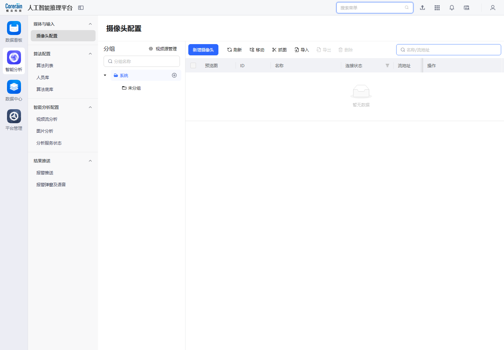 | 摄像头配置 10_名称/流地址_悬停 | hover 悬停查看 名称/流地址 的 hover/提示状态 | 悬停 名称/流地址，观察按钮可点击性、危险操作样式、行操作显隐和 hover 反馈；这是判断操作优先级的重要细节。 |
| 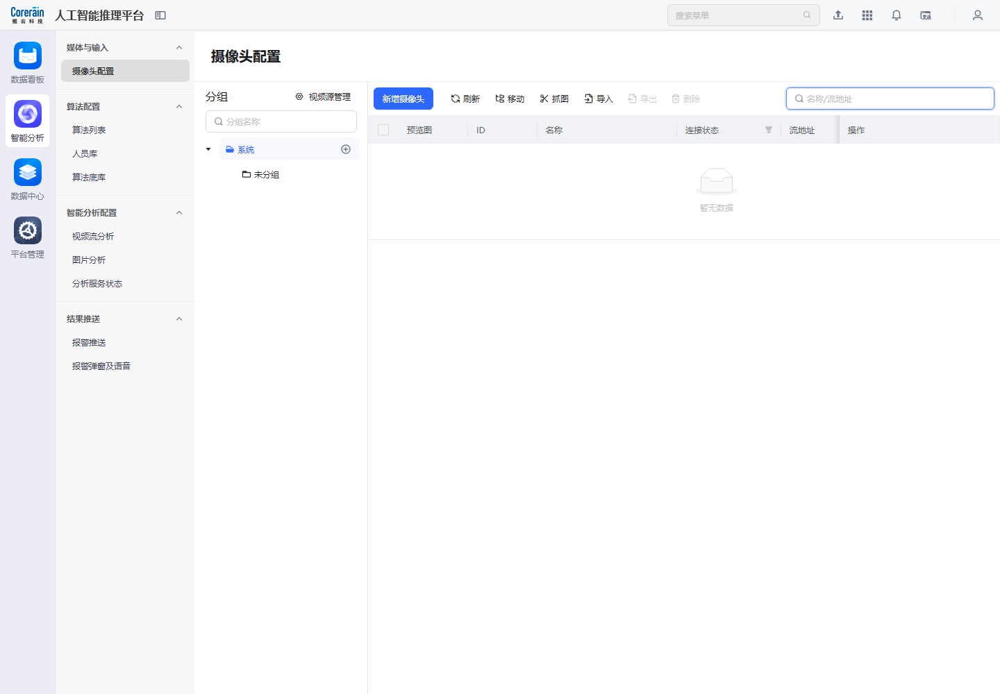 | 摄像头配置 10_名称/流地址_点击后 | focus-or-open 点击后记录页面反馈或空数据提示 | 点击后记录页面反馈或空数据提示 |

## 算法列表

- 定位：算法资产目录，负责把底层算法能力包装成业务可选择的标准能力。
- 核心对象：算法 ID、中文名、英文名、算法等级、编辑入口、虚拟算法。
- 页面 URL：http://192.168.11.88:8081/app/main-app/dispatch/pre-processing/algo-info/#/algorithm-dispatch/pre-scheduling/algorithm-list
- 主要控件：搜索菜单、创建虚拟算法、统计配置、算法ID/算法中文名称/算法英文名称、三级、编辑、50 条/页
- 表格字段：算法ID、算法中文名称、算法英文名称、算法等级、操作

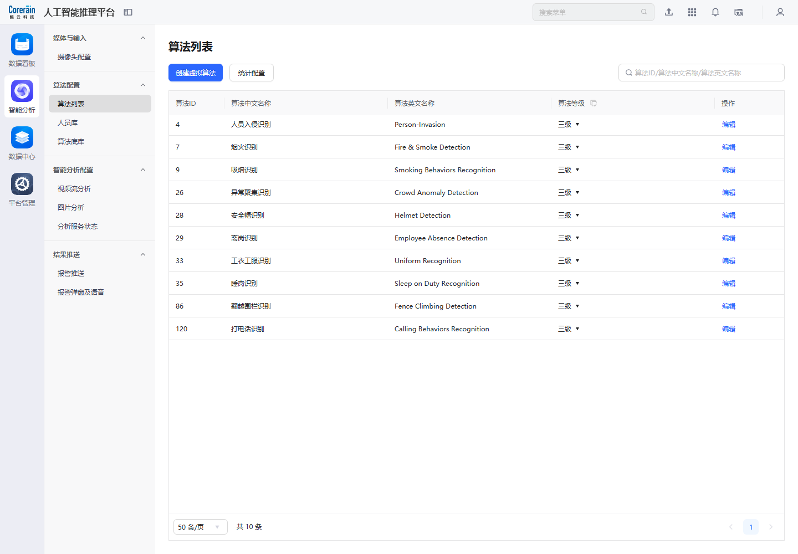

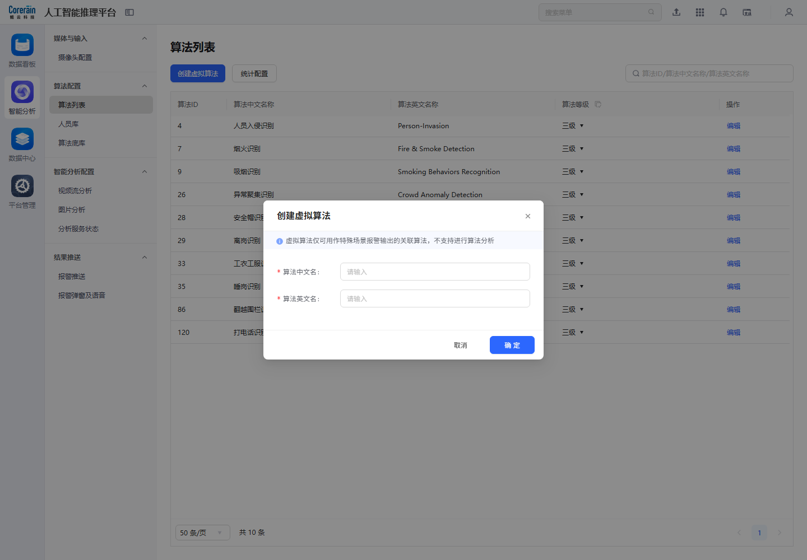

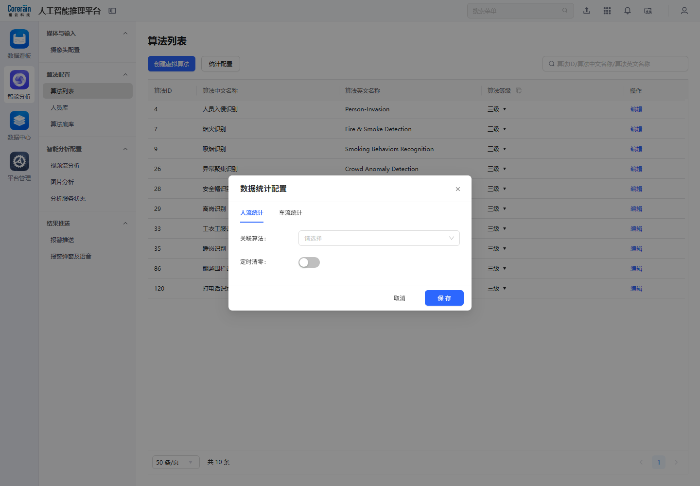

### 产品设计解读

- 中英文名称并列兼顾业务用户与工程用户；统计配置说明算法输出还会被汇总到看板指标。
- 页面内容摘要：人工智能推理平台 搜索菜单 数据看板 智能分析 数据中心 平台管理 媒体与输入 摄像头配置 算法配置 算法列表 人员库 算法底库 智能分析配置 视频流分析 图片分析 分析服务状态 结果推送 报警推送 报警弹窗及语音 算法列表 创建虚拟算法 统计配置 算法ID 算法中文名称 算法英文名称 算法等级 操作 4 人员入侵识别 Person-Invasion 三级 编辑 7 烟火识别 Fire & Smoke Detection 三级 编辑 9 吸烟识别 Smoking Behaviors Recognition 三级 编辑 26 异常聚集识别 Crowd Anomaly Detection 三级 编辑 28 安全帽识别 Helmet Detection 三级 编辑 29 离岗识别 Employee Absence D
- 算法列表建议补充适用场景、输入要求、输出字段、版本、算力消耗和启停状态。

### 算法列表按钮、弹窗与状态截图明细

| 截图 | 子模块/动作 | 类型与页面反馈 | 产品设计说明 |
| --- | --- | --- | --- |
|  | 算法列表 页面全貌 | overview 进入子模块后的页面全貌，用于识别信息架构、主操作区、筛选区和表格/卡片区。 | 页面全貌用于判断信息架构：左侧导航负责定位，主区承载筛选、操作、表格或卡片，适合作为子模块设计基线。 |
|  | 算法列表 滚动位置_0% | scroll 记录页面不同滚动位置，补足表格、卡片和底部状态。 | 滚动截图用于确认页面内容密度、底部表格/分页/卡片布局，避免只看首屏导致遗漏。 |
| 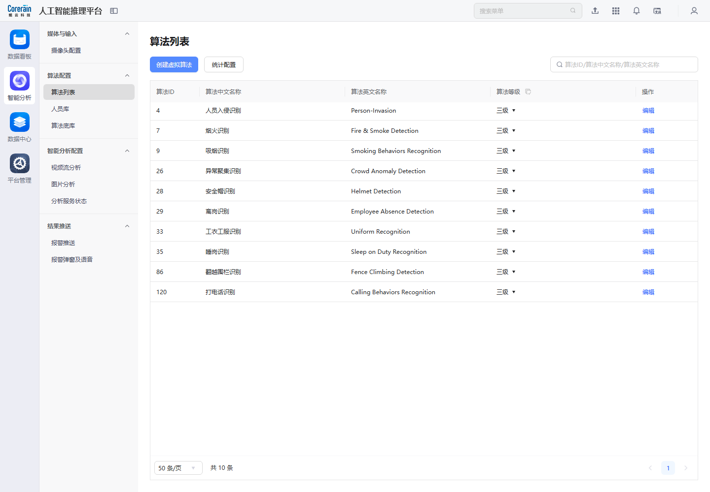 | 算法列表 01_创建虚拟算法_悬停 | hover 悬停查看 创建虚拟算法 的 hover/提示状态 | 悬停 创建虚拟算法，观察按钮可点击性、危险操作样式、行操作显隐和 hover 反馈；这是判断操作优先级的重要细节。 |
|  | 算法列表 01_创建虚拟算法_点击后 | click 点击后出现弹窗/下拉/提示：.custom-light-modal、[role="dialog"] | 点击 创建虚拟算法 后进入弹窗/抽屉式流程。弹窗内容：创建虚拟算法 虚拟算法仅可用作特殊场景报警输出的关联算法，不支持进行算法分析 算法中文名 算法英文名 取消 确 定。设计上把复杂创建、导入、配置或密码类操作隔离在临时层，既保留当前列表上下文，也降低页面跳转成本。 |
| 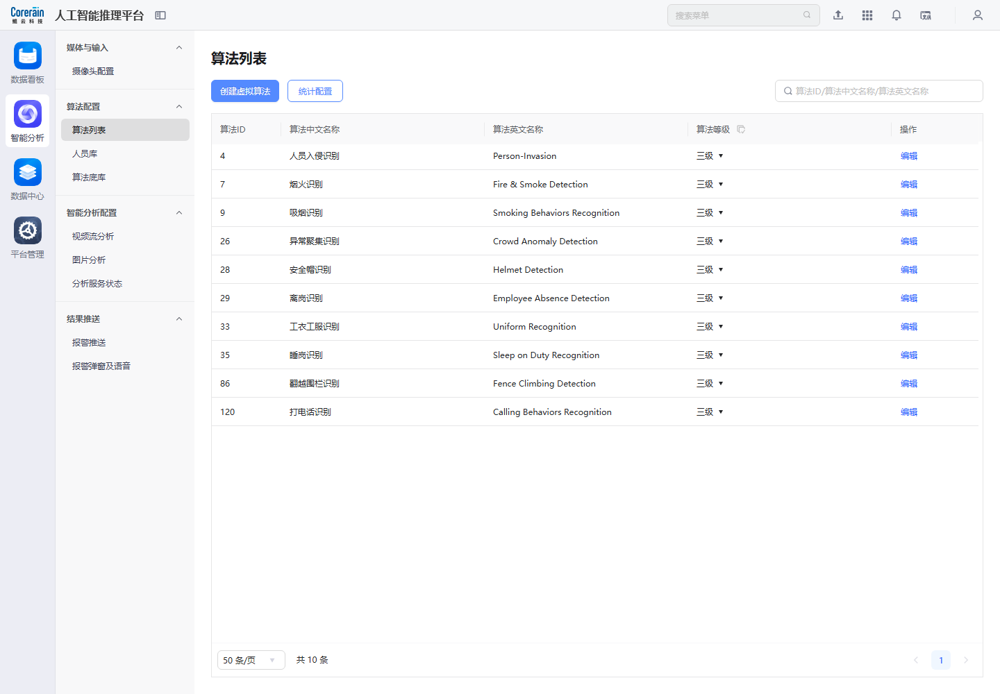 | 算法列表 02_统计配置_悬停 | hover 悬停查看 统计配置 的 hover/提示状态 | 悬停 统计配置，观察按钮可点击性、危险操作样式、行操作显隐和 hover 反馈；这是判断操作优先级的重要细节。 |
|  | 算法列表 02_统计配置_点击后 | click 点击后出现弹窗/下拉/提示：.custom-light-modal、[role="dialog"] | 点击 统计配置 后进入弹窗/抽屉式流程。弹窗内容：数据统计配置 人流统计 车流统计 关联算法 请选择 定时清零 取消 保 存。设计上把复杂创建、导入、配置或密码类操作隔离在临时层，既保留当前列表上下文，也降低页面跳转成本。 |
| 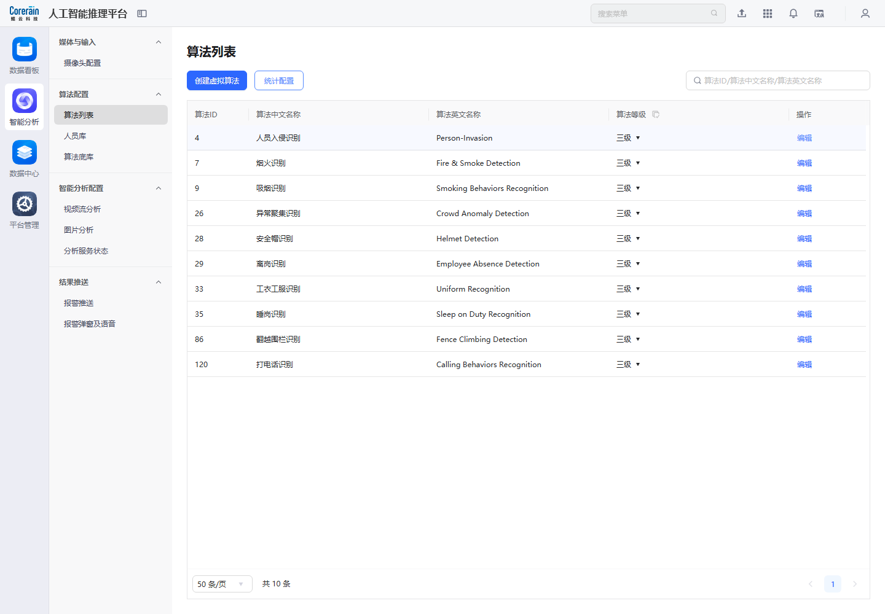 | 算法列表 03_编辑_悬停 | hover 悬停查看 编辑 的 hover/提示状态 | 悬停 编辑，观察按钮可点击性、危险操作样式、行操作显隐和 hover 反馈；这是判断操作优先级的重要细节。 |
| 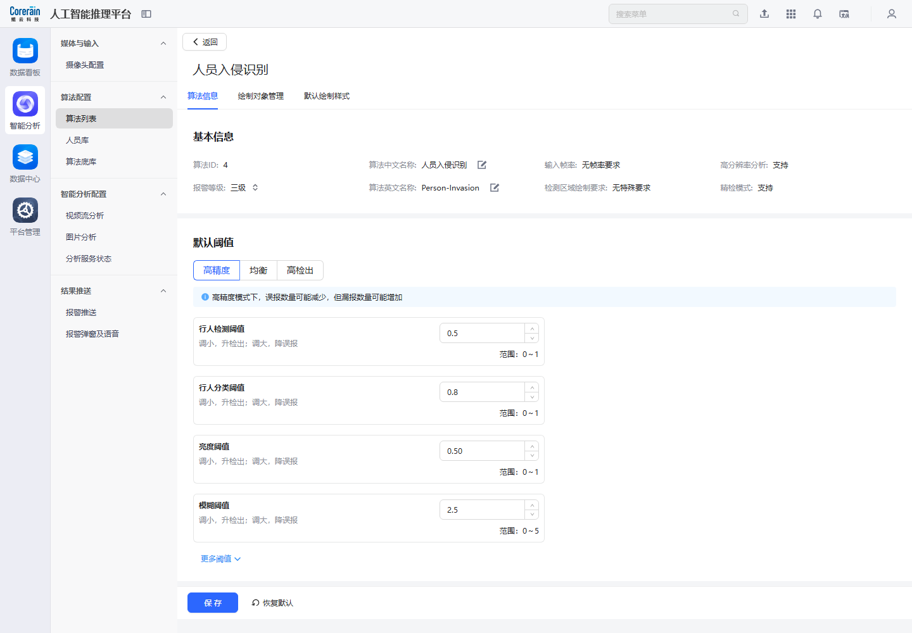 | 算法列表 03_编辑_点击后 | click 点击后记录页面反馈或空数据提示 | 点击 编辑 用于从列表进入单对象配置或查看，体现“列表管理 + 详情维护”的后台产品模式。 |
| 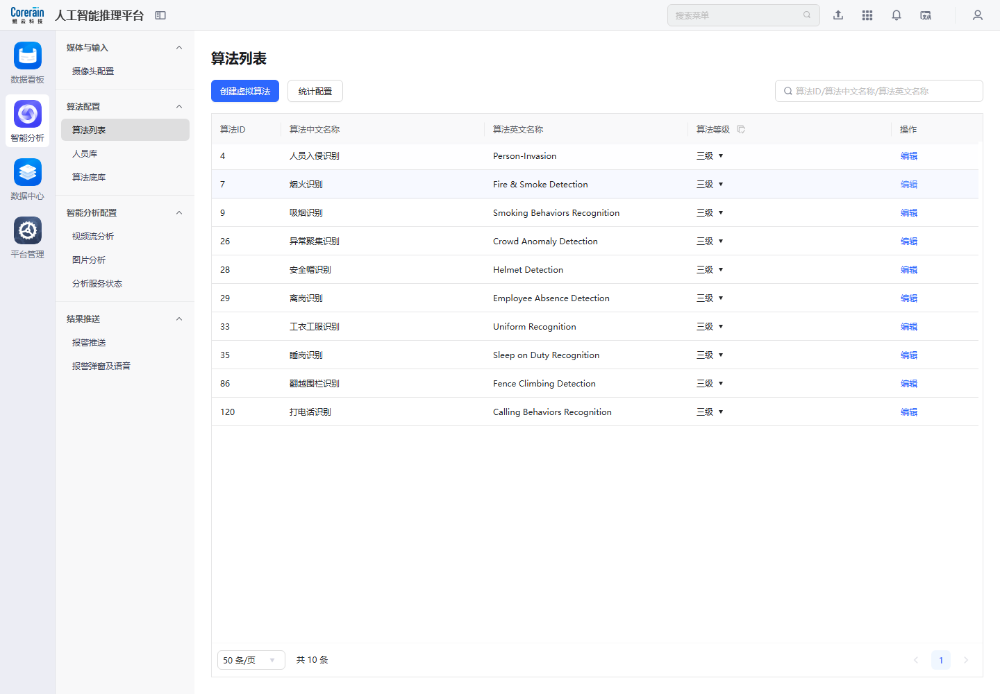 | 算法列表 04_编辑_悬停 | hover 悬停查看 编辑 的 hover/提示状态 | 悬停 编辑，观察按钮可点击性、危险操作样式、行操作显隐和 hover 反馈；这是判断操作优先级的重要细节。 |
|  | 算法列表 04_编辑_点击后 | click 点击后记录页面反馈或空数据提示 | 点击 编辑 用于从列表进入单对象配置或查看，体现“列表管理 + 详情维护”的后台产品模式。 |
| 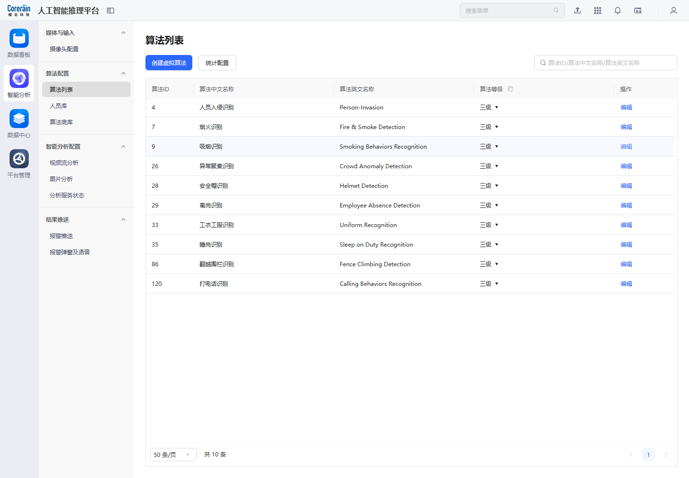 | 算法列表 05_编辑_悬停 | hover 悬停查看 编辑 的 hover/提示状态 | 悬停 编辑，观察按钮可点击性、危险操作样式、行操作显隐和 hover 反馈；这是判断操作优先级的重要细节。 |
|  | 算法列表 05_编辑_点击后 | click 点击后记录页面反馈或空数据提示 | 点击 编辑 用于从列表进入单对象配置或查看，体现“列表管理 + 详情维护”的后台产品模式。 |
| 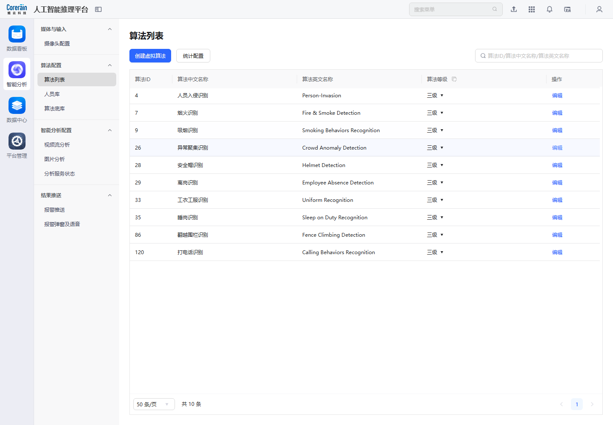 | 算法列表 06_编辑_悬停 | hover 悬停查看 编辑 的 hover/提示状态 | 悬停 编辑，观察按钮可点击性、危险操作样式、行操作显隐和 hover 反馈；这是判断操作优先级的重要细节。 |
| 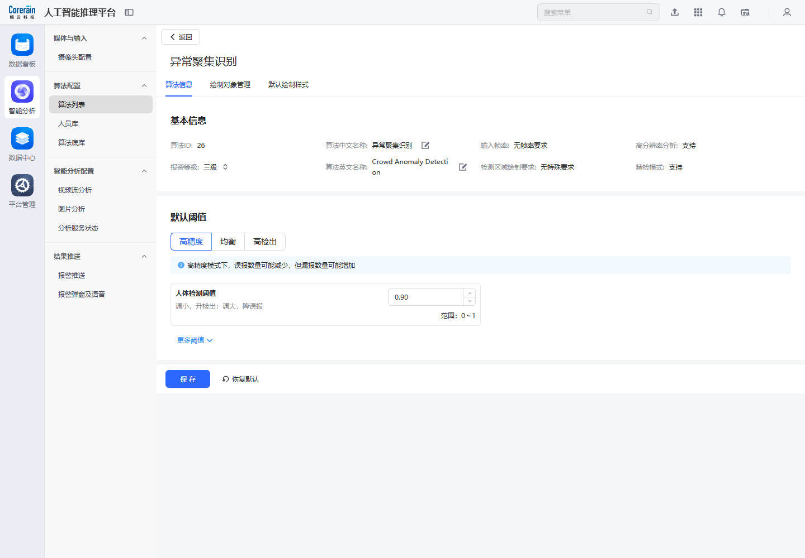 | 算法列表 06_编辑_点击后 | click 点击后记录页面反馈或空数据提示 | 点击 编辑 用于从列表进入单对象配置或查看，体现“列表管理 + 详情维护”的后台产品模式。 |
| 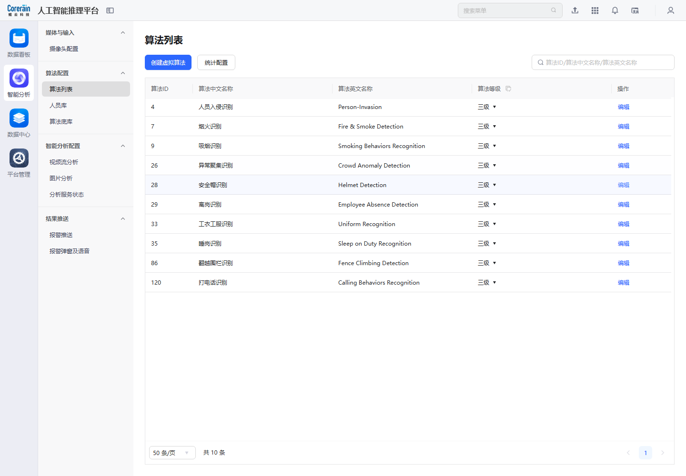 | 算法列表 07_编辑_悬停 | hover 悬停查看 编辑 的 hover/提示状态 | 悬停 编辑，观察按钮可点击性、危险操作样式、行操作显隐和 hover 反馈；这是判断操作优先级的重要细节。 |
| 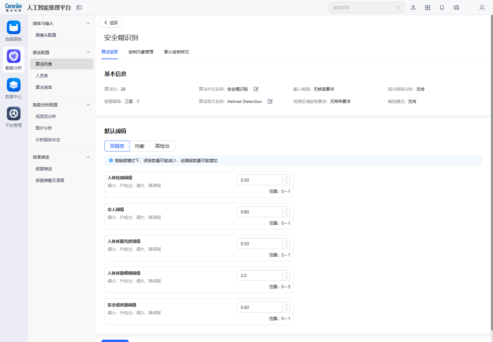 | 算法列表 07_编辑_点击后 | click 点击后记录页面反馈或空数据提示 | 点击 编辑 用于从列表进入单对象配置或查看，体现“列表管理 + 详情维护”的后台产品模式。 |
|  | 算法列表 08_编辑_悬停 | hover 悬停查看 编辑 的 hover/提示状态 | 悬停 编辑，观察按钮可点击性、危险操作样式、行操作显隐和 hover 反馈；这是判断操作优先级的重要细节。 |
| 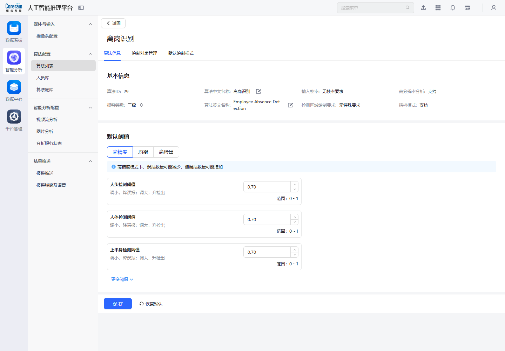 | 算法列表 08_编辑_点击后 | click 点击后记录页面反馈或空数据提示 | 点击 编辑 用于从列表进入单对象配置或查看，体现“列表管理 + 详情维护”的后台产品模式。 |
| 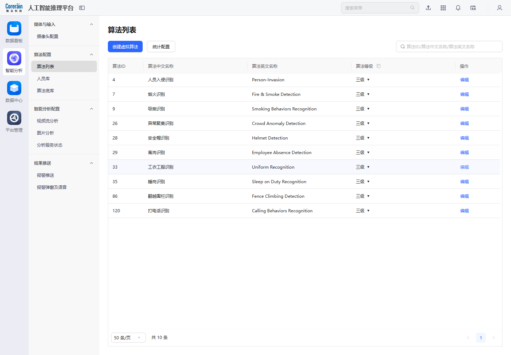 | 算法列表 09_编辑_悬停 | hover 悬停查看 编辑 的 hover/提示状态 | 悬停 编辑，观察按钮可点击性、危险操作样式、行操作显隐和 hover 反馈；这是判断操作优先级的重要细节。 |
| 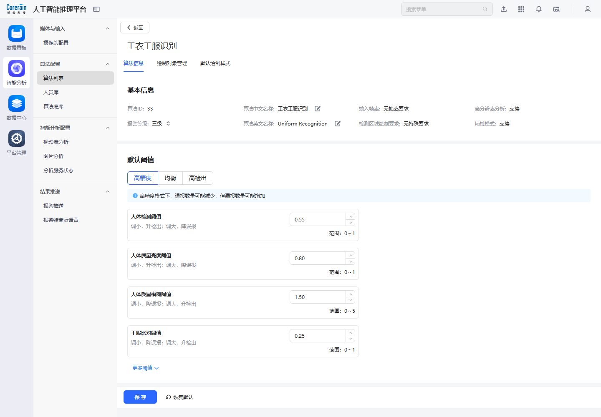 | 算法列表 09_编辑_点击后 | click 点击后记录页面反馈或空数据提示 | 点击 编辑 用于从列表进入单对象配置或查看，体现“列表管理 + 详情维护”的后台产品模式。 |
| 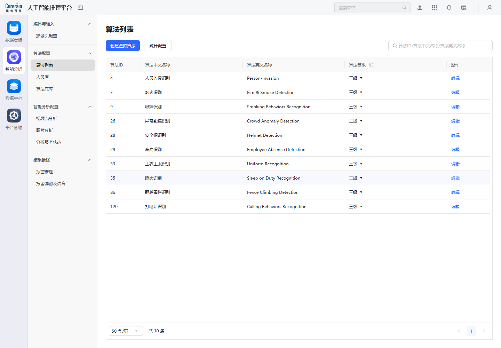 | 算法列表 10_编辑_悬停 | hover 悬停查看 编辑 的 hover/提示状态 | 悬停 编辑，观察按钮可点击性、危险操作样式、行操作显隐和 hover 反馈；这是判断操作优先级的重要细节。 |
| 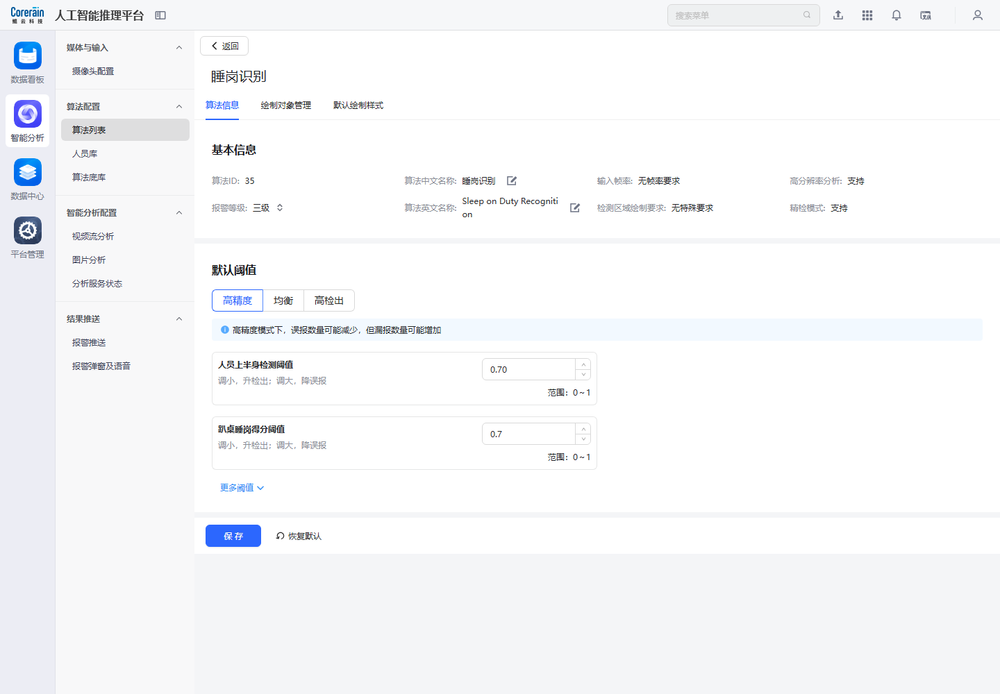 | 算法列表 10_编辑_点击后 | click 点击后记录页面反馈或空数据提示 | 点击 编辑 用于从列表进入单对象配置或查看，体现“列表管理 + 详情维护”的后台产品模式。 |

## 人员库

- 定位：人脸/人员识别类算法的基础数据维护中心，承载人员照片、标签、分组和特征提取。
- 核心对象：人员、照片、特征提取状态、工号、联系方式、分组、陌生人。
- 页面 URL：http://192.168.11.88:8081/app/main-app/dispatch/dispatch_face/#/face
- 主要控件：搜索菜单、分组名称、添加人员、提取人员特征、更多、姓名/ID/工号
- 表格字段：照片、姓名、提取状态、ID、性别、工号、联系方式、操作

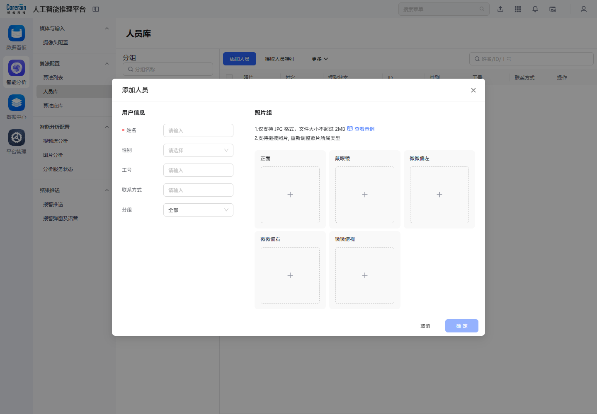

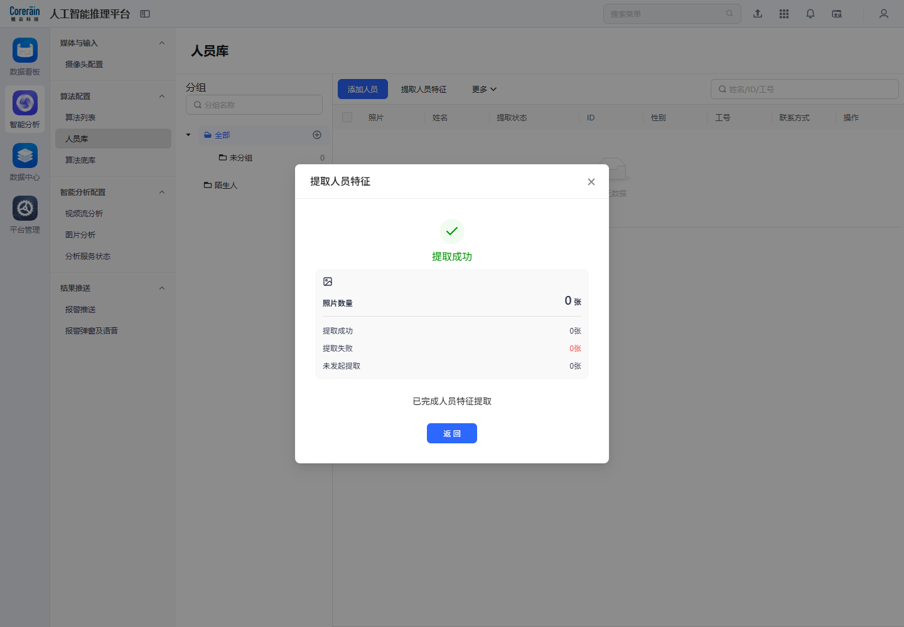

### 产品设计解读

- 添加人员弹窗明确照片规格和角度类型，说明系统对特征质量有要求；特征提取把“照片入库”和“算法可识别”区分开。
- 页面内容摘要：人工智能推理平台 搜索菜单 数据看板 智能分析 数据中心 平台管理 媒体与输入 摄像头配置 算法配置 算法列表 人员库 算法底库 智能分析配置 视频流分析 图片分析 分析服务状态 结果推送 报警推送 报警弹窗及语音 人员库 分组 全部 未分组 0 陌生人 0 添加人员 提取人员特征 更多 照片 姓名 提取状态 ID 性别 工号 联系方式 操作 暂无数据
- 建议在列表中强化失败原因、照片质量提示、批量导入模板校验和隐私合规提示。

### 人员库按钮、弹窗与状态截图明细

| 截图 | 子模块/动作 | 类型与页面反馈 | 产品设计说明 |
| --- | --- | --- | --- |
|  | 人员库 页面全貌 | overview 进入子模块后的页面全貌，用于识别信息架构、主操作区、筛选区和表格/卡片区。 | 页面全貌用于判断信息架构：左侧导航负责定位，主区承载筛选、操作、表格或卡片，适合作为子模块设计基线。 |
| 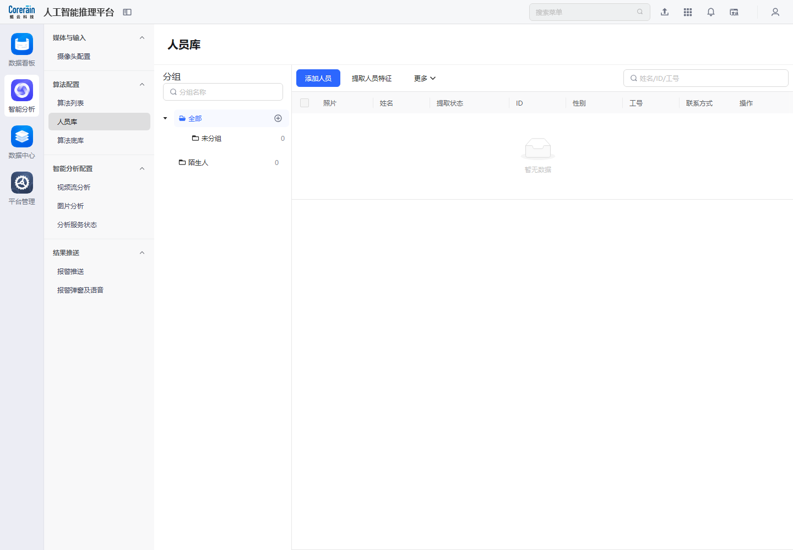 | 人员库 滚动位置_0% | scroll 记录页面不同滚动位置，补足表格、卡片和底部状态。 | 滚动截图用于确认页面内容密度、底部表格/分页/卡片布局，避免只看首屏导致遗漏。 |
|  | 人员库 01_添加人员_悬停 | hover 悬停查看 添加人员 的 hover/提示状态 | 悬停 添加人员，观察按钮可点击性、危险操作样式、行操作显隐和 hover 反馈；这是判断操作优先级的重要细节。 |
|  | 人员库 01_添加人员_点击后 | click 点击后出现弹窗/下拉/提示：.custom-light-modal、[role="dialog"] | 点击 添加人员 后进入弹窗/抽屉式流程。弹窗内容：添加人员 用户信息 姓名 性别 请选择 工号 联系方式 分组 全部 照片组 1.仅支持 JPG 格式，文件大小不超过 2MB 查看示例 2.支持拖拽照片, 重新调整照片所属类型 正面 戴眼镜 微微偏左 微微偏右 微微俯视 取消 确 定。设计上把复杂创建、导入、配置或密码类操作隔离在临时层，既保留当前列表上下文，也降低页面跳转成本。 |
|  | 人员库 02_提取人员特征_悬停 | hover 悬停查看 提取人员特征 的 hover/提示状态 | 悬停 提取人员特征，观察按钮可点击性、危险操作样式、行操作显隐和 hover 反馈；这是判断操作优先级的重要细节。 |
|  | 人员库 02_提取人员特征_点击后 | click 点击后出现弹窗/下拉/提示：.custom-light-modal、[role="dialog"] | 点击 提取人员特征 后进入弹窗/抽屉式流程。弹窗内容：提取人员特征 提取成功 照片数量 0 张 提取成功 0张 提取失败 0张 未发起提取 0张 已完成人员特征提取 返 回。设计上把复杂创建、导入、配置或密码类操作隔离在临时层，既保留当前列表上下文，也降低页面跳转成本。 |
|  | 人员库 03_更多_悬停 | hover 悬停查看 更多 的 hover/提示状态 | 悬停 更多，观察按钮可点击性、危险操作样式、行操作显隐和 hover 反馈；这是判断操作优先级的重要细节。 |
|  | 人员库 03_更多_点击后 | click 点击后出现弹窗/下拉/提示：.custom-light-dropdown | 点击 更多 后打开菜单。菜单内容：导入 导出 删除。适合更多操作、账号、语言、应用中心、通知等轻量分发场景。 |
| 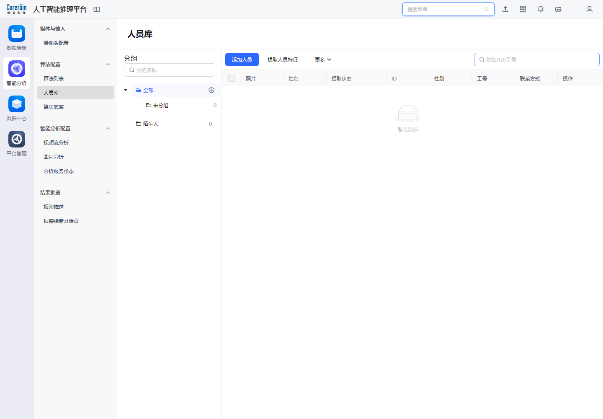 | 人员库 05_姓名/ID/工号_悬停 | hover 悬停查看 姓名/ID/工号 的 hover/提示状态 | 悬停 姓名/ID/工号，观察按钮可点击性、危险操作样式、行操作显隐和 hover 反馈；这是判断操作优先级的重要细节。 |
| 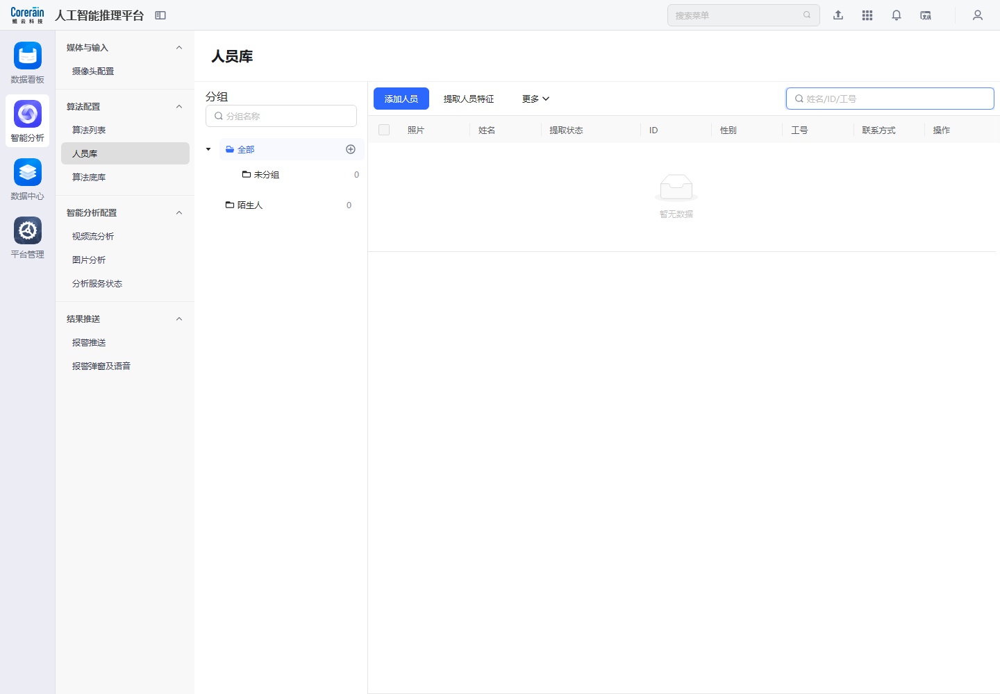 | 人员库 05_姓名/ID/工号_点击后 | focus-or-open 点击后记录页面反馈或空数据提示 | 点击后记录页面反馈或空数据提示 |
|  | 人员库 06_分组名称_悬停 | hover 悬停查看 分组名称 的 hover/提示状态 | 悬停 分组名称，观察按钮可点击性、危险操作样式、行操作显隐和 hover 反馈；这是判断操作优先级的重要细节。 |
| 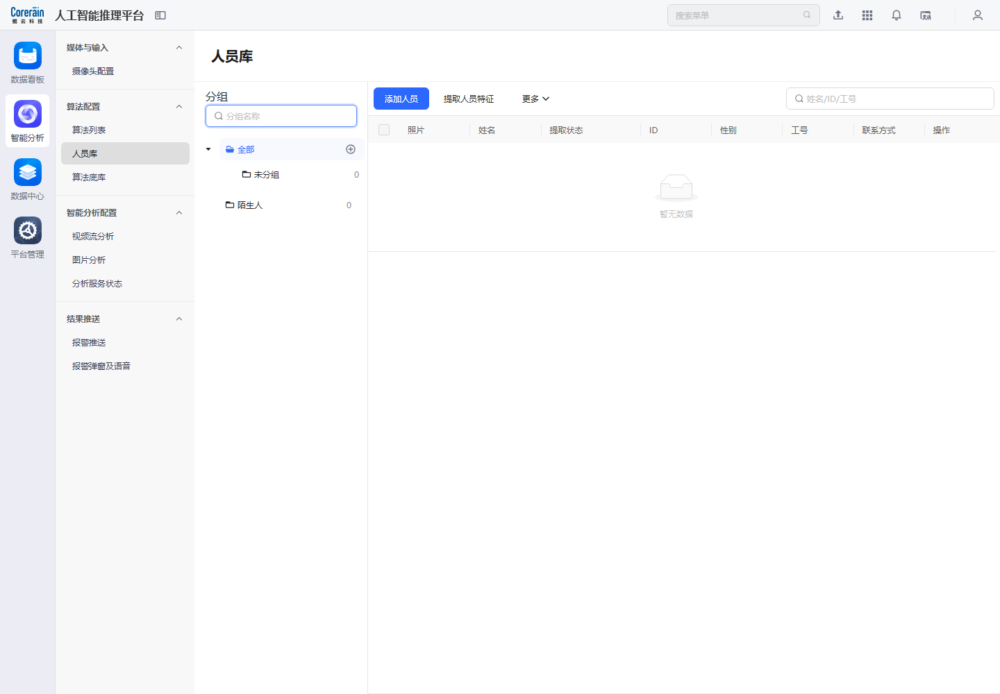 | 人员库 06_分组名称_点击后 | focus-or-open 点击后记录页面反馈或空数据提示 | 点击后记录页面反馈或空数据提示 |

## 算法底库

- 定位：算法专用底库/标签库，用于为特定算法提供可同步、可上传图片、可加标签的基础样本集合。
- 核心对象：底库、关联算法、同步状态、图片、标签。
- 页面 URL：http://192.168.11.88:8081/app/main-app/dispatch/dispatch_algo_base_library/#/algo_base_library
- 主要控件：搜索菜单、底库名称、同步详情、立即同步、上传图片、添加标签、删除、10 条/页
- 表格字段：未采集到表格字段或本页以卡片/配置项为主

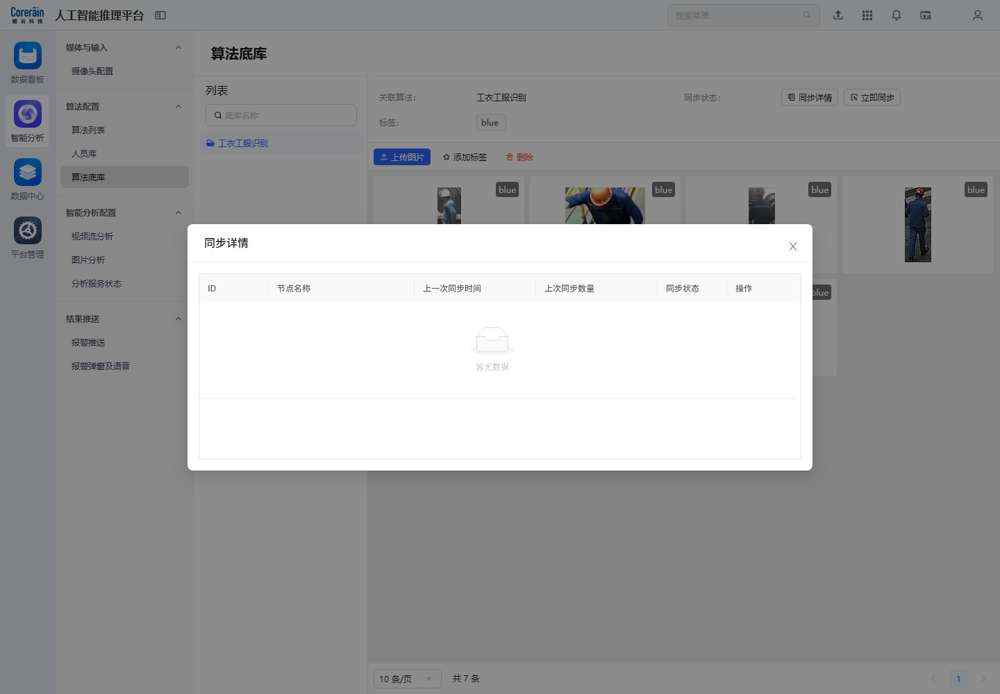

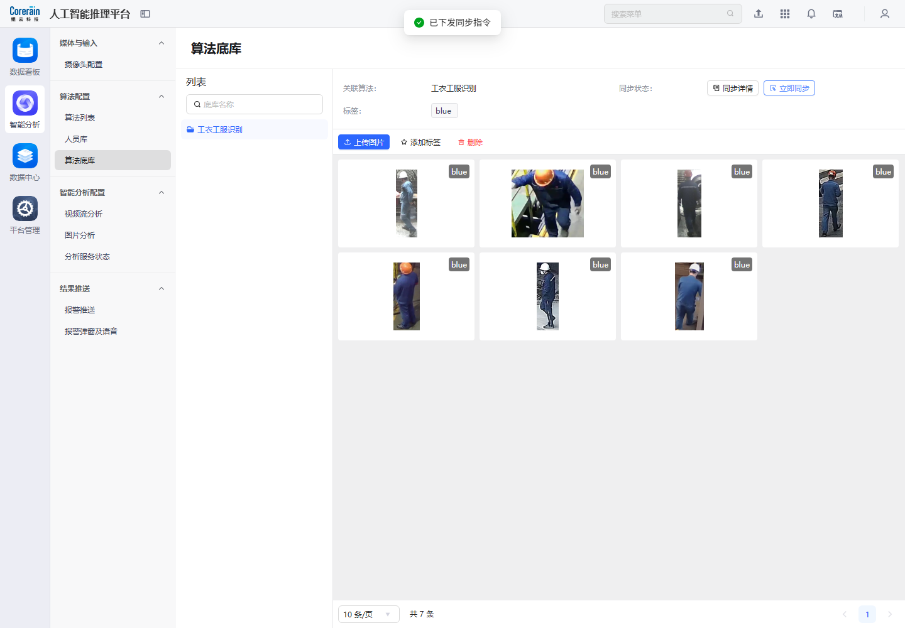

### 产品设计解读

- 同步详情和立即同步体现了离线底库与运行服务之间存在同步链路。
- 页面内容摘要：人工智能推理平台 搜索菜单 数据看板 智能分析 数据中心 平台管理 媒体与输入 摄像头配置 算法配置 算法列表 人员库 算法底库 智能分析配置 视频流分析 图片分析 分析服务状态 结果推送 报警推送 报警弹窗及语音 算法底库 列表 工衣工服识别 关联算法： 工衣工服识别 同步状态： 同步详情 立即同步 标签： blue 上传图片 添加标签 删除 blue blue blue blue blue blue blue 共 7 条 1 10 条/页
- 建议增加同步失败原因、最近同步时间、样本数、标签分布和增量同步策略。

### 算法底库按钮、弹窗与状态截图明细

| 截图 | 子模块/动作 | 类型与页面反馈 | 产品设计说明 |
| --- | --- | --- | --- |
|  | 算法底库 页面全貌 | overview 进入子模块后的页面全貌，用于识别信息架构、主操作区、筛选区和表格/卡片区。 | 页面全貌用于判断信息架构：左侧导航负责定位，主区承载筛选、操作、表格或卡片，适合作为子模块设计基线。 |
|  | 算法底库 滚动位置_0% | scroll 记录页面不同滚动位置，补足表格、卡片和底部状态。 | 滚动截图用于确认页面内容密度、底部表格/分页/卡片布局，避免只看首屏导致遗漏。 |
| 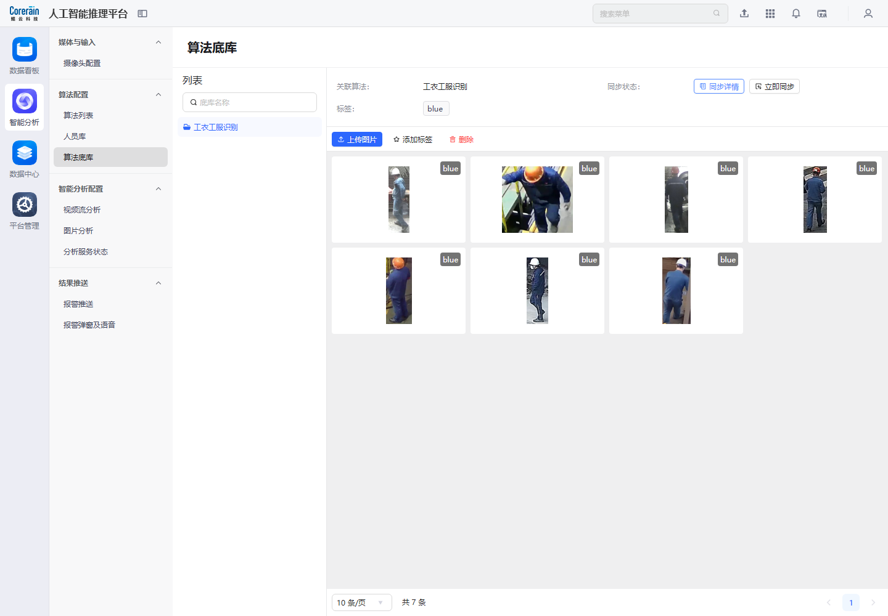 | 算法底库 01_同步详情_悬停 | hover 悬停查看 同步详情 的 hover/提示状态 | 悬停 同步详情，观察按钮可点击性、危险操作样式、行操作显隐和 hover 反馈；这是判断操作优先级的重要细节。 |
|  | 算法底库 01_同步详情_点击后 | click 点击后出现弹窗/下拉/提示：.custom-light-modal、[role="dialog"] | 点击 同步详情 后进入弹窗/抽屉式流程。弹窗内容：同步详情 ID 节点名称 上一次同步时间 上次同步数量 同步状态 操作 暂无数据。设计上把复杂创建、导入、配置或密码类操作隔离在临时层，既保留当前列表上下文，也降低页面跳转成本。 |
| 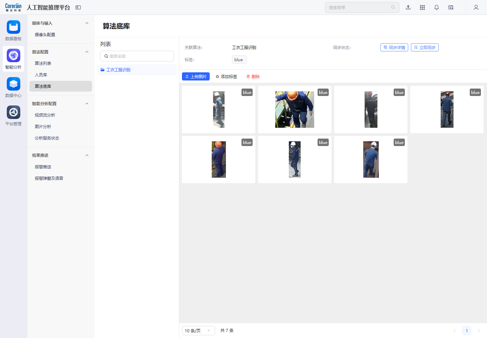 | 算法底库 02_立即同步_悬停 | hover 悬停查看 立即同步 的 hover/提示状态 | 悬停 立即同步，观察按钮可点击性、危险操作样式、行操作显隐和 hover 反馈；这是判断操作优先级的重要细节。 |
|  | 算法底库 02_立即同步_点击后 | click 点击后出现弹窗/下拉/提示：.custom-light-message | 点击 立即同步 后出现消息反馈。反馈内容：已下发同步指令。该设计把空选择、无效操作、成功结果即时告知用户，是批量操作和空数据场景的必要兜底。 |
| 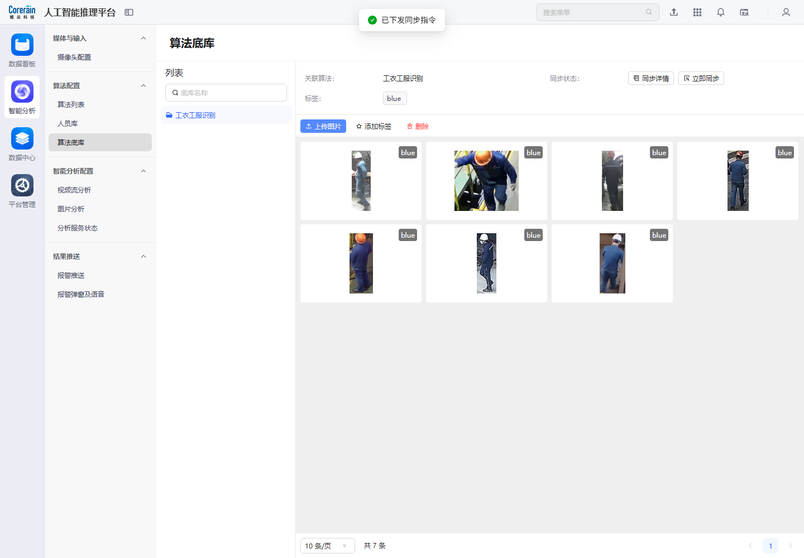 | 算法底库 03_上传图片_悬停 | hover 悬停查看 上传图片 的 hover/提示状态 | 悬停 上传图片，观察按钮可点击性、危险操作样式、行操作显隐和 hover 反馈；这是判断操作优先级的重要细节。 |
|  | 算法底库 03_上传图片_点击后 | click 点击后出现弹窗/下拉/提示：.custom-light-message | 点击 上传图片 后出现消息反馈。反馈内容：已下发同步指令。该设计把空选择、无效操作、成功结果即时告知用户，是批量操作和空数据场景的必要兜底。 |
|  | 算法底库 04_添加标签_悬停 | hover 悬停查看 添加标签 的 hover/提示状态 | 悬停 添加标签，观察按钮可点击性、危险操作样式、行操作显隐和 hover 反馈；这是判断操作优先级的重要细节。 |
|  | 算法底库 04_添加标签_点击后 | click 点击后出现弹窗/下拉/提示：.custom-light-message | 点击 添加标签 后出现消息反馈。反馈内容：请先选择图片。该设计把空选择、无效操作、成功结果即时告知用户，是批量操作和空数据场景的必要兜底。 |
|  | 算法底库 05_删除_悬停 | hover 悬停查看 删除 的 hover/提示状态 | 悬停 删除，观察按钮可点击性、危险操作样式、行操作显隐和 hover 反馈；这是判断操作优先级的重要细节。 |
| 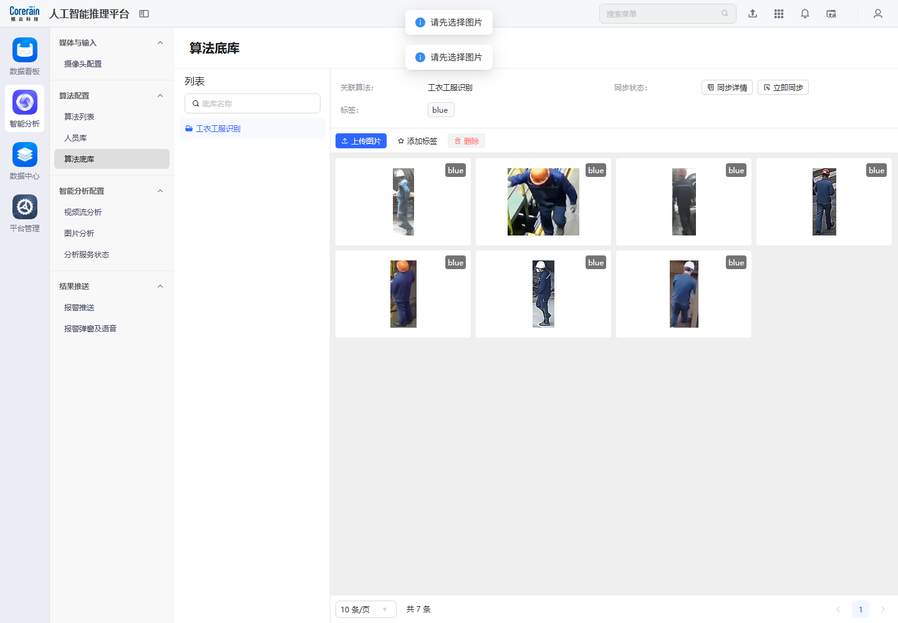 | 算法底库 05_删除_点击后 | click 点击后出现弹窗/下拉/提示：.custom-light-message | 点击 删除 后出现消息反馈。反馈内容：请先选择图片 请先选择图片。该设计把空选择、无效操作、成功结果即时告知用户，是批量操作和空数据场景的必要兜底。 |
| 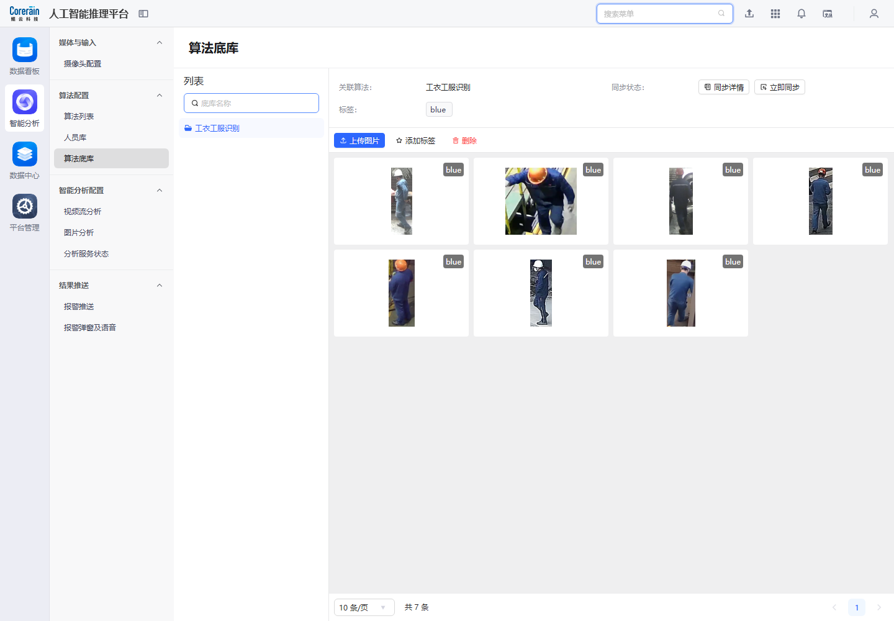 | 算法底库 07_底库名称_悬停 | hover 悬停查看 底库名称 的 hover/提示状态 | 悬停 底库名称，观察按钮可点击性、危险操作样式、行操作显隐和 hover 反馈；这是判断操作优先级的重要细节。 |
|  | 算法底库 07_底库名称_点击后 | focus-or-open 点击后记录页面反馈或空数据提示 | 点击后记录页面反馈或空数据提示 |
| 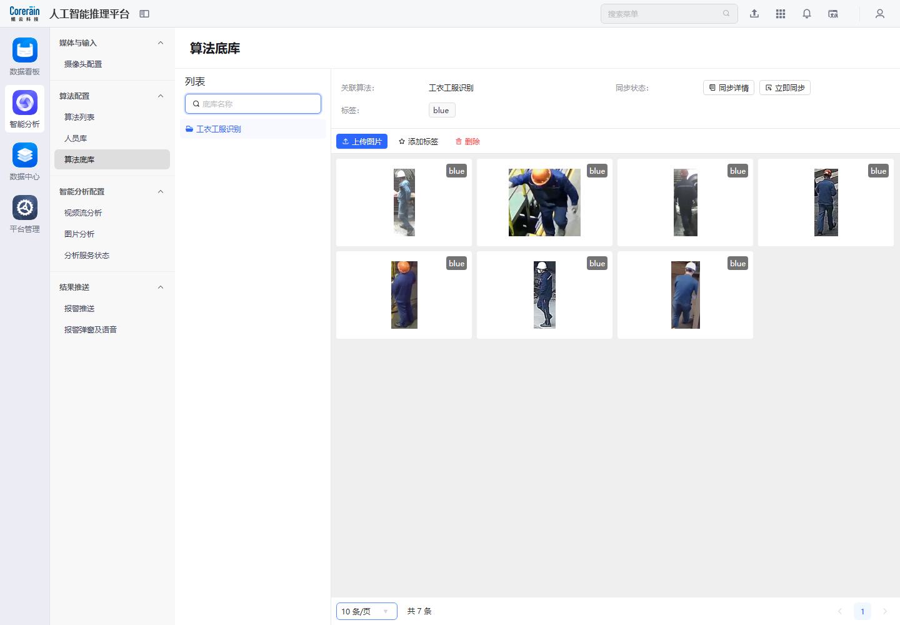 | 算法底库 08_10 条/页_悬停 | hover 悬停查看 10 条/页 的 hover/提示状态 | 悬停 10 条/页，观察按钮可点击性、危险操作样式、行操作显隐和 hover 反馈；这是判断操作优先级的重要细节。 |
| 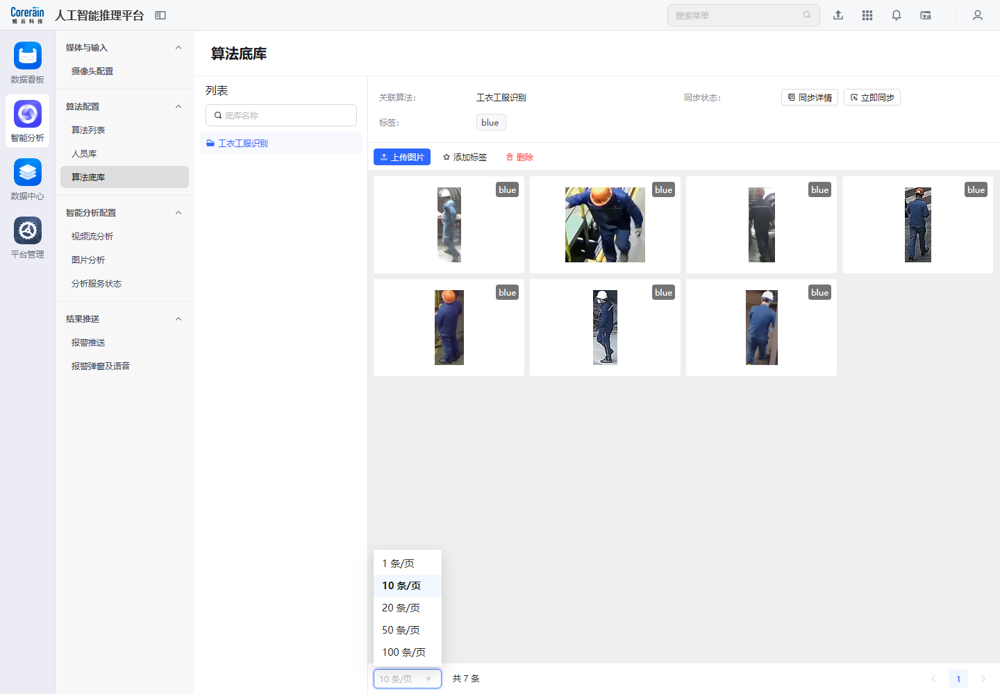 | 算法底库 08_10 条/页_点击后 | focus-or-open 点击后出现弹窗/下拉/提示：.custom-light-select-dropdown | 点击 10 条/页 后打开下拉选择。选项内容：1 10 20 1 条/页 10 条/页 20 条/页 50 条/页 100 条/页。适合枚举型筛选、菜单搜索和业务分类选择，建议支持搜索、高亮和最近使用。 |

## 视频流分析

- 定位：实时任务编排页，把摄像头、算法、报警输出和结果推流组合成持续运行的分析任务。
- 核心对象：视频分析任务、启用状态、报警推送输出、分析结果推流、详情、演示视频。
- 页面 URL：http://192.168.11.88:8081/app/main-app/dispatch/task/video-analysis/#/algorithm-dispatch/schedule-tasks/video-stream-analysis
- 主要控件：搜索菜单、创建视频分析任务、ID/任务名称、启用、详情、演示视频、删除、20 条/页
- 表格字段：ID、任务名称、任务启用状态、报警推送输出、分析结果推流、操作

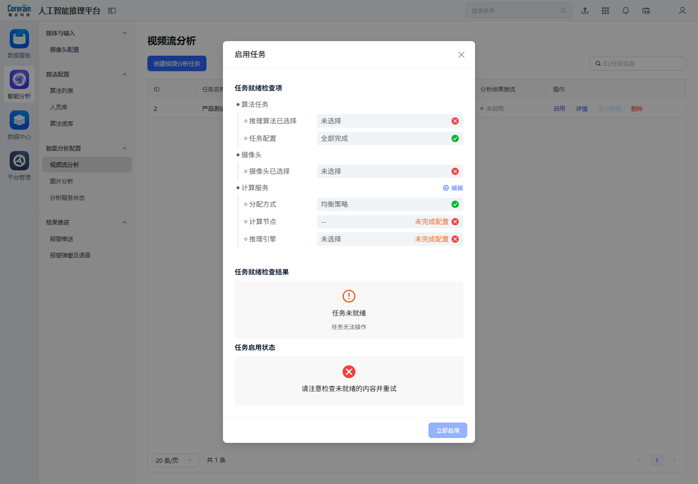

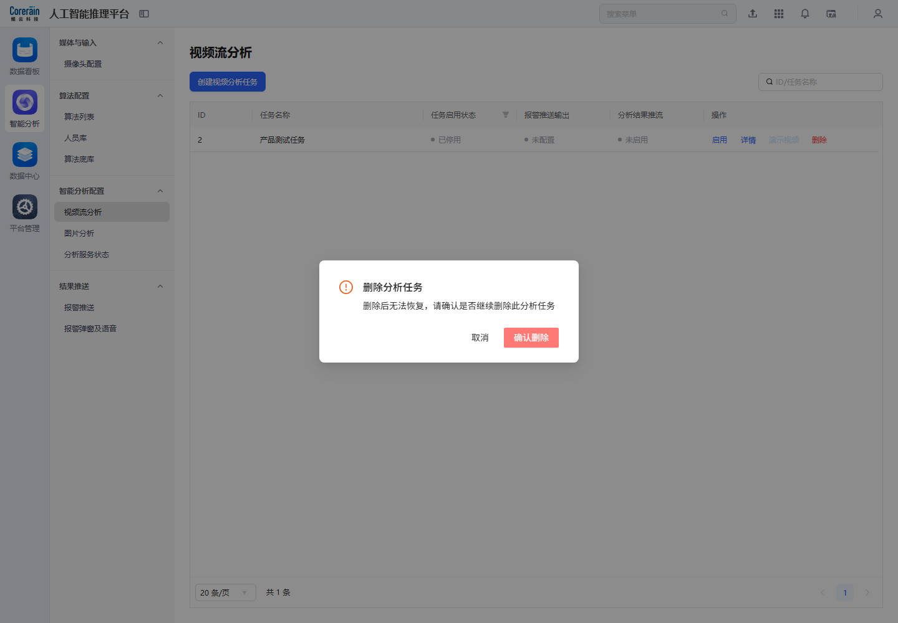

### 产品设计解读

- 任务列表同时显示输入、算法输出和结果分发状态，是智能分析链路的核心中台页。
- 页面内容摘要：人工智能推理平台 搜索菜单 数据看板 智能分析 数据中心 平台管理 媒体与输入 摄像头配置 算法配置 算法列表 人员库 算法底库 智能分析配置 视频流分析 图片分析 分析服务状态 结果推送 报警推送 报警弹窗及语音 视频流分析 创建视频分析任务 ID 任务名称 任务启用状态 报警推送输出 分析结果推流 操作 2 产品测试任务 已停用 未配置 未启用 启用 详情 演示视频 删除 共 1 条 1 20 条/页
- 建议把详情页设计成任务配置全景，包括摄像头、算法、规则区域、阈值、运行时间、推送目标、历史报警。

### 视频流分析按钮、弹窗与状态截图明细

| 截图 | 子模块/动作 | 类型与页面反馈 | 产品设计说明 |
| --- | --- | --- | --- |
|  | 视频流分析 页面全貌 | overview 进入子模块后的页面全貌，用于识别信息架构、主操作区、筛选区和表格/卡片区。 | 页面全貌用于判断信息架构：左侧导航负责定位，主区承载筛选、操作、表格或卡片，适合作为子模块设计基线。 |
|  | 视频流分析 滚动位置_0% | scroll 记录页面不同滚动位置，补足表格、卡片和底部状态。 | 滚动截图用于确认页面内容密度、底部表格/分页/卡片布局，避免只看首屏导致遗漏。 |
| 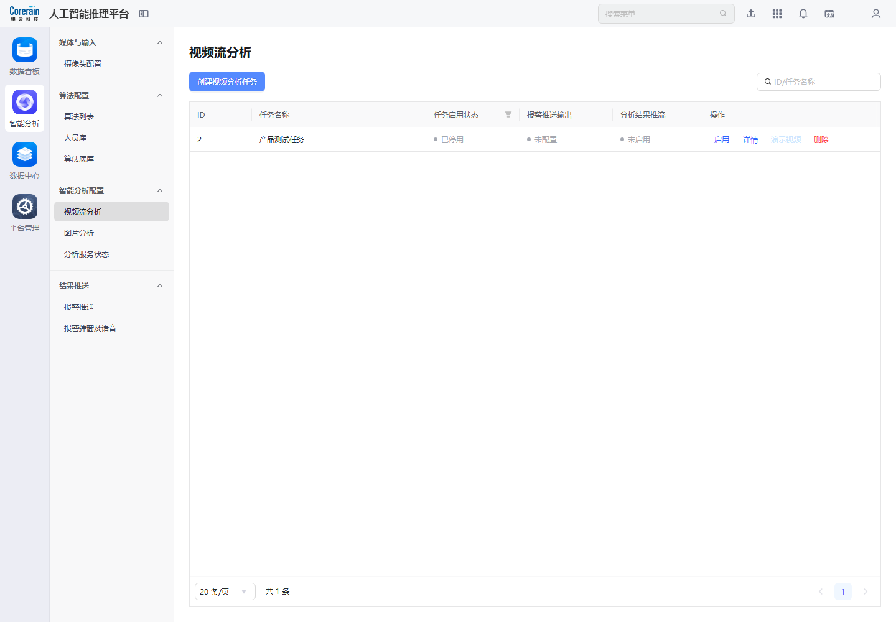 | 视频流分析 01_创建视频分析任务_悬停 | hover 悬停查看 创建视频分析任务 的 hover/提示状态 | 悬停 创建视频分析任务，观察按钮可点击性、危险操作样式、行操作显隐和 hover 反馈；这是判断操作优先级的重要细节。 |
|  | 视频流分析 01_创建视频分析任务_点击后 | click 点击后出现弹窗/下拉/提示：.custom-light-modal、[role="dialog"] | 点击 创建视频分析任务 后进入弹窗/抽屉式流程。弹窗内容：请选择视频流分析任务类型 实时分析 对所选摄像头进行实时取流分析 轮巡分析 每次对一组摄像头进行分析，分析一定时间后自动切换到下一组，仅支持关键帧分析 确 定。设计上把复杂创建、导入、配置或密码类操作隔离在临时层，既保留当前列表上下文，也降低页面跳转成本。 |
| 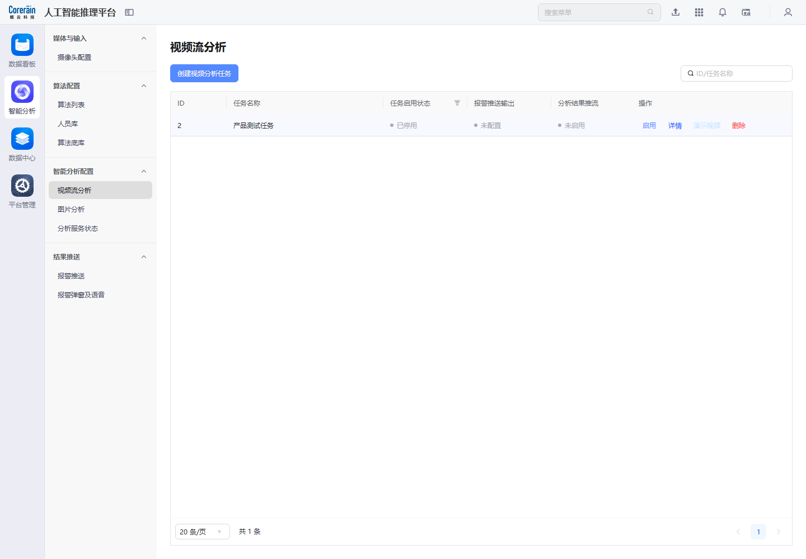 | 视频流分析 02_启用_悬停 | hover 悬停查看 启用 的 hover/提示状态 | 悬停 启用，观察按钮可点击性、危险操作样式、行操作显隐和 hover 反馈；这是判断操作优先级的重要细节。 |
|  | 视频流分析 02_启用_点击后 | click 点击后出现弹窗/下拉/提示：.custom-light-modal、[role="dialog"] | 点击 启用 后进入弹窗/抽屉式流程。弹窗内容：启用任务 任务就绪检查项 算法任务 推理算法已选择 未选择 任务配置 全部完成 摄像头 摄像头已选择 未选择 计算服务 编辑 分配方式 均衡策略 计算节点 -- 未完成配置 推理引擎 未选择 未完成配置 任务就绪检查结果 任务未就绪 任务无法操作 任务启用状态 请注意检查未就绪的内容并重试 立即启用。设计上把复杂创建、导入、配置或密码类操作隔离在临时层，既保留当前列表上下文，也降低页面跳转成本。 |
|  | 视频流分析 03_详情_悬停 | hover 悬停查看 详情 的 hover/提示状态 | 悬停 详情，观察按钮可点击性、危险操作样式、行操作显隐和 hover 反馈；这是判断操作优先级的重要细节。 |
|  | 视频流分析 03_详情_点击后 | click 点击后出现弹窗/下拉/提示：.custom-light-modal、[role="dialog"] | 点击 详情 后进入弹窗/抽屉式流程。弹窗内容：视频分析任务详情 视频流-实时分析 01 选择摄像头与算法 02 配置任务 03 查看报警 暂未发现报警。设计上把复杂创建、导入、配置或密码类操作隔离在临时层，既保留当前列表上下文，也降低页面跳转成本。 |
|  | 视频流分析 04_演示视频_悬停 | hover 悬停查看 演示视频 的 hover/提示状态 | 悬停 演示视频，观察按钮可点击性、危险操作样式、行操作显隐和 hover 反馈；这是判断操作优先级的重要细节。 |
|  | 视频流分析 04_演示视频_安全跳过点击 | safety-skip 该控件可能触发安装、导出、保存等最终动作，本轮只记录悬停状态，避免修改系统数据。 | 该操作可能产生安装、导出、保存、删除、启停或配置变更等副作用，本次只保留悬停/按钮状态截图；产品上应通过权限、二次确认和审计保护。 |
|  | 视频流分析 05_删除_悬停 | hover 悬停查看 删除 的 hover/提示状态 | 悬停 删除，观察按钮可点击性、危险操作样式、行操作显隐和 hover 反馈；这是判断操作优先级的重要细节。 |
|  | 视频流分析 05_删除_点击后 | click 点击后出现弹窗/下拉/提示：.custom-light-modal、[role="dialog"] | 点击 删除 后进入弹窗/抽屉式流程。弹窗内容：删除分析任务 删除后无法恢复，请确认是否继续删除此分析任务 取消确认删除。设计上把复杂创建、导入、配置或密码类操作隔离在临时层，既保留当前列表上下文，也降低页面跳转成本。 |
| 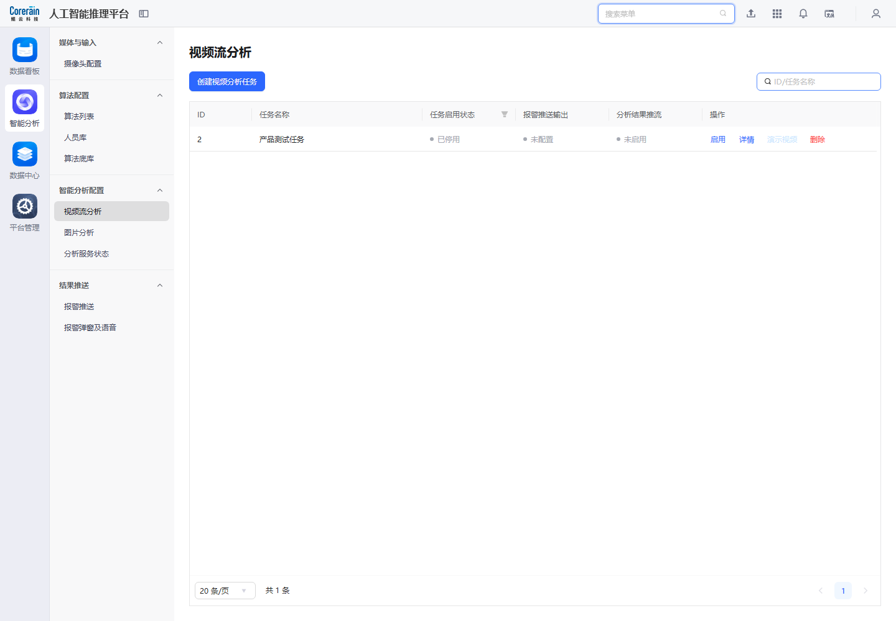 | 视频流分析 07_ID/任务名称_悬停 | hover 悬停查看 ID/任务名称 的 hover/提示状态 | 悬停 ID/任务名称，观察按钮可点击性、危险操作样式、行操作显隐和 hover 反馈；这是判断操作优先级的重要细节。 |
| 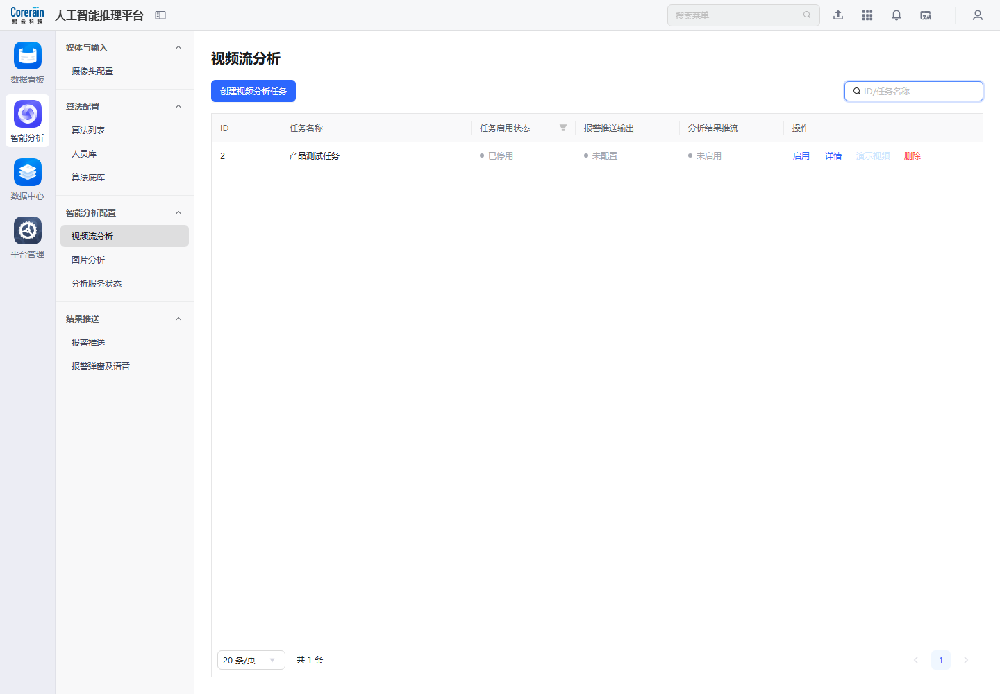 | 视频流分析 07_ID/任务名称_点击后 | focus-or-open 点击后记录页面反馈或空数据提示 | 点击后记录页面反馈或空数据提示 |
| 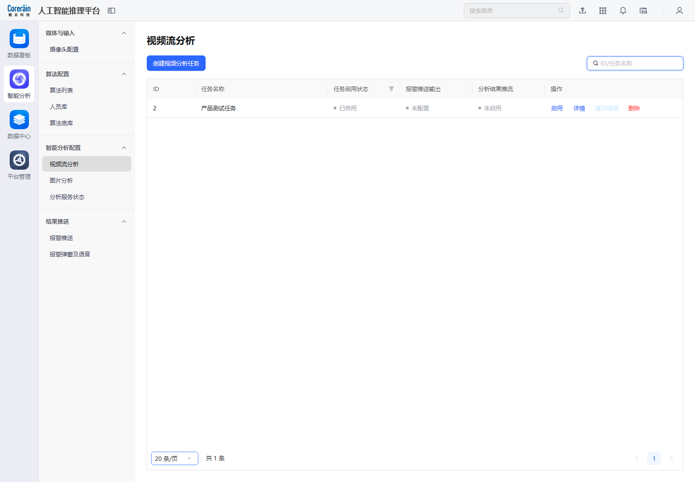 | 视频流分析 08_20 条/页_悬停 | hover 悬停查看 20 条/页 的 hover/提示状态 | 悬停 20 条/页，观察按钮可点击性、危险操作样式、行操作显隐和 hover 反馈；这是判断操作优先级的重要细节。 |
| 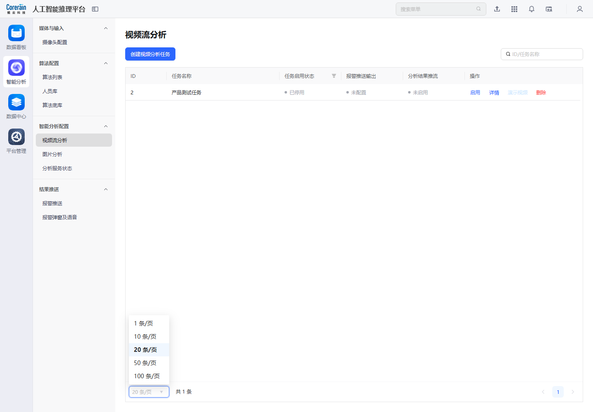 | 视频流分析 08_20 条/页_点击后 | focus-or-open 点击后出现弹窗/下拉/提示：.custom-light-select-dropdown | 点击 20 条/页 后打开下拉选择。选项内容：10 20 50 1 条/页 10 条/页 20 条/页 50 条/页 100 条/页。适合枚举型筛选、菜单搜索和业务分类选择，建议支持搜索、高亮和最近使用。 |

## 图片分析

- 定位：面向离线图片或批量图片的分析任务管理页，与视频流分析构成输入形态互补。
- 核心对象：图片分析任务、启用状态、关联算法、详情、删除。
- 页面 URL：http://192.168.11.88:8081/app/main-app/dispatch/task/img-analysis/#/algorithm-dispatch/schedule-tasks/picture-analysis
- 主要控件：搜索菜单、创建图片分析任务、ID/任务名称、停用、详情、删除、10 条/页
- 表格字段：ID、任务名称、启用状态、关联算法、操作

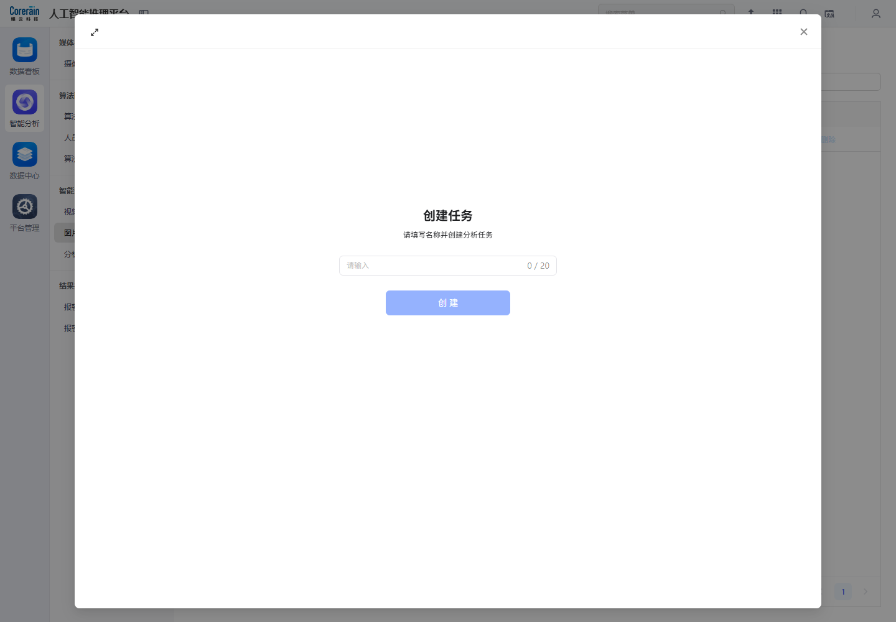

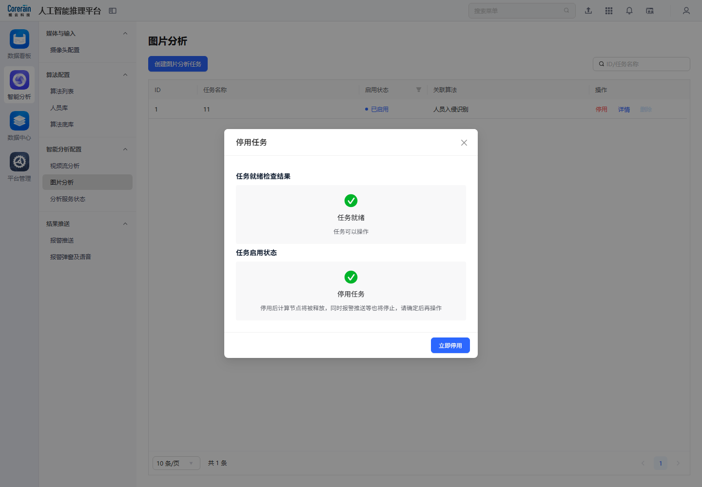

### 产品设计解读

- 保留启停和详情，说明图片分析也被当作长期任务而非一次性上传。
- 页面内容摘要：人工智能推理平台 搜索菜单 数据看板 智能分析 数据中心 平台管理 媒体与输入 摄像头配置 算法配置 算法列表 人员库 算法底库 智能分析配置 视频流分析 图片分析 分析服务状态 结果推送 报警推送 报警弹窗及语音 图片分析 创建图片分析任务 ID 任务名称 启用状态 关联算法 操作 1 11 已启用 人员入侵识别 停用 详情 删除 共 1 条 1 10 条/页
- 建议明确图片来源、批量上传、识别结果落库路径和失败重试策略。

### 图片分析按钮、弹窗与状态截图明细

| 截图 | 子模块/动作 | 类型与页面反馈 | 产品设计说明 |
| --- | --- | --- | --- |
|  | 图片分析 页面全貌 | overview 进入子模块后的页面全貌，用于识别信息架构、主操作区、筛选区和表格/卡片区。 | 页面全貌用于判断信息架构：左侧导航负责定位，主区承载筛选、操作、表格或卡片，适合作为子模块设计基线。 |
| 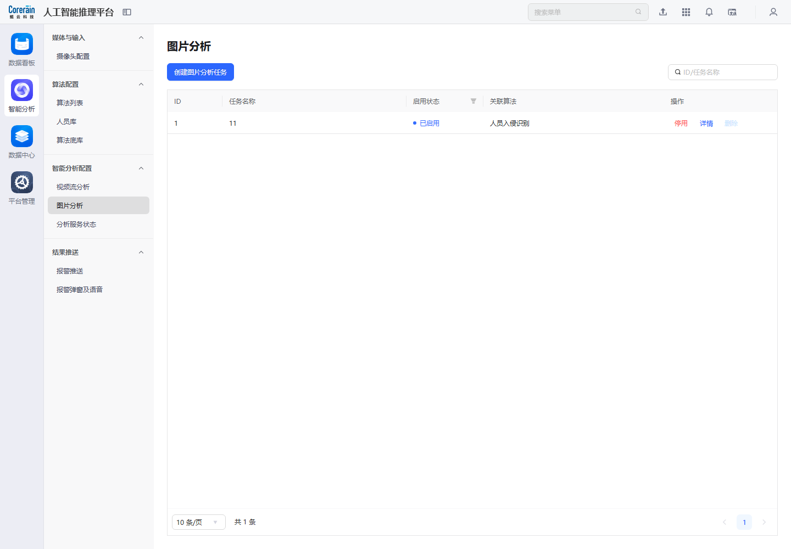 | 图片分析 滚动位置_0% | scroll 记录页面不同滚动位置，补足表格、卡片和底部状态。 | 滚动截图用于确认页面内容密度、底部表格/分页/卡片布局，避免只看首屏导致遗漏。 |
| 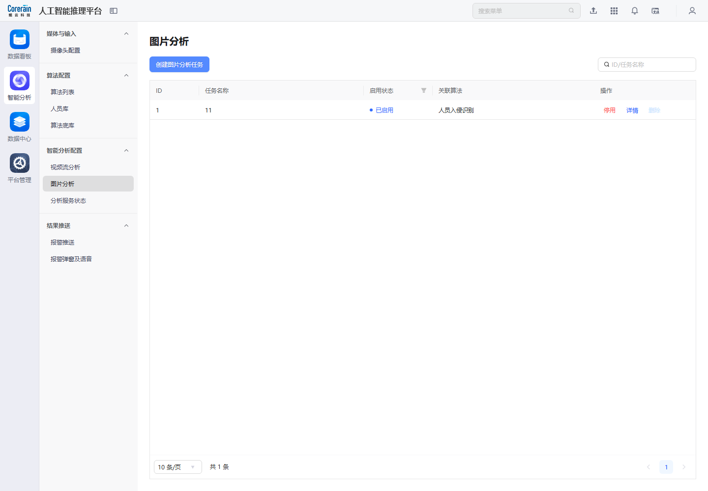 | 图片分析 01_创建图片分析任务_悬停 | hover 悬停查看 创建图片分析任务 的 hover/提示状态 | 悬停 创建图片分析任务，观察按钮可点击性、危险操作样式、行操作显隐和 hover 反馈；这是判断操作优先级的重要细节。 |
|  | 图片分析 01_创建图片分析任务_点击后 | click 点击后出现弹窗/下拉/提示：.custom-light-modal、[role="dialog"] | 点击 创建图片分析任务 后进入弹窗/抽屉式流程。弹窗内容：创建任务 请填写名称并创建分析任务 0 / 20 创 建。设计上把复杂创建、导入、配置或密码类操作隔离在临时层，既保留当前列表上下文，也降低页面跳转成本。 |
| 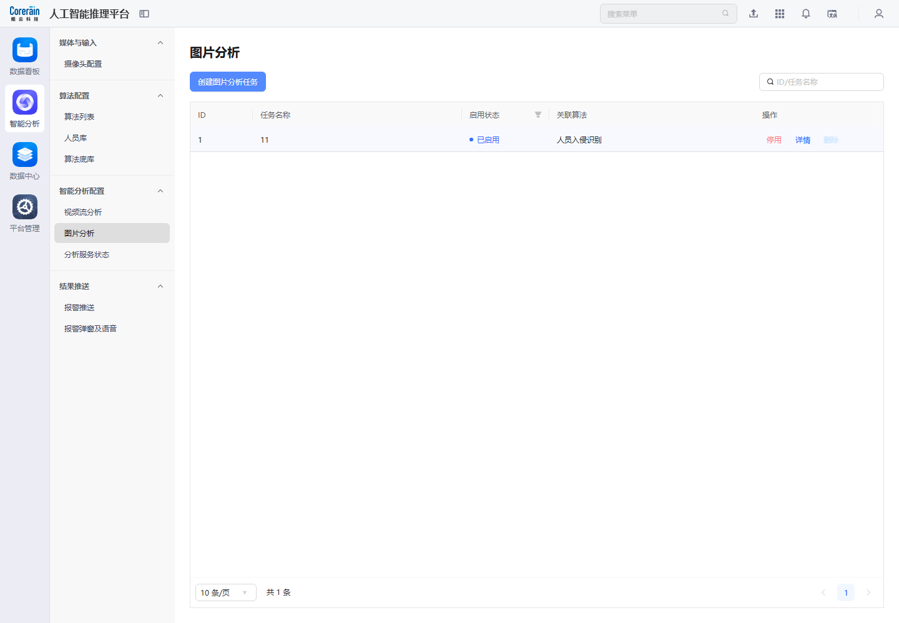 | 图片分析 02_停用_悬停 | hover 悬停查看 停用 的 hover/提示状态 | 悬停 停用，观察按钮可点击性、危险操作样式、行操作显隐和 hover 反馈；这是判断操作优先级的重要细节。 |
|  | 图片分析 02_停用_点击后 | click 点击后出现弹窗/下拉/提示：.custom-light-modal、[role="dialog"] | 点击 停用 后进入弹窗/抽屉式流程。弹窗内容：停用任务 任务就绪检查结果 任务就绪 任务可以操作 任务启用状态 停用任务 停用后计算节点将被释放，同时报警推送等也将停止，请确定后再操作 立即停用。设计上把复杂创建、导入、配置或密码类操作隔离在临时层，既保留当前列表上下文，也降低页面跳转成本。 |
|  | 图片分析 03_详情_悬停 | hover 悬停查看 详情 的 hover/提示状态 | 悬停 详情，观察按钮可点击性、危险操作样式、行操作显隐和 hover 反馈；这是判断操作优先级的重要细节。 |
|  | 图片分析 03_详情_点击后 | click 点击后出现弹窗/下拉/提示：.custom-light-modal、[role="dialog"] | 点击 详情 后进入弹窗/抽屉式流程。弹窗内容：图片分析任务 图片-API推送分析 01 配置算法 算法数量: 1 02 配置任务 03 查看报警 暂未发现报警。设计上把复杂创建、导入、配置或密码类操作隔离在临时层，既保留当前列表上下文，也降低页面跳转成本。 |
| 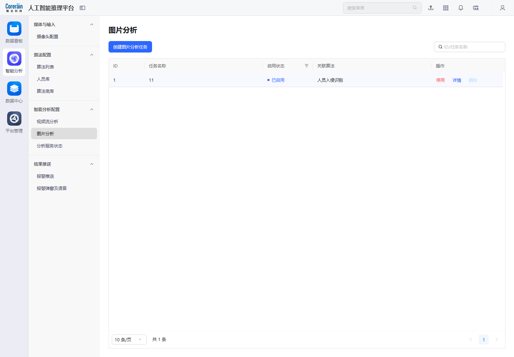 | 图片分析 04_删除_悬停 | hover 悬停查看 删除 的 hover/提示状态 | 悬停 删除，观察按钮可点击性、危险操作样式、行操作显隐和 hover 反馈；这是判断操作优先级的重要细节。 |
|  | 图片分析 04_删除_安全跳过点击 | safety-skip 该控件可能触发安装、导出、保存等最终动作，本轮只记录悬停状态，避免修改系统数据。 | 该操作可能产生安装、导出、保存、删除、启停或配置变更等副作用，本次只保留悬停/按钮状态截图；产品上应通过权限、二次确认和审计保护。 |
| 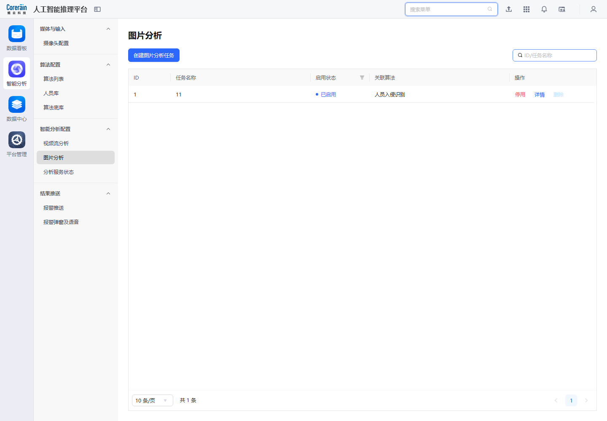 | 图片分析 06_ID/任务名称_悬停 | hover 悬停查看 ID/任务名称 的 hover/提示状态 | 悬停 ID/任务名称，观察按钮可点击性、危险操作样式、行操作显隐和 hover 反馈；这是判断操作优先级的重要细节。 |
|  | 图片分析 06_ID/任务名称_点击后 | focus-or-open 点击后记录页面反馈或空数据提示 | 点击后记录页面反馈或空数据提示 |
|  | 图片分析 07_10 条/页_悬停 | hover 悬停查看 10 条/页 的 hover/提示状态 | 悬停 10 条/页，观察按钮可点击性、危险操作样式、行操作显隐和 hover 反馈；这是判断操作优先级的重要细节。 |
| 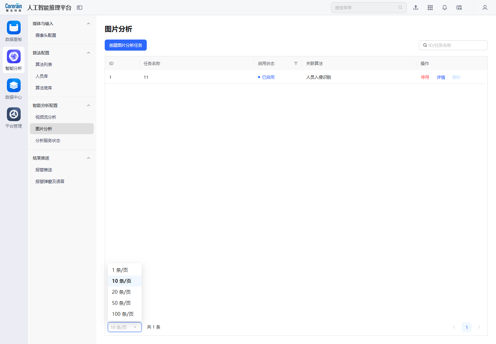 | 图片分析 07_10 条/页_点击后 | focus-or-open 点击后出现弹窗/下拉/提示：.custom-light-select-dropdown | 点击 10 条/页 后打开下拉选择。选项内容：1 10 20 1 条/页 10 条/页 20 条/页 50 条/页 100 条/页。适合枚举型筛选、菜单搜索和业务分类选择，建议支持搜索、高亮和最近使用。 |

## 分析服务状态

- 定位：运行健康监控页，帮助运维和管理员查看分析节点、服务状态与算法/摄像头承载数量。
- 核心对象：节点 IP、节点名称、服务名称、状态、算法数量、摄像头数量。
- 页面 URL：http://192.168.11.88:8081/app/main-app/dispatch/task/execute-service/#/execute-service
- 主要控件：搜索菜单、节点名称/IP、强制重启、详情
- 表格字段：节点 IP、节点名称、服务名称、状态、算法数量、摄像头数量、操作

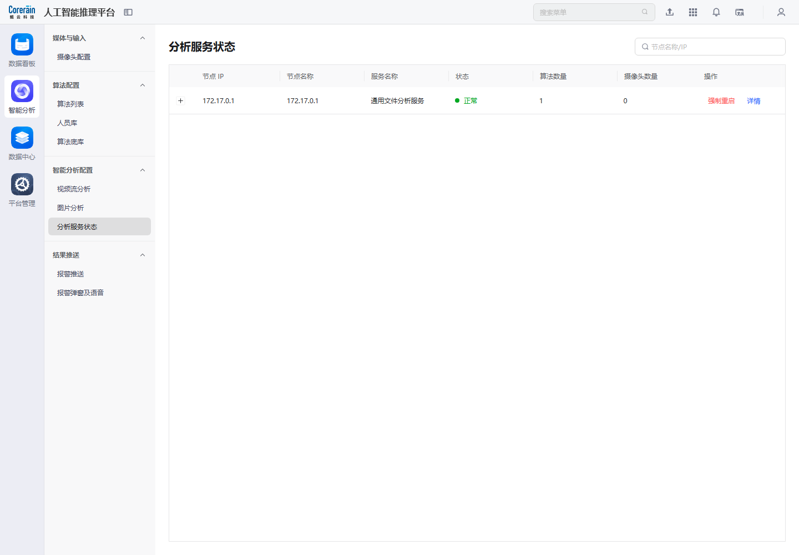

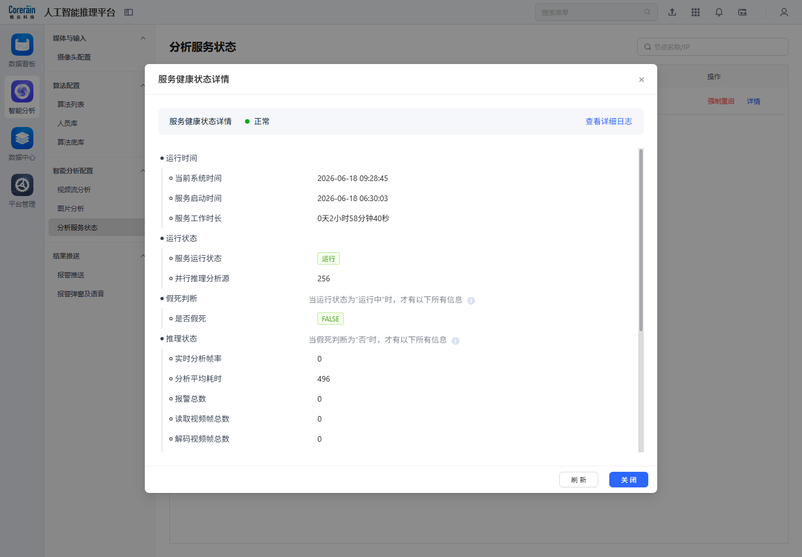

### 产品设计解读

- 强制重启和详情属于运维操作，说明系统支持对推理服务做运行时治理。
- 页面内容摘要：人工智能推理平台 搜索菜单 数据看板 智能分析 数据中心 平台管理 媒体与输入 摄像头配置 算法配置 算法列表 人员库 算法底库 智能分析配置 视频流分析 图片分析 分析服务状态 结果推送 报警推送 报警弹窗及语音 分析服务状态 节点 IP 节点名称 服务名称 状态 算法数量 摄像头数量 操作 172.17.0.1 172.17.0.1 通用文件分析服务 正常 1 0 强制重启 详情
- 建议增加 CPU/GPU/内存/队列积压、最近错误、心跳时间和重启审计。

### 分析服务状态按钮、弹窗与状态截图明细

| 截图 | 子模块/动作 | 类型与页面反馈 | 产品设计说明 |
| --- | --- | --- | --- |
|  | 分析服务状态 页面全貌 | overview 进入子模块后的页面全貌，用于识别信息架构、主操作区、筛选区和表格/卡片区。 | 页面全貌用于判断信息架构：左侧导航负责定位，主区承载筛选、操作、表格或卡片，适合作为子模块设计基线。 |
|  | 分析服务状态 滚动位置_0% | scroll 记录页面不同滚动位置，补足表格、卡片和底部状态。 | 滚动截图用于确认页面内容密度、底部表格/分页/卡片布局，避免只看首屏导致遗漏。 |
| 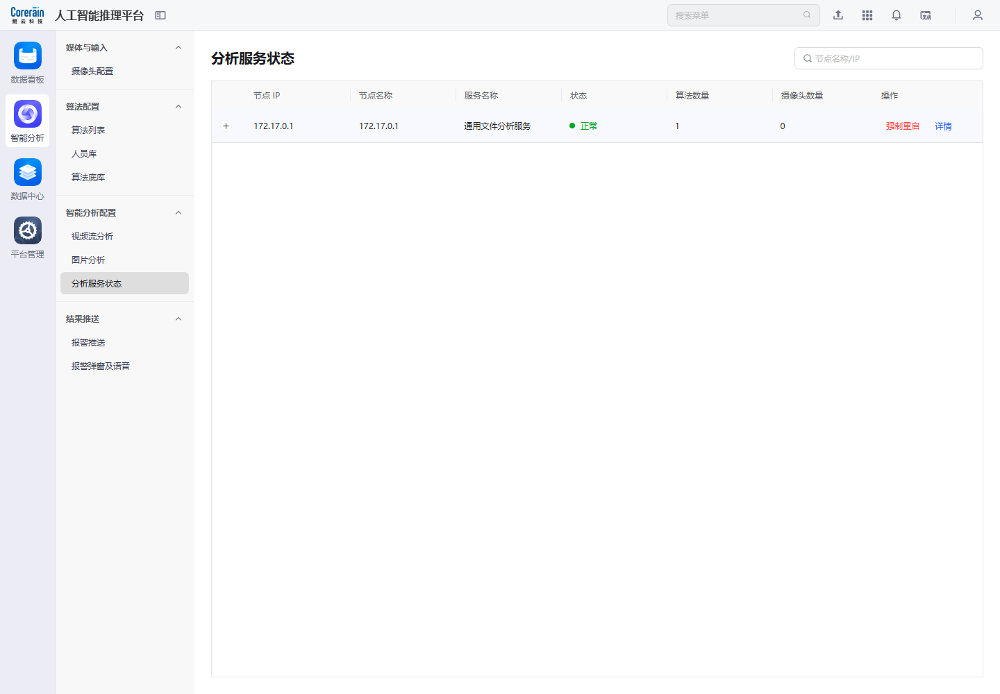 | 分析服务状态 01_强制重启_悬停 | hover 悬停查看 强制重启 的 hover/提示状态 | 悬停 强制重启，观察按钮可点击性、危险操作样式、行操作显隐和 hover 反馈；这是判断操作优先级的重要细节。 |
| 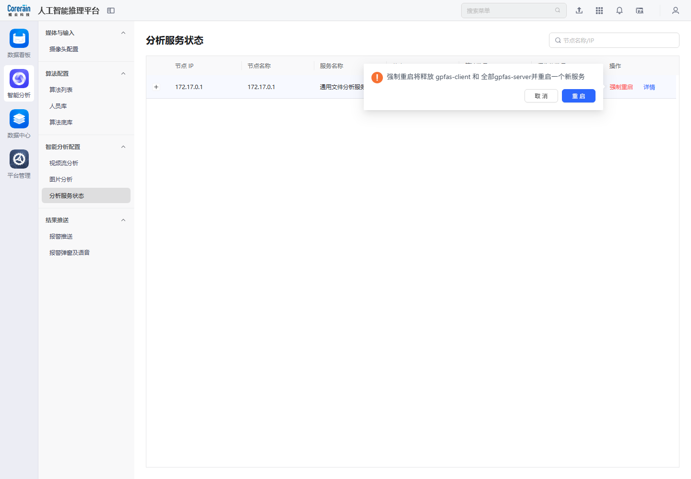 | 分析服务状态 01_强制重启_点击后 | click 点击后出现弹窗/下拉/提示：.custom-light-popover | 点击后出现弹窗/下拉/提示：.custom-light-popover |
|  | 分析服务状态 02_详情_悬停 | hover 悬停查看 详情 的 hover/提示状态 | 悬停 详情，观察按钮可点击性、危险操作样式、行操作显隐和 hover 反馈；这是判断操作优先级的重要细节。 |
|  | 分析服务状态 02_详情_点击后 | click 点击后出现弹窗/下拉/提示：.custom-light-modal、[role="dialog"] | 点击 详情 后进入弹窗/抽屉式流程。弹窗内容：服务健康状态详情 服务健康状态详情 正常 查看详细日志 运行时间 当前系统时间 2026-06-18 09:28:45 服务启动时间 2026-06-18 06:30:03 服务工作时长 0天2小时58分钟40秒 运行状态 服务运行状态 运行 并行推理分析源 256 假死判断 当运行状态为“运行中”时，才有以下所有信息 是否假死 FALSE 推理状态 当假死判断为“否”时，才有以下所有信息 实时分析帧率 0 分析平均耗时 496 报警总数 0 读取视频帧总数 0 解码视频帧总数 0 推送分析总数 1 分析完成总数 。设计上把复杂创建、导入、配置或密码类操作隔离在临时层，既保留当前列表上下文，也降低页面跳转成本。 |
| 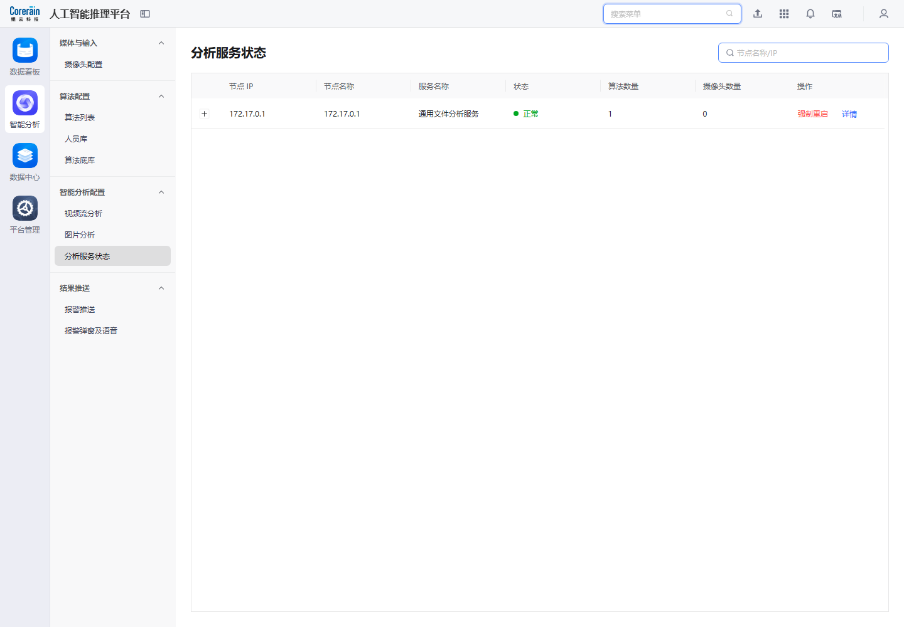 | 分析服务状态 04_节点名称/IP_悬停 | hover 悬停查看 节点名称/IP 的 hover/提示状态 | 悬停 节点名称/IP，观察按钮可点击性、危险操作样式、行操作显隐和 hover 反馈；这是判断操作优先级的重要细节。 |
| 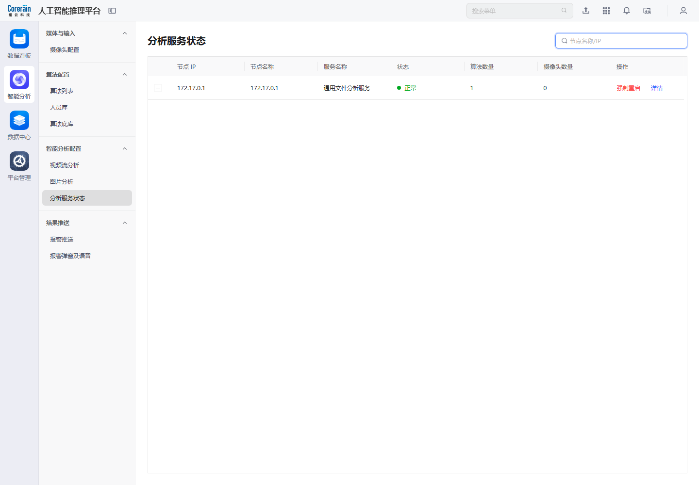 | 分析服务状态 04_节点名称/IP_点击后 | focus-or-open 点击后记录页面反馈或空数据提示 | 点击后记录页面反馈或空数据提示 |
|  | 分析服务状态 滚动位置_50% | scroll 记录页面不同滚动位置，补足表格、卡片和底部状态。 | 滚动截图用于确认页面内容密度、底部表格/分页/卡片布局，避免只看首屏导致遗漏。 |
| 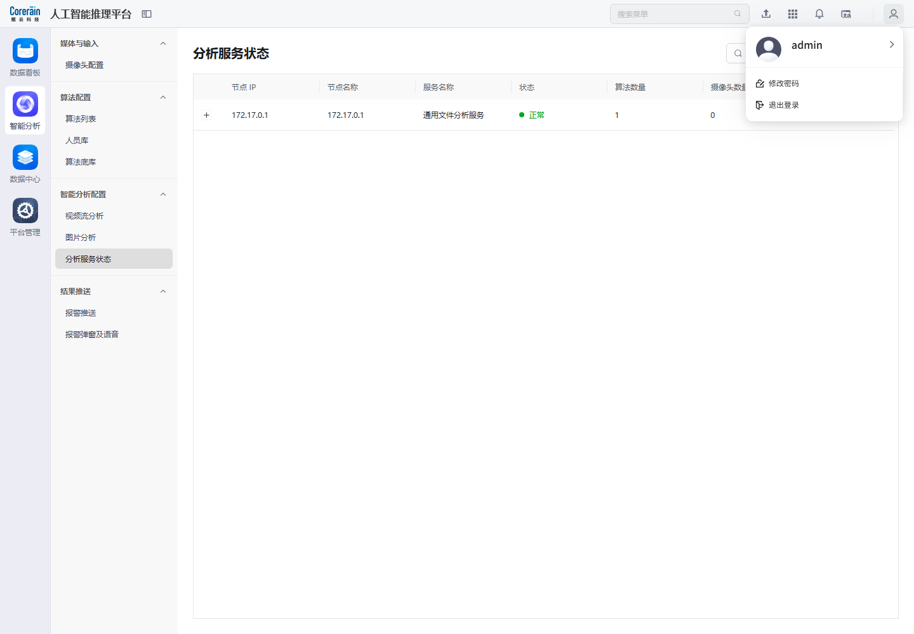 | 分析服务状态 滚动位置_100% | scroll 记录页面不同滚动位置，补足表格、卡片和底部状态。 | 滚动截图用于确认页面内容密度、底部表格/分页/卡片布局，避免只看首屏导致遗漏。 |

## 报警推送

- 定位：把分析结果送到外部系统的配置页，是 AI 事件进入业务系统的出口。
- 核心对象：推送名称、推送地址、状态、创建推送、状态测试。
- 页面 URL：http://192.168.11.88:8081/app/main-app/dispatch/result-push/callback/#/open-ability/alarm-push/callback-output
- 主要控件：搜索菜单、创建推送、状态测试
- 表格字段：名称、推送地址、状态、操作

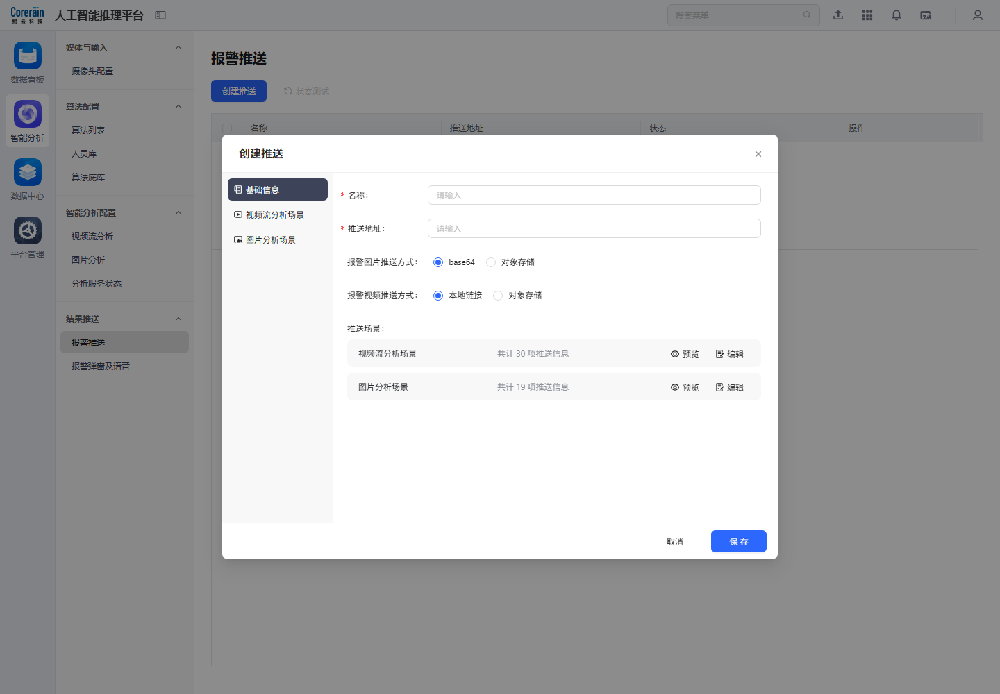

### 产品设计解读

- 创建推送与状态测试形成配置闭环，先建通道再验证通道可用性。
- 页面内容摘要：人工智能推理平台 搜索菜单 数据看板 智能分析 数据中心 平台管理 媒体与输入 摄像头配置 算法配置 算法列表 人员库 算法底库 智能分析配置 视频流分析 图片分析 分析服务状态 结果推送 报警推送 报警弹窗及语音 报警推送 创建推送 状态测试 名称 推送地址 状态 操作 暂无数据
- 建议增加鉴权方式、重试策略、签名配置、失败日志跳转和回调字段预览。

### 报警推送按钮、弹窗与状态截图明细

| 截图 | 子模块/动作 | 类型与页面反馈 | 产品设计说明 |
| --- | --- | --- | --- |
|  | 报警推送 页面全貌 | overview 进入子模块后的页面全貌，用于识别信息架构、主操作区、筛选区和表格/卡片区。 | 页面全貌用于判断信息架构：左侧导航负责定位，主区承载筛选、操作、表格或卡片，适合作为子模块设计基线。 |
| 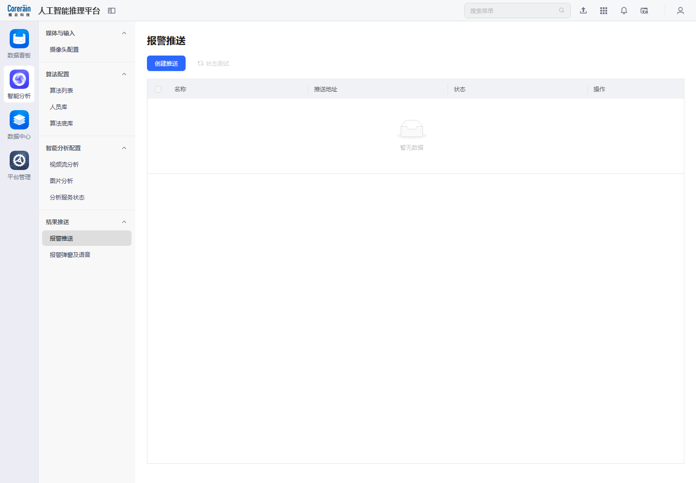 | 报警推送 滚动位置_0% | scroll 记录页面不同滚动位置，补足表格、卡片和底部状态。 | 滚动截图用于确认页面内容密度、底部表格/分页/卡片布局，避免只看首屏导致遗漏。 |
| 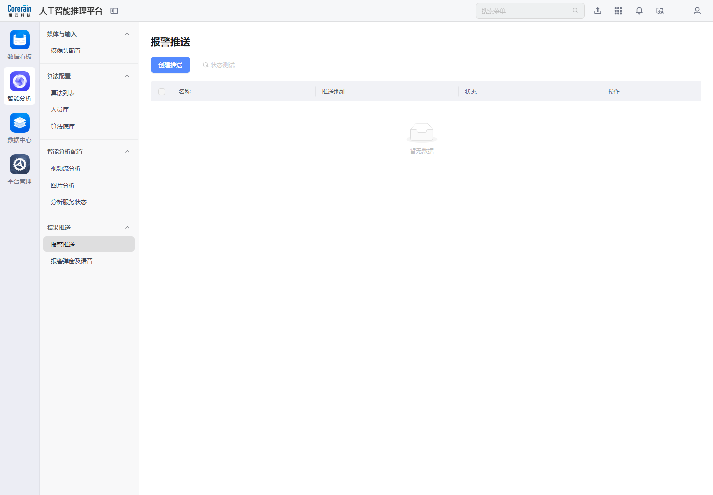 | 报警推送 01_创建推送_悬停 | hover 悬停查看 创建推送 的 hover/提示状态 | 悬停 创建推送，观察按钮可点击性、危险操作样式、行操作显隐和 hover 反馈；这是判断操作优先级的重要细节。 |
|  | 报警推送 01_创建推送_点击后 | click 点击后出现弹窗/下拉/提示：.custom-light-modal、[role="dialog"] | 点击 创建推送 后进入弹窗/抽屉式流程。弹窗内容：创建推送 基础信息 视频流分析场景 图片分析场景 名称 推送地址 报警图片推送方式 base64 对象存储 报警视频推送方式 本地链接 对象存储 推送场景 视频流分析场景 共计 30 项推送信息 预览 编辑 图片分析场景 共计 19 项推送信息 预览 编辑 取消 保 存。设计上把复杂创建、导入、配置或密码类操作隔离在临时层，既保留当前列表上下文，也降低页面跳转成本。 |
|  | 报警推送 02_状态测试_悬停 | hover 悬停查看 状态测试 的 hover/提示状态 | 悬停 状态测试，观察按钮可点击性、危险操作样式、行操作显隐和 hover 反馈；这是判断操作优先级的重要细节。 |
|  | 报警推送 02_状态测试_安全跳过点击 | safety-skip 该控件可能触发安装、导出、保存等最终动作，本轮只记录悬停状态，避免修改系统数据。 | 该操作可能产生安装、导出、保存、删除、启停或配置变更等副作用，本次只保留悬停/按钮状态截图；产品上应通过权限、二次确认和审计保护。 |
| 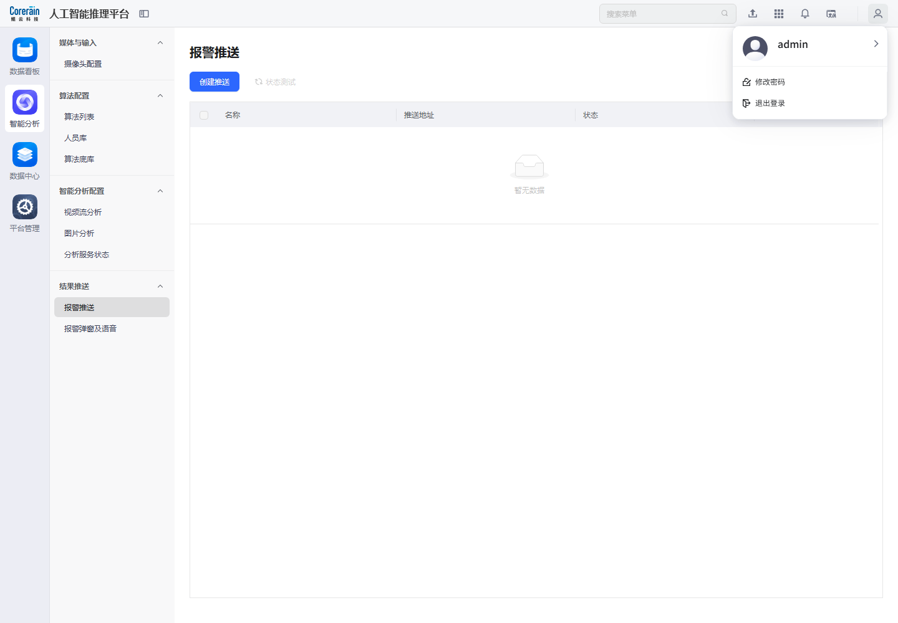 | 报警推送 滚动位置_50% | scroll 记录页面不同滚动位置，补足表格、卡片和底部状态。 | 滚动截图用于确认页面内容密度、底部表格/分页/卡片布局，避免只看首屏导致遗漏。 |
|  | 报警推送 滚动位置_100% | scroll 记录页面不同滚动位置，补足表格、卡片和底部状态。 | 滚动截图用于确认页面内容密度、底部表格/分页/卡片布局，避免只看首屏导致遗漏。 |

## 报警弹窗及语音

- 定位：面向值守场景的本地提醒配置页，通过报警等级、语音和弹窗控制事件触达。
- 核心对象：报警等级、语音文件、TTS 声音、语速、音量、算法级播报方式。
- 页面 URL：http://192.168.11.88:8081/app/main-app/dispatch/result-push/modal-voice/#/modal-voice
- 主要控件：搜索菜单、一级 二级 三级 + 2 ...、试听、替换、恢复默认、Google Deutsch-de-DE、编辑、10 条/页
- 表格字段：算法ID、算法名称、报警等级、播报方式、操作

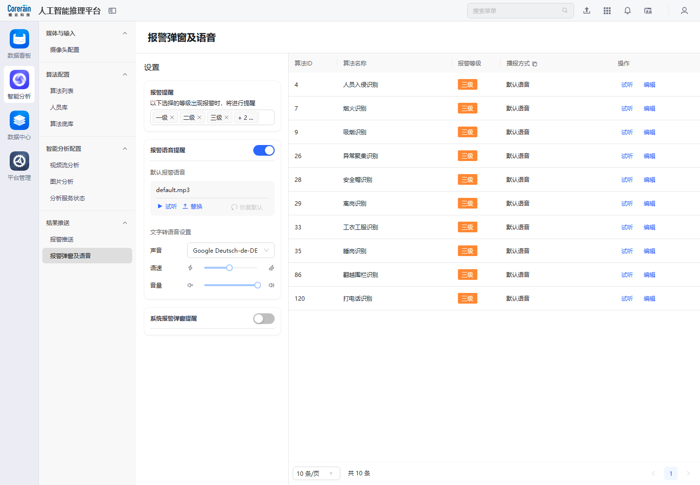

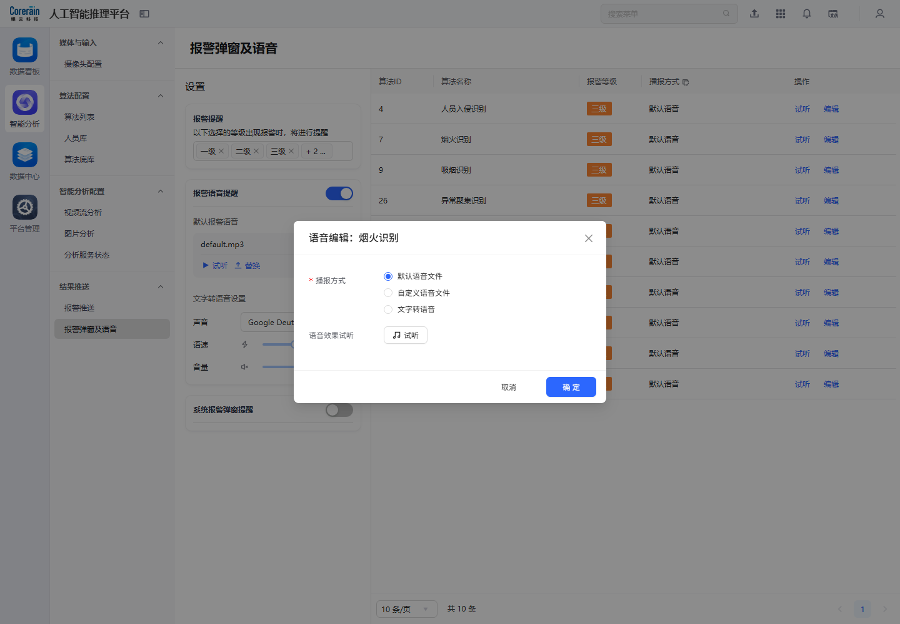

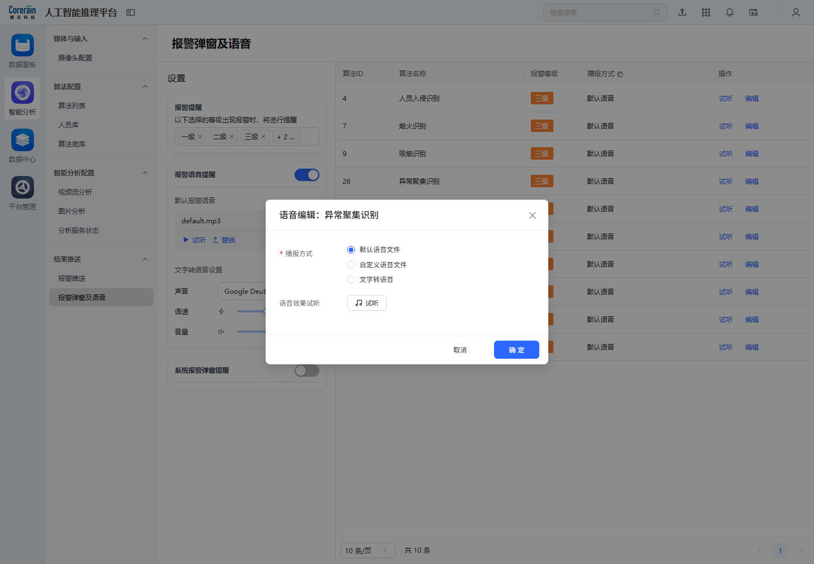

### 产品设计解读

- 系统级提醒与算法级提醒并存，可让高优先级算法有差异化触达方式。
- 页面内容摘要：人工智能推理平台 搜索菜单 数据看板 智能分析 数据中心 平台管理 媒体与输入 摄像头配置 算法配置 算法列表 人员库 算法底库 智能分析配置 视频流分析 图片分析 分析服务状态 结果推送 报警推送 报警弹窗及语音 报警弹窗及语音 设置 报警提醒以下选择的等级出现报警时，将进行提醒 一级 二级 三级 + 2 ... 报警语音提醒 默认报警语音 default.mp3 试听 替换 恢复默认 文字转语音设置 声音 Google Deutsch-de-DE 语速 音量 系统报警弹窗提醒 算法ID 算法名称 报警等级 播报方式 操作 4 人员入侵识别 三级 默认语音 试听 编辑 7 烟火识别 三级 默认语音 试听 编辑 9 吸烟识别 三级 默认语音 试听 编辑 26 异常聚集识别 三级 默认语音 试听 编辑 28 安全
- 建议支持分时段、分用户组、静默策略、试听队列和多语言语音包。

### 报警弹窗及语音按钮、弹窗与状态截图明细

| 截图 | 子模块/动作 | 类型与页面反馈 | 产品设计说明 |
| --- | --- | --- | --- |
|  | 报警弹窗及语音 页面全貌 | overview 进入子模块后的页面全貌，用于识别信息架构、主操作区、筛选区和表格/卡片区。 | 页面全貌用于判断信息架构：左侧导航负责定位，主区承载筛选、操作、表格或卡片，适合作为子模块设计基线。 |
|  | 报警弹窗及语音 滚动位置_0% | scroll 记录页面不同滚动位置，补足表格、卡片和底部状态。 | 滚动截图用于确认页面内容密度、底部表格/分页/卡片布局，避免只看首屏导致遗漏。 |
| 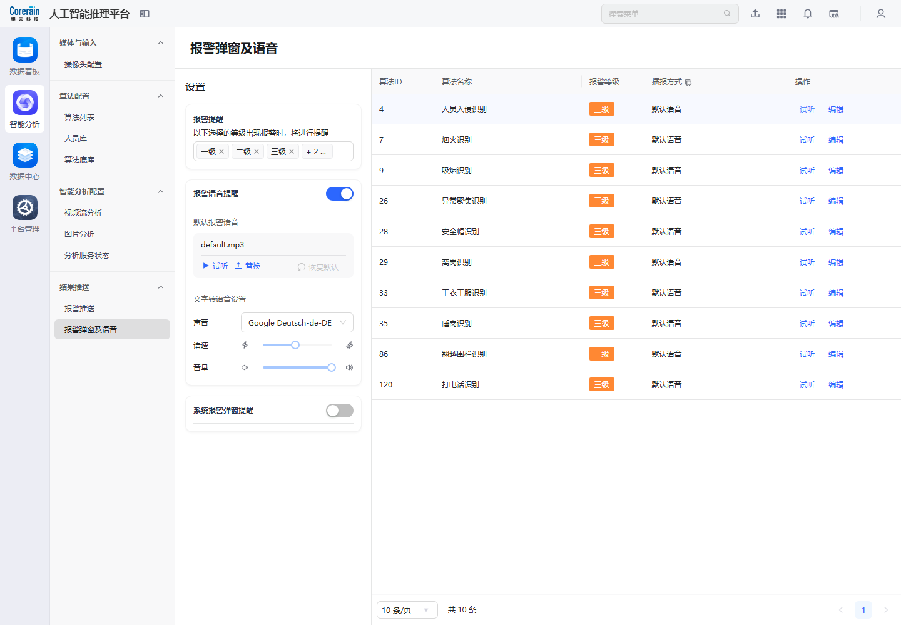 | 报警弹窗及语音 01_试听_悬停 | hover 悬停查看 试听 的 hover/提示状态 | 悬停 试听，观察按钮可点击性、危险操作样式、行操作显隐和 hover 反馈；这是判断操作优先级的重要细节。 |
| 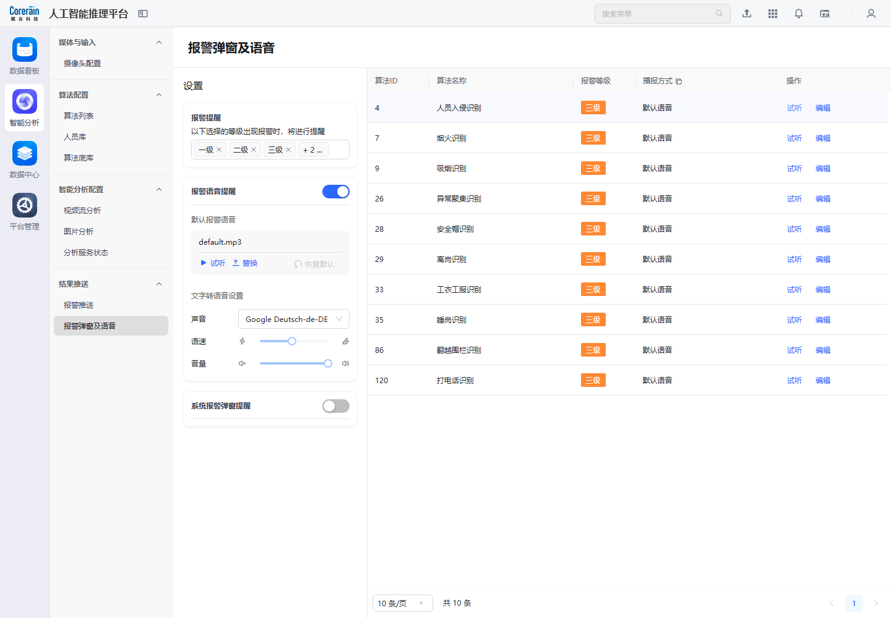 | 报警弹窗及语音 01_试听_点击后 | click 点击后记录页面反馈或空数据提示 | 点击后记录页面反馈或空数据提示 |
|  | 报警弹窗及语音 02_编辑_悬停 | hover 悬停查看 编辑 的 hover/提示状态 | 悬停 编辑，观察按钮可点击性、危险操作样式、行操作显隐和 hover 反馈；这是判断操作优先级的重要细节。 |
|  | 报警弹窗及语音 02_编辑_点击后 | click 点击后出现弹窗/下拉/提示：.custom-light-modal、[role="dialog"] | 点击 编辑 后进入弹窗/抽屉式流程。弹窗内容：语音编辑：人员入侵识别 播报方式 默认语音文件 自定义语音文件 文字转语音 语音效果试听 试听 取消 确 定。设计上把复杂创建、导入、配置或密码类操作隔离在临时层，既保留当前列表上下文，也降低页面跳转成本。 |
| 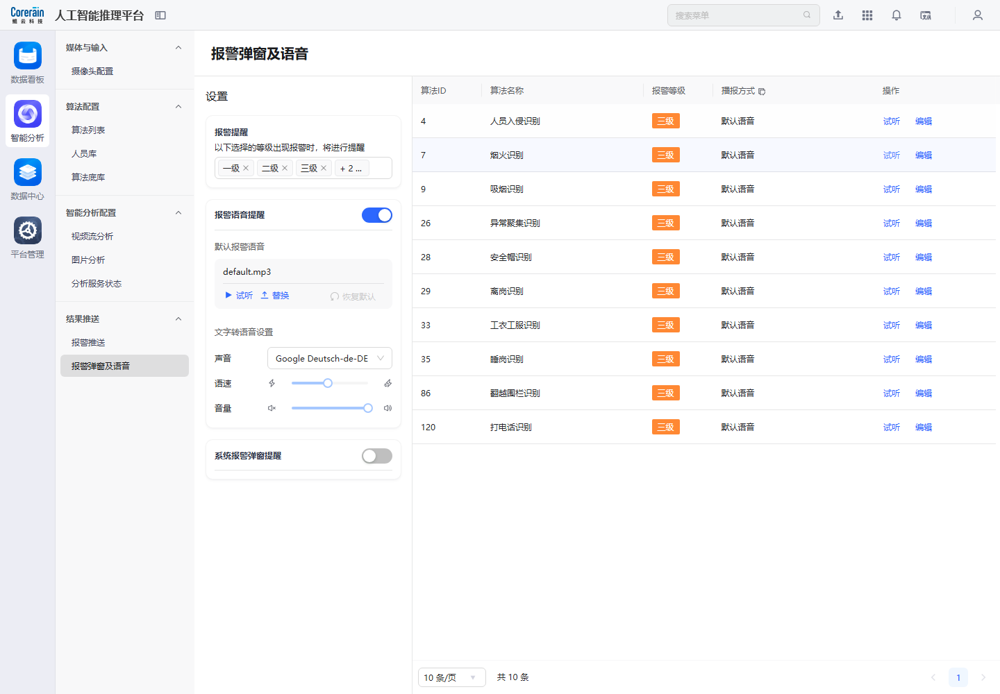 | 报警弹窗及语音 03_试听_悬停 | hover 悬停查看 试听 的 hover/提示状态 | 悬停 试听，观察按钮可点击性、危险操作样式、行操作显隐和 hover 反馈；这是判断操作优先级的重要细节。 |
|  | 报警弹窗及语音 03_试听_点击后 | click 点击后记录页面反馈或空数据提示 | 点击后记录页面反馈或空数据提示 |
|  | 报警弹窗及语音 04_编辑_悬停 | hover 悬停查看 编辑 的 hover/提示状态 | 悬停 编辑，观察按钮可点击性、危险操作样式、行操作显隐和 hover 反馈；这是判断操作优先级的重要细节。 |
|  | 报警弹窗及语音 04_编辑_点击后 | click 点击后出现弹窗/下拉/提示：.custom-light-modal、[role="dialog"] | 点击 编辑 后进入弹窗/抽屉式流程。弹窗内容：语音编辑：烟火识别 播报方式 默认语音文件 自定义语音文件 文字转语音 语音效果试听 试听 取消 确 定。设计上把复杂创建、导入、配置或密码类操作隔离在临时层，既保留当前列表上下文，也降低页面跳转成本。 |
|  | 报警弹窗及语音 05_试听_悬停 | hover 悬停查看 试听 的 hover/提示状态 | 悬停 试听，观察按钮可点击性、危险操作样式、行操作显隐和 hover 反馈；这是判断操作优先级的重要细节。 |
| 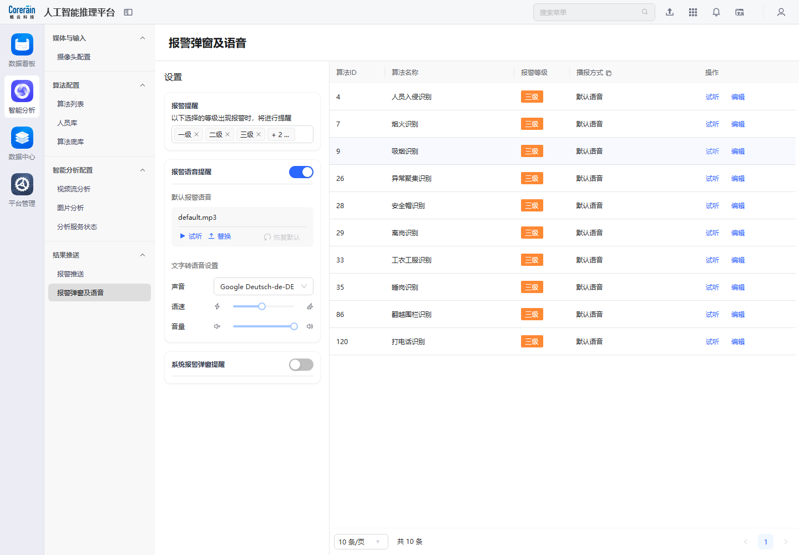 | 报警弹窗及语音 05_试听_点击后 | click 点击后记录页面反馈或空数据提示 | 点击后记录页面反馈或空数据提示 |
|  | 报警弹窗及语音 06_编辑_悬停 | hover 悬停查看 编辑 的 hover/提示状态 | 悬停 编辑，观察按钮可点击性、危险操作样式、行操作显隐和 hover 反馈；这是判断操作优先级的重要细节。 |
|  | 报警弹窗及语音 06_编辑_点击后 | click 点击后出现弹窗/下拉/提示：.custom-light-modal、[role="dialog"] | 点击 编辑 后进入弹窗/抽屉式流程。弹窗内容：语音编辑：吸烟识别 播报方式 默认语音文件 自定义语音文件 文字转语音 语音效果试听 试听 取消 确 定。设计上把复杂创建、导入、配置或密码类操作隔离在临时层，既保留当前列表上下文，也降低页面跳转成本。 |
|  | 报警弹窗及语音 07_试听_悬停 | hover 悬停查看 试听 的 hover/提示状态 | 悬停 试听，观察按钮可点击性、危险操作样式、行操作显隐和 hover 反馈；这是判断操作优先级的重要细节。 |
|  | 报警弹窗及语音 07_试听_点击后 | click 点击后记录页面反馈或空数据提示 | 点击后记录页面反馈或空数据提示 |
|  | 报警弹窗及语音 08_编辑_悬停 | hover 悬停查看 编辑 的 hover/提示状态 | 悬停 编辑，观察按钮可点击性、危险操作样式、行操作显隐和 hover 反馈；这是判断操作优先级的重要细节。 |
|  | 报警弹窗及语音 08_编辑_点击后 | click 点击后出现弹窗/下拉/提示：.custom-light-modal、[role="dialog"] | 点击 编辑 后进入弹窗/抽屉式流程。弹窗内容：语音编辑：异常聚集识别 播报方式 默认语音文件 自定义语音文件 文字转语音 语音效果试听 试听 取消 确 定。设计上把复杂创建、导入、配置或密码类操作隔离在临时层，既保留当前列表上下文，也降低页面跳转成本。 |
|  | 报警弹窗及语音 09_试听_悬停 | hover 悬停查看 试听 的 hover/提示状态 | 悬停 试听，观察按钮可点击性、危险操作样式、行操作显隐和 hover 反馈；这是判断操作优先级的重要细节。 |
|  | 报警弹窗及语音 09_试听_点击后 | click 点击后记录页面反馈或空数据提示 | 点击后记录页面反馈或空数据提示 |
| 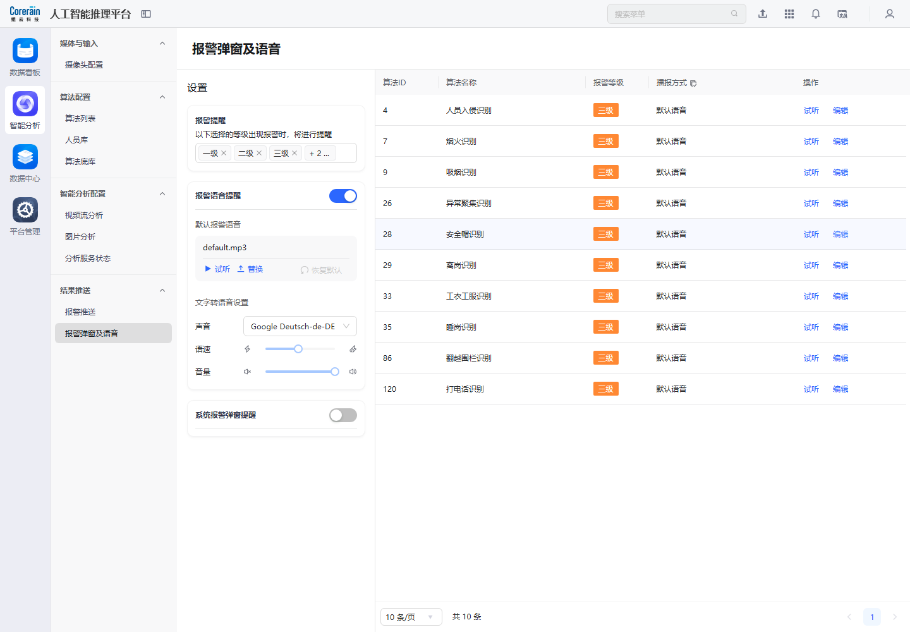 | 报警弹窗及语音 10_编辑_悬停 | hover 悬停查看 编辑 的 hover/提示状态 | 悬停 编辑，观察按钮可点击性、危险操作样式、行操作显隐和 hover 反馈；这是判断操作优先级的重要细节。 |
|  | 报警弹窗及语音 10_编辑_点击后 | click 点击后出现弹窗/下拉/提示：.custom-light-modal、[role="dialog"] | 点击 编辑 后进入弹窗/抽屉式流程。弹窗内容：语音编辑：安全帽识别 播报方式 默认语音文件 自定义语音文件 文字转语音 语音效果试听 试听 取消 确 定。设计上把复杂创建、导入、配置或密码类操作隔离在临时层，既保留当前列表上下文，也降低页面跳转成本。 |