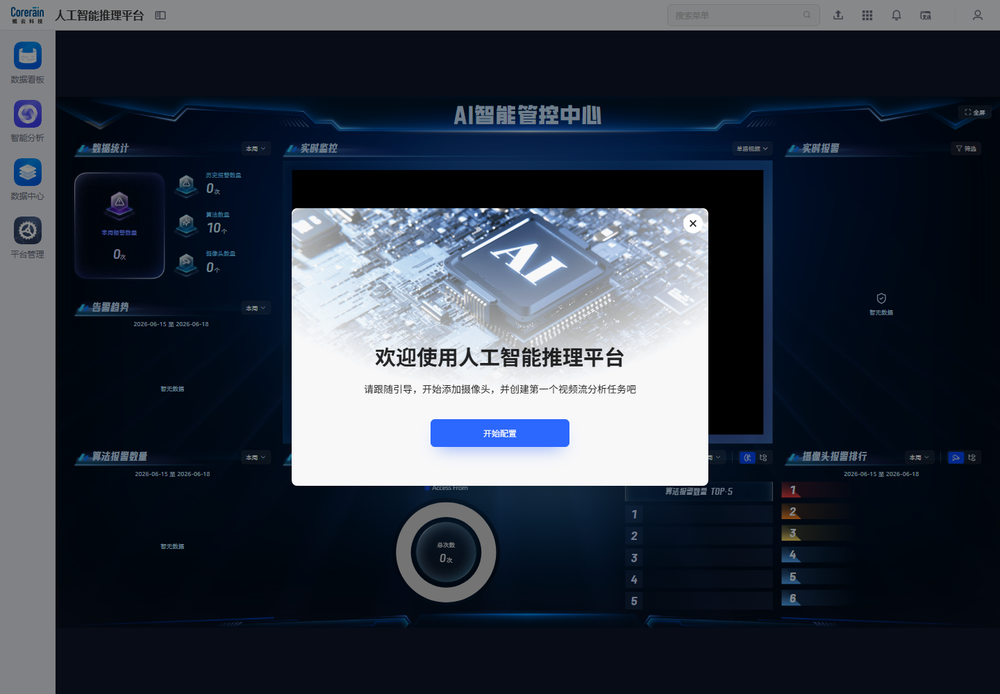
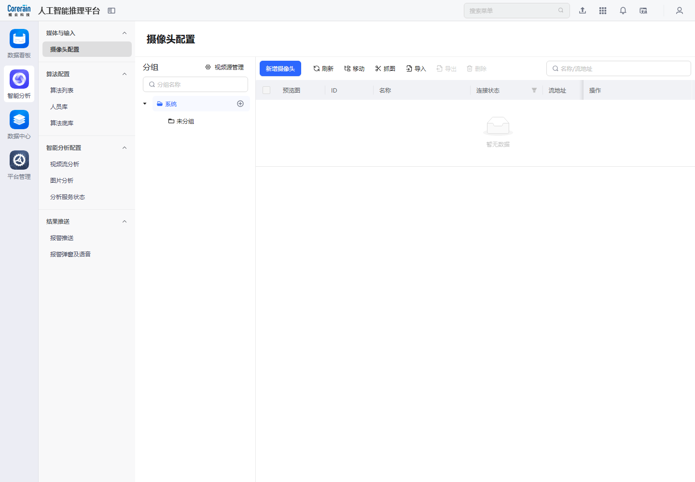
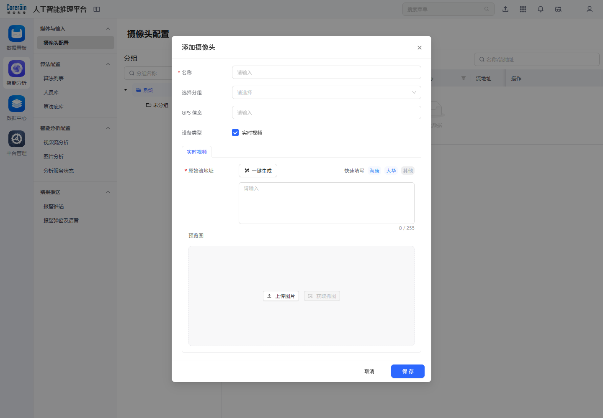
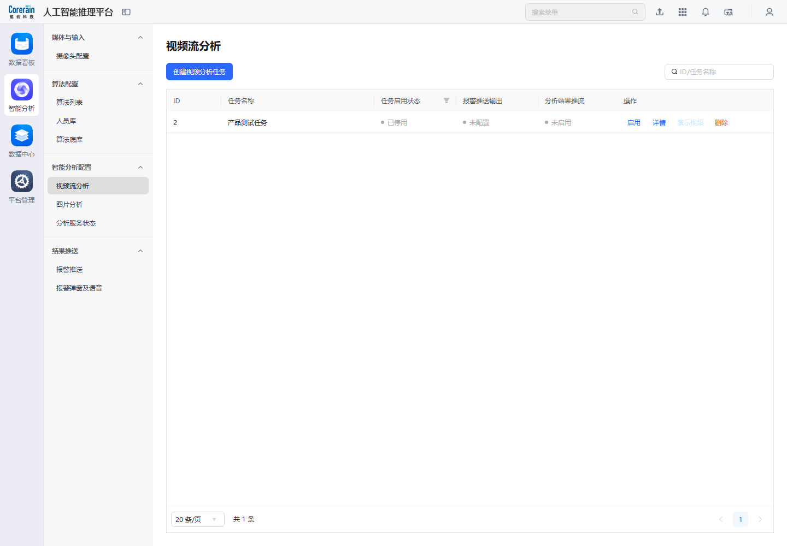
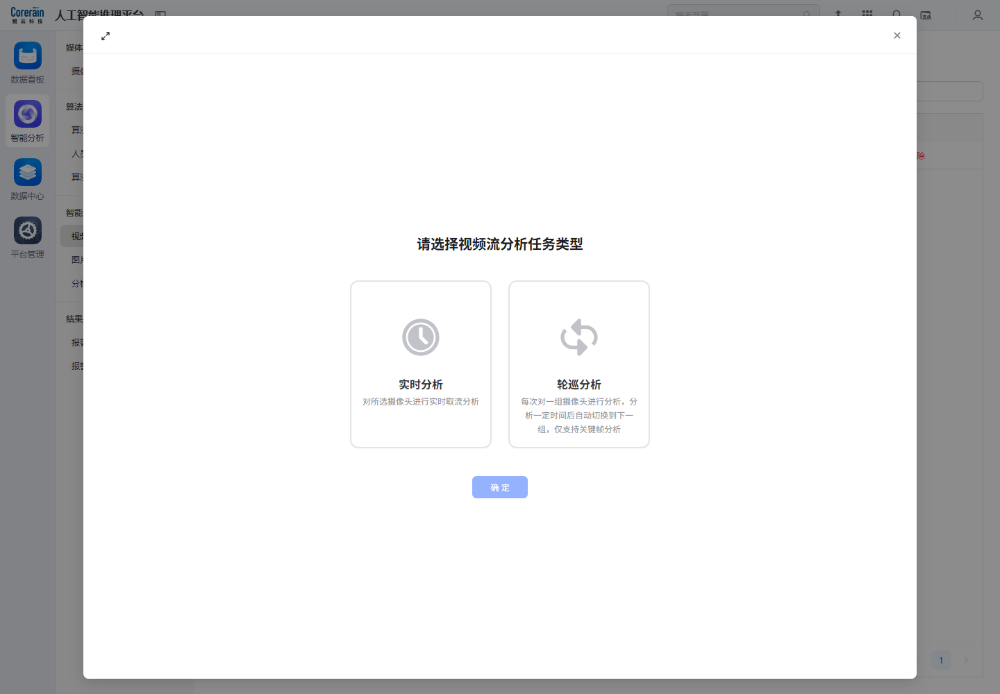

# 新手引导弹窗模块

新手引导弹窗的核心不是“展示欢迎语”，而是把新用户从登录后的 AI 智能管控中心，带入平台最关键的冷启动链路：添加摄像头、创建视频流分析任务、配置报警输出，并最终回到数据中心或数据看板验证结果。

本次重新梳理后，将“点击开始配置”作为主路径继续分析；“关闭弹窗”只作为跳过分支，不再作为引导流程的结束。

## 结论先行

| 判断项 | 观察结论 | 产品影响 |
| --- | --- | --- |
| 弹窗目标 | 文案明确要求“添加摄像头，并创建第一个视频流分析任务” | 引导的主任务应继续进入智能分析配置链路，而不是停留在弹窗层。 |
| 主按钮 | `开始配置` 是唯一主 CTA | 该按钮应把用户带到可执行的配置页面或直接打开对应新增弹窗。 |
| 当前采集结果 | 历史截图显示点击 `开始配置` 后仍停留在 AI 智能管控中心空态 | 当前链路存在断点或采集未记录到后续跳转，文档应指出该风险。 |
| 正确业务闭环 | 摄像头配置 -> 新增摄像头 -> 视频流分析 -> 创建任务 -> 报警推送 -> 报警日志/看板验证 | 新手引导应该围绕这条闭环设计，而不是仅解释弹窗视觉结构。 |
| 关闭入口 | 右上角关闭只适合熟练用户跳过 | 关闭后应保留可恢复入口，避免用户无法再次进入配置向导。 |

## 1. 弹窗出现：冷启动入口

首次登录后，系统在 AI 智能管控中心上方展示新手引导弹窗。底层是大屏化管控界面，弹窗把用户注意力从“看结果”转移到“先完成配置”。

### 弹窗设计拆解

| 元素 | 页面表现 | 产品设计说明 |
| --- | --- | --- |
| 背景 | AI 智能管控中心大屏作为底层页面 | 先展示最终价值，让用户知道完成配置后能看到什么。 |
| 主标题 | 欢迎使用人工智能推理平台 | 建立系统定位，避免用户只把它理解为普通后台。 |
| 引导文案 | 引导用户添加摄像头，并创建第一个视频流分析任务 | 文案直接指向平台最小可用链路，即“输入源 + 分析任务”。 |
| 主按钮 | 开始配置 | 应承载真实业务跳转，而不是只关闭弹窗。 |
| 关闭按钮 | 弹窗右上角关闭 | 是跳过路径，不应成为默认分析主线。 |

## 2. 点击开始配置：主链路不应中断

历史采集中的 `guide_02_after_start_config` 显示，点击 `开始配置` 后页面仍停留在 AI 智能管控中心空态，未记录到“新增摄像头”或“创建视频分析任务”的后续配置页。

### 现状问题

| 问题 | 说明 | 对用户的影响 |
| --- | --- | --- |
| 主 CTA 没有明显落到配置动作 | 点击后仍在管控中心页面，页面内容是空数据和暂无视频连接 | 新用户会产生“我已经点了开始配置，但下一步在哪里”的困惑。 |
| 没有直接打开新增表单 | 理想情况下应进入摄像头配置页，并自动打开 `新增摄像头` 弹窗 | 用户需要自己理解左侧菜单层级，冷启动成本变高。 |
| 没有形成步骤反馈 | 页面未展示“第 1 步/第 2 步/已完成”等状态 | 用户不知道自己处在配置链路的哪个阶段。 |
| 空态没有下一步 CTA | AI 管控中心展示暂无数据，但未把用户继续导向摄像头或任务配置 | 结果页和配置页之间缺少闭环桥接。 |

### 产品判断

`开始配置` 点击后不应该只关闭弹窗，也不应该停留在 AI 管控中心。它应该继续深挖业务，至少进入以下两种路径之一：

- 推荐路径 A：直接进入 `智能分析 > 摄像头配置`，并打开 `新增摄像头` 弹窗。
- 推荐路径 B：进入一个多步骤向导页，按顺序完成 `添加摄像头 -> 创建视频分析任务 -> 配置报警推送 -> 查看结果`。

## 3. 正确后续路径一：添加摄像头

新手引导文案首先要求“添加摄像头”，因此点击开始配置后的第一站应是 `智能分析 > 媒体与输入 > 摄像头配置`。

### 摄像头配置页设计要点

| 区域 | 页面内容 | 设计说明 |
| --- | --- | --- |
| 左侧分组 | 分组、系统、未分组 | 用分组管理大量摄像头，适合多点位、多区域场景。 |
| 主操作 | 新增摄像头、刷新、移动、抓图、导入、导出、删除 | 覆盖摄像头从创建、校验、批量维护到移除的全生命周期。 |
| 表格字段 | 预览图、ID、名称、连接状态、流地址、操作 | 预览图和连接状态帮助用户判断视频源是否真实可用。 |
| 搜索 | 名称/流地址 | 支持用户从大量摄像头中快速定位输入源。 |

点击 `新增摄像头` 后，系统展示添加摄像头弹窗。

### 新增摄像头弹窗设计要点

| 字段/按钮 | 页面内容 | 产品设计说明 |
| --- | --- | --- |
| 名称 | 摄像头名称 | 作为后续任务、报警日志、看板展示的主识别字段。 |
| 选择分组 | 请选择 | 让摄像头进入组织结构，后续便于批量管理和筛选。 |
| GPS 信息 | 地理信息字段 | 支持地图、大屏态势或区域化管理扩展。 |
| 设备类型 | 实时视频 | 明确摄像头作为实时流输入。 |
| 原始流地址 | RTSP/视频流地址输入 | 是 AI 分析链路的关键输入，必须做格式和连通性校验。 |
| 一键生成/快速填写 | 海康、大华、其他 | 降低常见厂商设备接入成本。 |
| 预览图/获取抓图 | 上传图片、获取抓图 | 用截图验证流是否可用，也为列表预览提供素材。 |
| 保存 | 最终创建动作 | 应在保存前校验流地址、连通性、分组和必填项。 |

### 对新手引导的要求

`开始配置` 如果落到这里，最好不是只打开摄像头配置页，而是直接打开 `新增摄像头` 弹窗，并在弹窗上方保留步骤提示：

| 步骤 | 引导文案建议 | 触发条件 |
| --- | --- | --- |
| 第 1 步 | 添加第一个摄像头，用于后续视频流分析 | 当前系统无摄像头或用户首次进入。 |
| 第 2 步 | 填写摄像头名称和原始流地址 | 用户打开新增摄像头弹窗。 |
| 第 3 步 | 点击获取抓图，确认视频流可用 | 用户填写流地址后。 |
| 第 4 步 | 保存摄像头，继续创建视频分析任务 | 摄像头保存成功后。 |

## 4. 正确后续路径二：创建视频流分析任务

摄像头添加完成后，引导应继续进入 `智能分析 > 智能分析配置 > 视频流分析`。这一步把摄像头和算法组合成可运行任务，是平台从“有输入源”走向“能产生结果”的关键。

### 视频流分析页设计要点

| 区域 | 页面内容 | 设计说明 |
| --- | --- | --- |
| 主按钮 | 创建视频分析任务 | 是新手引导的第二个核心 CTA。 |
| 搜索 | ID/任务名称 | 支持任务数量增长后的快速检索。 |
| 表格字段 | ID、任务名称、任务启用状态、报警推送输出、分析结果推流、操作 | 把任务运行、结果输出和推流状态放在列表中，便于运维判断链路是否完整。 |
| 行操作 | 启用、详情、演示视频、删除 | 覆盖任务运行、查看、验证和移除。 |

点击 `创建视频分析任务` 后，系统弹出任务类型选择。

### 任务类型弹窗设计要点

| 任务类型 | 页面说明 | 产品设计意义 |
| --- | --- | --- |
| 实时分析 | 对所选摄像头进行实时取流分析 | 适合固定点位、持续值守，是默认推荐路径。 |
| 轮巡分析 | 每次对一组摄像头进行分析，分析一定时间后自动切换到下一组，仅支持关键帧分析 | 适合摄像头多、算力有限的场景，用时间片降低算力压力。 |
| 确定 | 进入下一步任务配置 | 应继续进入摄像头选择、算法选择、规则区域、报警等级、输出配置等表单。 |

### 对新手引导的要求

新手引导应在摄像头保存成功后自动带用户进入 `创建视频分析任务`：

| 步骤 | 引导内容 | 设计重点 |
| --- | --- | --- |
| 选择任务类型 | 推荐默认选择实时分析 | 降低第一条任务创建成本。 |
| 选择摄像头 | 默认选中刚创建的摄像头 | 保留上下文，避免用户重新查找。 |
| 选择算法 | 推荐已安装的常见算法，如人员入侵、烟火、安全帽等 | 让用户快速完成首个可运行任务。 |
| 配置规则 | 可先使用默认区域/默认阈值 | 新手路径不应要求复杂规则配置。 |
| 启用任务 | 创建后默认提示是否立即启用 | 确保用户能产生第一条结果。 |

## 5. 正确后续路径三：配置报警推送

视频分析任务创建后，系统应继续提示用户是否配置报警推送。报警推送决定 AI 结果是否能进入外部系统或业务闭环。

点击 `创建推送` 后进入推送配置弹窗。

### 创建推送弹窗设计要点

| 配置项 | 页面内容 | 产品设计说明 |
| --- | --- | --- |
| 基础信息 | 名称、推送地址 | 定义外部系统接收地址和通道名称。 |
| 场景切换 | 视频流分析场景、图片分析场景 | 不同输入形态可能对应不同推送字段。 |
| 报警图片推送方式 | base64、对象存储 | 兼容直接传输和文件对象引用两类集成方式。 |
| 报警视频推送方式 | 本地链接、对象存储 | 适配视频片段体积较大的传输场景。 |
| 推送信息 | 视频流分析共计 30 项，图片分析共计 19 项 | 说明系统支持字段级推送配置或字段预览。 |
| 预览/编辑 | 预览、编辑 | 帮助集成方确认推送 payload。 |
| 保存 | 最终创建推送配置 | 保存前应支持状态测试，避免配置成功但链路不可用。 |

### 对新手引导的要求

报警推送不一定是第一天必须完成，但新手引导应提示它的价值：

- 如果用户只想在平台内查看结果，可以跳过推送，直接去数据中心查看报警日志。
- 如果用户需要对接第三方系统，应继续配置推送地址、图片/视频推送方式和字段内容。
- 配置完成后应引导用户做一次 `状态测试`，并把测试结果写入推送日志。

## 6. 正确后续路径四：查看结果和验证闭环

当摄像头、视频分析任务和推送策略配置完成后，引导应把用户带回结果消费层，验证“配置是否真的产生价值”。

### 在数据中心查看报警日志

报警日志用于验证任务是否产生报警事件，并完成处理、归档、推送、导出等运营动作。

| 区域 | 页面内容 | 产品设计说明 |
| --- | --- | --- |
| 筛选条件 | 任务名称、摄像头、异常类型、处理状态、归档状态、报警等级、时间范围 | 支持用户快速定位刚创建任务产生的报警。 |
| 表格字段 | 报警时间、报警截图、录制片段、异常类型、摄像头名称、报警等级、拓展信息、处理状态、归档状态 | 形成可审计的事件证据链。 |
| 批量操作 | 推送、处理、归档、导出、删除 | 让报警从识别结果进入运营处置闭环。 |
| 空态风险 | 暂无数据 | 新手路径应解释“暂无数据”的原因，例如任务未启用、摄像头无连接、算法未触发。 |

### 回到数据看板查看整体态势

数据看板用于把配置成果转化为可见价值，例如实时视频、报警图片墙、业务数据概览和 AI 智能管控中心。

| 看板入口 | 与新手引导的关系 | 设计说明 |
| --- | --- | --- |
| 实时视频监控 | 摄像头配置成功后可查看实时视频 | 验证输入源是否接入成功。 |
| 报警图片墙 | 任务产生报警后展示报警截图 | 验证算法输出是否产生事件。 |
| 业务数据概览 | 多任务、多算法运行后形成统计 | 验证平台长期运营价值。 |
| AI 智能管控中心 | 汇总实时监控、报警趋势和排行 | 验证系统是否完成从配置到态势展示的闭环。 |

## 7. 推荐的新手引导流程设计

新手引导应该从单弹窗升级为状态化业务向导。建议设计如下：

| 步骤 | 页面/弹窗 | 用户动作 | 系统反馈 | 完成条件 |
| --- | --- | --- | --- | --- |
| 0 | 欢迎弹窗 | 点击开始配置 | 进入摄像头配置，并自动打开新增摄像头弹窗 | 用户进入可执行配置状态。 |
| 1 | 新增摄像头弹窗 | 填写名称、分组、流地址，获取抓图 | 校验流地址和截图预览 | 摄像头保存成功且连接可用。 |
| 2 | 创建视频分析任务 | 选择实时分析，默认带入刚创建摄像头 | 进入算法/规则配置 | 任务创建成功。 |
| 3 | 启用任务 | 立即启用或稍后启用 | 显示任务启用状态和服务状态 | 任务处于已启用或已创建状态。 |
| 4 | 配置报警推送 | 创建推送或跳过 | 状态测试成功，或标记为稍后配置 | 推送配置完成或明确跳过。 |
| 5 | 查看结果 | 跳转报警日志或数据看板 | 展示报警、空态原因或下一步建议 | 用户看到第一条结果或明确知道为何暂无数据。 |

## 8. 现有链路的产品问题与优化建议

| 问题 | 当前表现 | 建议优化 |
| --- | --- | --- |
| 点击开始配置后的落点不清晰 | 历史截图显示仍在 AI 智能管控中心空态 | 直接跳转并打开 `新增摄像头` 弹窗，或进入可视化向导。 |
| 引导没有持续步骤 | 弹窗只负责开始，没有记录后续完成状态 | 增加顶部步骤条或侧边任务清单。 |
| 空态缺少解释 | AI 管控中心和报警日志可能显示暂无数据 | 空态提示应解释原因，并提供“去添加摄像头/去创建任务/去启用任务”按钮。 |
| 关闭后难以恢复 | 用户关闭弹窗后可能找不到向导入口 | 在首页、顶部帮助或数据看板保留“新手配置向导”入口。 |
| 缺少上下文带入 | 摄像头创建后用户还要自己找任务页面 | 创建成功后自动带入刚创建摄像头，继续创建视频分析任务。 |
| 推送配置与结果验证脱节 | 新手可能不知道是否需要配置报警推送 | 在任务创建完成后给出两个明确选项：平台内查看、对接外部系统。 |

## 9. 关闭弹窗只应作为跳过分支

关闭弹窗不是主流程，只代表用户暂时不做配置。

关闭后的设计建议：

- 页面右上角或数据看板首页保留 `新手配置向导` 入口。
- 如果系统仍无摄像头或无分析任务，下次进入数据看板时可用轻提示提醒继续配置。
- 对管理员和普通用户区分提示强度：管理员看到完整配置向导，普通用户看到“联系管理员配置摄像头/任务”。
- 不要把“已关闭弹窗”简单等同于“已完成引导”，应分别记录 `已关闭`、`已开始`、`已完成摄像头`、`已完成任务` 等状态。

## 10. 文档修正后的产品结论

新手引导弹窗应被定义为“AI 推理平台冷启动业务向导”，而不是“首页欢迎弹窗”。它的成功标准不是用户点击了关闭，也不是用户看到了 AI 管控中心，而是用户完成至少一个可运行的分析闭环：

添加摄像头 -> 创建视频流分析任务 -> 启用任务 -> 查看报警日志/数据看板。

如果 `开始配置` 当前点击后无法直接进入该链路，这是需要在产品设计和实现上补齐的关键问题。
