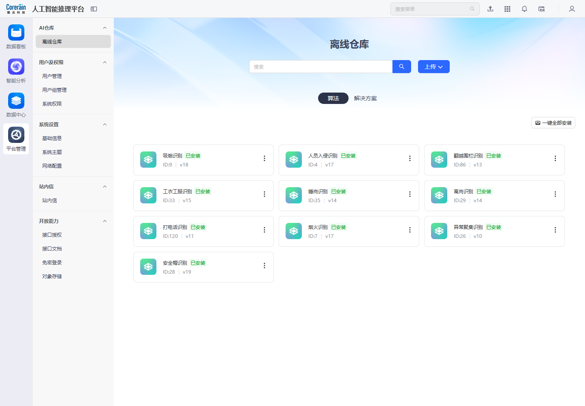
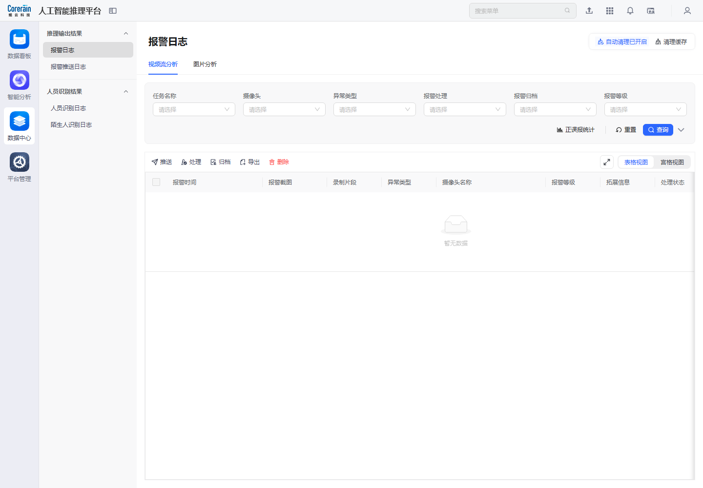
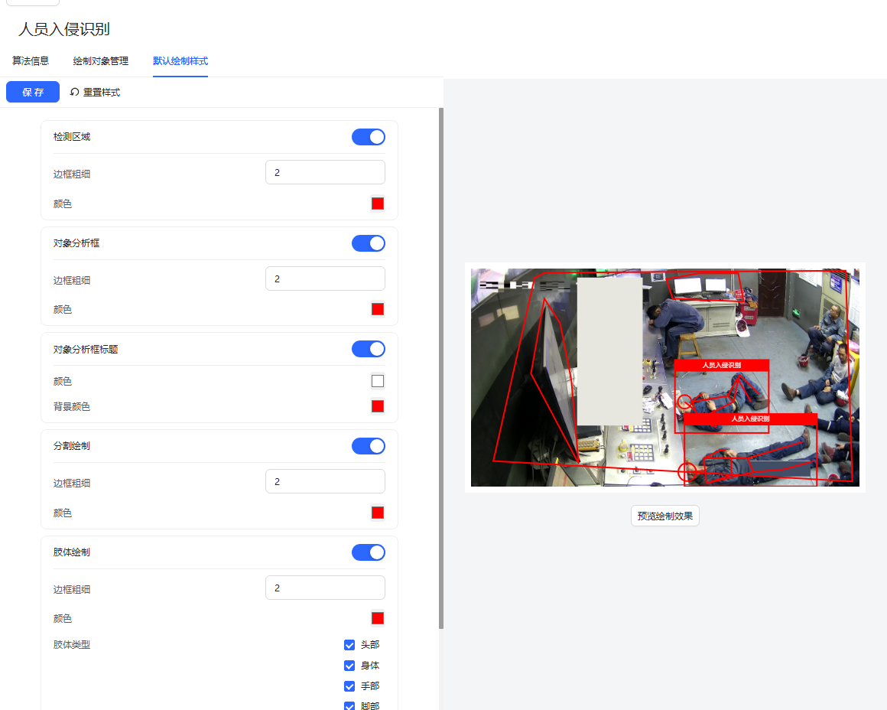
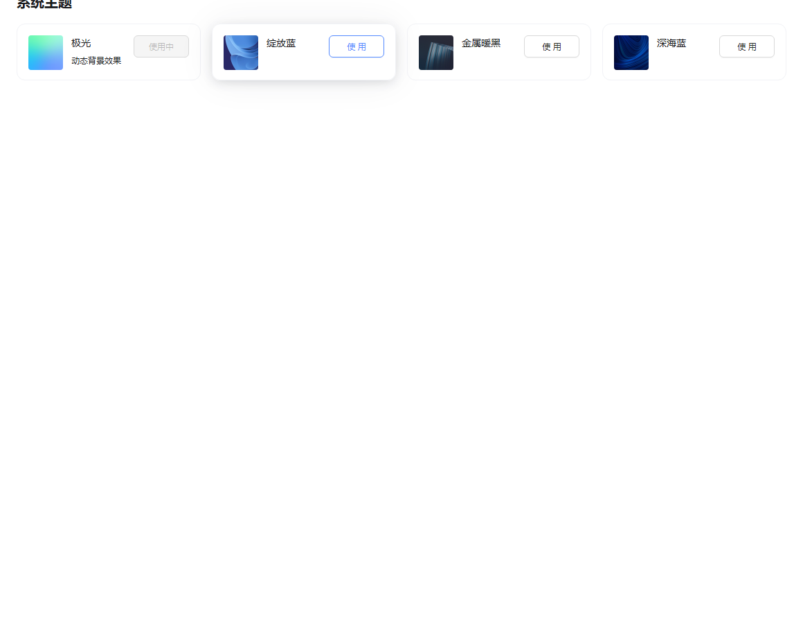

# 跨模块依赖与交集

四个大模块不是并列孤岛，而是围绕 AI 推理业务形成闭环：平台管理提供算法和治理基础，智能分析把输入源与算法编排成任务，数据中心沉淀结果并完成处置，数据看板消费指标并展示态势。

## 总体链路

| 链路阶段 | 主责模块 | 关键对象 | 设计说明 |
| --- | --- | --- | --- |
| 能力准备 | 平台管理 | 离线算法包、解决方案、权限、对象存储 | 算法安装、权限授权、存储和开放接口决定系统可用能力边界。 |
| 输入接入 | 智能分析 | 摄像头、视频源、图片输入、人员库、算法底库 | 让平台知道看哪里、识别什么、依赖哪些基础数据。 |
| 任务执行 | 智能分析 | 视频流分析任务、图片分析任务、分析服务 | 把输入与算法组合成可运行任务，并监控服务健康。 |
| 结果沉淀 | 数据中心 | 报警日志、推送日志、人员识别日志、陌生人日志 | 用于审计、处置、归档、导出和排障。 |
| 结果展示 | 数据看板 | 实时监控、业务概览、报警图片墙、AI 管控中心 | 面向管理者和值守人员展示全局态势。 |

## 代表性证据截图

| 依赖关系 | 截图 | 产品解读 |
| --- | --- | --- |
| 平台管理 -> 智能分析 |  | 离线仓库安装的算法包进入算法资产体系，之后才能在智能分析中创建任务或配置算法。 |
| 智能分析 -> 数据中心 |  | 视频流分析任务产生报警或识别结果，数据中心承接这些输出并提供查询处置。 |
| 数据中心 -> 数据看板 |  | 报警日志中的事件、状态和等级会成为看板报警趋势、图片墙和管控中心指标来源。 |
| 全局导航贯穿全模块 |  | 顶部搜索、应用中心、站内信和账号入口跨模块固定存在，降低在深层页面切换成本。 |
| 新手引导 -> 智能分析 |  | 新手引导把用户直接带向添加摄像头和创建视频分析任务，是系统冷启动的跨模块入口。 |

<!-- FOCUSED_SUPPLEMENT_START -->
## 聚焦补图后的交集补充

本次复查后，将顶部搜索、应用中心、通知、语言、账号统一归为公共顶部工具区；跨模块分析不再把它们重复计入每个业务模块，而是关注业务对象之间的依赖。

| 依赖关系 | 聚焦截图 | 产品解读 |
| --- | --- | --- |
| 算法参数配置 -> 任务运行 |  | 算法详情中的阈值、绘制对象和默认样式会影响后续视频/图片分析任务的识别结果与报警可解释性。 |
| 任务配置 -> 报警日志 |  | 视频流分析详情中的“查看报警”与数据中心报警日志形成直接闭环，建议支持带条件跳转。 |
| 报警推送 -> 对象存储 |  | 报警推送可选择 base64、对象存储、本地链接等证据交付方式，依赖平台管理中的存储配置。 |
| 平台治理 -> 全局体验 |  | 系统主题、基础信息、站内信等平台配置会影响所有业务模块，是公共能力而不是单页能力。 |
<!-- FOCUSED_SUPPLEMENT_END -->

## 交集对象模型

| 对象 | 涉及模块 | 生命周期与交集 |
| --- | --- | --- |
| 摄像头/视频源 | 智能分析、数据中心、数据看板 | 在摄像头配置中创建和分组；任务运行后生成报警；看板展示实时视频和报警态势。 |
| 算法 | 平台管理、智能分析、数据中心、数据看板 | 在离线仓库安装；在算法列表中配置；在任务中被调用；结果进入日志和看板统计。 |
| 分析任务 | 智能分析、数据中心、数据看板 | 在视频/图片分析中创建；运行后产生日志；状态和结果成为看板指标。 |
| 报警事件 | 智能分析、数据中心、数据看板、平台管理开放能力 | 由任务产生；在数据中心处理/归档/推送；看板消费趋势；开放能力向外部系统推送。 |
| 人员/陌生人 | 智能分析、数据中心 | 人员库维护基础数据；识别结果进入人员识别日志和陌生人日志。 |
| 用户/权限 | 平台管理、全部模块 | 用户、用户组、系统权限决定菜单、按钮和数据范围可见性。 |
| 对象存储 | 平台管理、数据中心、数据看板 | 存放报警截图、录制片段、算法包等文件资源，是日志证据和看板媒体展示的底座。 |

## 产品设计建议

- 建立跨模块上下文跳转：从报警日志跳任务详情，从看板指标跳过滤后的日志，从算法卡片跳算法任务列表。
- 统一对象命名：摄像头、视频源、点位、监控点等概念应在不同模块保持一致，减少理解成本。
- 强化空状态下一步：数据中心无报警时应提示去创建任务；看板无数据时应提示配置摄像头和算法；平台无密钥时提示创建访问密钥。
- 把新手引导做成闭环任务清单：添加摄像头、选择算法、创建任务、配置推送、查看报警/看板。
- 补齐审计：删除、安装、保存网络、重置密码、强制重启等高风险操作应有二次确认、操作人、时间、结果和回滚提示。
